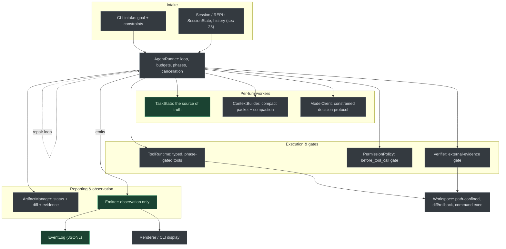
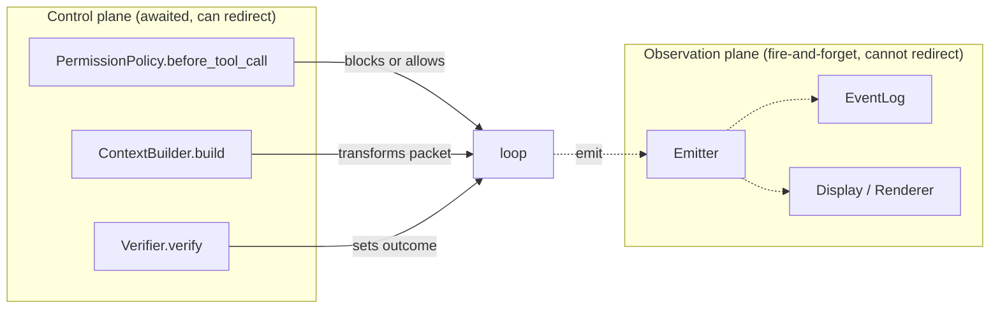
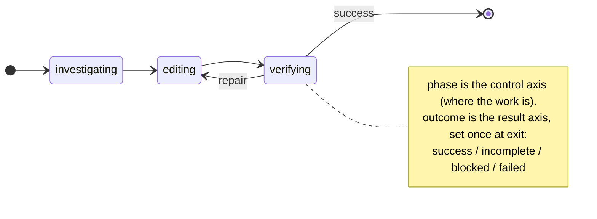
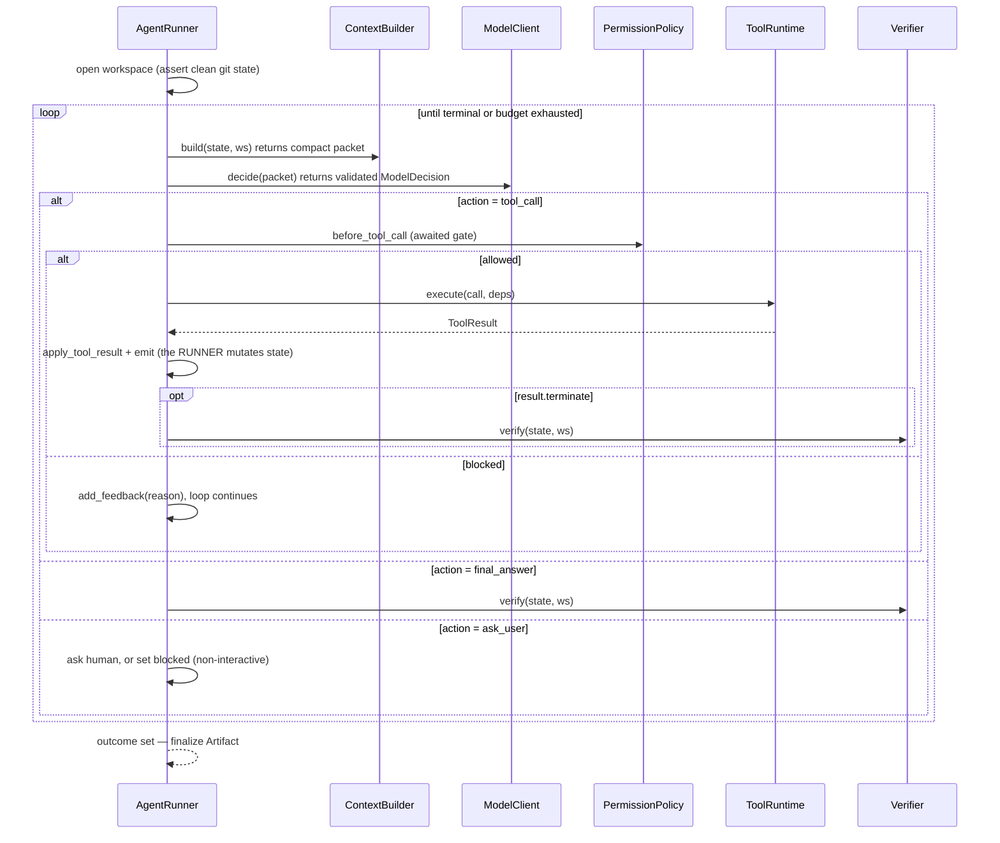
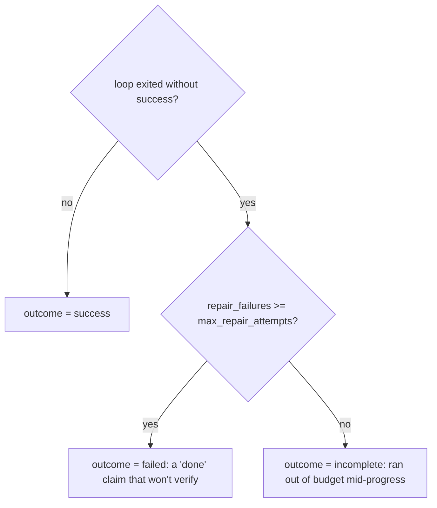
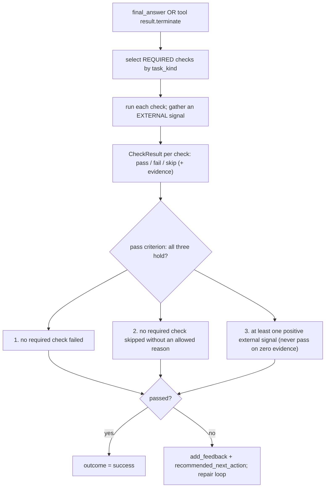
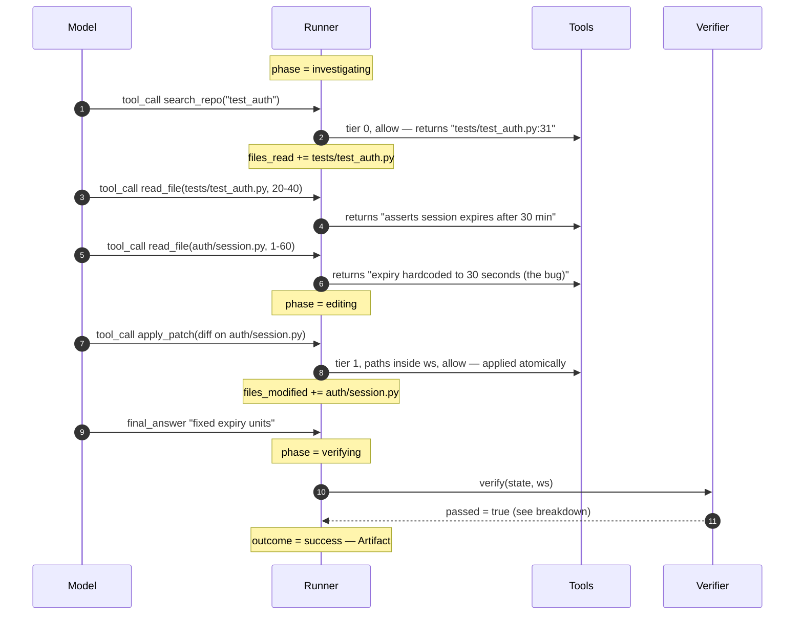

# ARCHITECTURE

A synthesized, visual map of how avatar-harness fits together — the whole-system picture for **broad work** (feature implementation, deep debugging, deep Q&A, onboarding). For *why* a thing is shaped a certain way, follow the `§N` links into `HARNESS_DESIGN.md` (the source-of-truth spec). For *what's built and what's next*, see `PROGRESS.md`.

> **Scope discipline:** this document describes the **target architecture** from the design spec and marks each piece's build status. It does not invent design beyond `HARNESS_DESIGN.md` or the code. Tags:
> **[Implemented]** = present in code today · **[Designed]** = specified, not yet built (see `PROGRESS.md`).
>
> **Maintenance:** update this file — diagrams and status tags included — whenever a change alters the architecture.

---

## 1. What this system is

A **coding-agent harness**: the runtime *around* an LLM that turns a natural-language task into a bounded, verifiable engineering loop. The defining inversion vs. a chat app:

> The model **proposes** actions; the harness **owns** execution, state, permissions, logging, and verification. The loop terminates on **external verification**, not on a text reply.

Everything below serves five invariants (`§3`): explicit structured state · propose→validate→gate→execute→record→apply · "done" is proven, never self-certified · everything reversible · everything observable.

## 2. High-level architecture

A central **`AgentRunner`** owns the loop and the `TaskState`. Everything else is a stateless worker or a passive store. In interactive use, a **`Session`** (`§23`) wraps the runner in a REPL; batch mode is the degenerate one-task session.



> Status note: as of **Phase 2**, the whole non-interactive engine is **[Implemented]** and wired end-to-end through `cli.main` — the read-only loop *and* the closing edit path (`apply_patch` under the permission gate, the external-evidence `Verifier`, the `ArtifactManager`), dogfooded live (an investigate task answered a real repo question and verified `success`). What remains **[Designed]** is the interactive `Session`/REPL (`§23`, Phase 3) and §21 extensions. Two live boundaries: the runner does not yet *advance* `phase` — tool *availability* is enforced by `task_kind` instead (an investigate task is blocked from `apply_patch` at the gate), with automated `investigating → editing → verifying` transitions deferred to Phase 3; and intake does not yet classify a free-text goal into a `task_kind` (the CLI runs `investigate` by default or takes an explicit kind).

| Component | Role | Status |
| --- | --- | --- |
| `AgentRunner` | Owns the loop, budgets, phase transitions, cancellation. | [Implemented] (loop + budgets + gate; auto phase transitions [Designed]) |
| `TaskState` | Explicit per-task progress — the source of truth. | [Implemented] |
| `ContextBuilder` | Builds the compact per-turn packet; compaction hook. | [Implemented] (compaction hook [Designed]) |
| `ModelClient` | Constrained decision protocol; streaming/delta assembly. | [Implemented] |
| `ToolRuntime` | Executes typed, phase-gated tools against the workspace. | [Implemented] |
| `PermissionPolicy` | `before_tool_call` control gate (tiers 0–4). | [Implemented] (synchronous; async with the REPL) |
| `Verifier` | Proves completion via external evidence. | [Implemented] (`investigate`/`edit`/`test_only`) |
| `Emitter` + `EventLog` | Observation-only events; durable JSONL, grouped by `session_id` (per-session log file). | [Implemented] |
| `ArtifactManager` | Final status + change summary + evidence. | [Implemented] |
| `Workspace` | Path confinement, diff/rollback, command execution. | [Implemented] |
| `Session` | REPL above the runner (`§23`). | [Designed] (Phase 3) |

### The two control planes (don't conflate them — `§13`)



Control hooks are **awaited function calls with return values the runner acts on**. Events are **notifications** — a subscriber that raises is swallowed and can never veto the loop. Making the permission gate a "subscriber" would be the cardinal trap.

## 3. Deep dive — the task lifecycle (execution)

A **task** = one goal handed to the runner, pursued over many turns until it reaches exactly one terminal **outcome**, producing one **Artifact**. One task ↔ one `TaskState`. It is the atomic *unit of the runner's contract*, but internally composite (many turns) and **not** transactional — a non-`success` task can leave partial edits in the workspace (auto-rollback is deferred, `§21`).

Nesting: `Session ⊃ Task ⊃ Turn ⊃ Tool action` (the tool action is the atomic step; `apply_patch` is all-or-nothing).

### 3.1 Two independent axes: `phase` and `outcome`

These are deliberately separate (`§7`). Conflating them is what leaves "ran out of budget" vs. "couldn't be verified" ambiguous.



- **`phase`** is a *control* axis: it gates which tools are active and how context is built. It advances `investigating → editing → verifying` and can fall back to `editing` during repair.
- **`outcome`** is the *terminal result* axis: `None` while live, then exactly one of four values — which is precisely what the Artifact reports. `terminal` is just `outcome is not None`.

### 3.2 The loop, one turn at a time



Three load-bearing rules: **the verifier is not a tool**; **`terminate`/`final_answer` only *propose* completion — the verifier disposes**; **repair is just the loop continuing** (a failed verification appends evidence that the next context surfaces).

### 3.3 Bounding — why a run never ends silently

Two *kinds* of bound map to two outcomes (`§5`):



General budgets (max iterations, wall-clock, per-tool timeout, max context, consecutive failed actions) → **`incomplete`**. The repair budget (consecutive verification rejections) → **`failed`**. `blocked` comes only from `ask_user` in a non-interactive run.

## 4. Deep dive — verification

Verification is the concrete form of principle #3 (*"done is proven, never self-certified"*). It is a **harness-owned gate**, not a tool the model can call, skip, or fake.

### 4.0 What the verifier is — and isn't

Two properties that are easy to misread:

- **It runs no model.** The verifier never calls an LLM — not the agent's, not another. An LLM grading an LLM is self-certification in disguise; "external evidence" means a signal that does *not* originate from a model's opinion. Every check resolves to a command exit code, a file/diff fact, or a predicate over structured state. (A model-based *advisory* check — flagging concerns, never solely gating — is conceivable later, but is out of MVP scope and would get its own config.)
- **"Structural inspection" = predicates over `TaskState`.** Because state is explicit and structured (invariant #1), the verifier interrogates it like a record — set membership, string/regex, field access — not by interpreting prose. The `investigate` gate is roughly: *answer present* **and** *the agent inspected something and the answer names a file it read* **and** *no files modified*:

  ```python
  cited     = [p for p in state.files_read if p in (state.final_answer or "")]
  inspected = bool(state.files_read or state.commands_run or state.evidence)
  passed    = bool(state.final_answer) and inspected and bool(cited) \
              and not state.files_modified and not ws.diff()
  ```

  The crude `p in answer` substring proves *grounding*, not *correctness* — correctness is delegated to tests (`edit`) or the human (interactive, §23.5). No prose judgment, hence no model.

**Verification reads the *uncommitted* working tree; the harness never commits.** At task start the `Workspace` pins a baseline (HEAD) and asserts a clean tree (§15); thereafter `ws.diff()` is `git diff <baseline>` — the delta the task introduced, **uncommitted**. So `edit` expects a *non-empty* diff and `investigate` expects an *empty* one (no edits made) — **both with nothing committed**. The diff is the deliverable, surfaced for a human (commit/push is tier 4, deferred §21). The primary "did this task change files" signal is the harness's own `state.files_modified` ledger, which is git-independent; diffing against the pinned baseline (not the git index) ensures a stray `git add` cannot hide a change.

### 4.1 What happens in a verification step



A `CheckResult` carries `status: pass | fail | skip` plus an `evidence` string (the actual command + output excerpt); a `skip` **requires** a reason. The verifier returns a `VerifierResult(passed, summary, checks, recommended_next_action)` — and `recommended_next_action` is what turns a rejection into useful repair *direction*, not just a "no".

The key subtlety: **a skipped check is not a passed check.** A naive "nothing failed → pass" would green-light a no-op, so the gate is defined on *required* checks plus a mandatory positive signal.

### 4.2 The contract is selected by `task_kind`

`task_kind` is a taxonomy of **verification contracts**, not user intents — which is why there are only three. (`investigate` is the single read-only kind; it subsumes pure explanation and pure command-execution, because all three are judged identically.)

| `task_kind` | Required checks | Positive signal must include |
| --- | --- | --- |
| `edit` | a diff exists; no unexpected files changed; no placeholders/secrets; targeted tests pass *or* an allowed skip; lint/types clean | a passing targeted test, or (if none exists) clean lint/types over the diff |
| `test_only` | tests were added/changed; the new tests run and pass | the new tests executing and passing |
| `investigate` | answer cites concrete evidence (files/lines, command output); no unintended diff | inspected files / search or command results in the log |

Always-on guards (no edits outside the workspace, no likely secrets) stay `required` for every kind. Checks that don't apply run as `optional` (recorded, never gating).

### 4.3 Where do the verifier's commands come from? — an open question

The verifier knows **which** checks to run (from `task_kind`) and the **pass rule** (fixed). But **how** it runs a check — the concrete command for *this* repo (e.g. `pytest tests/test_auth.py`, `ruff check`) — is **not yet specified in the design or the code.** The nearest anchors today:

- `§9` lists repo conventions (`pyproject.toml`, `Makefile`, `README`) the `ContextBuilder` *prefers* — but for context selection, not as a verification command source.
- `§10` defines the `run_tests(target, timeout)` / `run_linter(timeout)` tools — the *mechanism*, but not which target/command is canonical.
- Smart **test-target inference** ("which tests cover this diff?") is explicitly **deferred** (`§9`, `§21`).

So the command→task mapping is a real gap. The expected MVP resolution (not yet built): commands come from `HarnessConfig` defaults plus lightweight convention detection; until inference exists, the verifier runs a configured/default command or the target the model already used. **This is flagged here so it isn't mistaken for a solved mechanism.**

### 4.4 Interactive vs. autonomous authority (`§23.5`)

Verification always *runs and reports*. **Who decides on the result** shifts: in an autonomous (`--auto`) run the verifier sets `outcome`; in a conversational turn `final_answer` is delivered as a reply and the human is the terminal authority. `task_kind` still picks *which* checks run.

## 5. Dry run — one task, end to end

**Goal:** "Fix the failing auth test." `task_kind = edit`. This traces both the task lifecycle (§3) and verification (§4). *(The engine that runs this is now built (Phase 2); a live-model dogfood is still pending an endpoint.)*



**The verification step, expanded** (`task_kind = edit`):

| Check (required) | How | Status / evidence |
| --- | --- | --- |
| diff exists | `Workspace` diff | **pass** — `auth/session.py` changed |
| no unexpected files changed | diff vs. expected set | **pass** — only `auth/session.py` |
| no placeholders/secrets | static scan over diff | **pass** |
| targeted tests pass | run test command *(source: open §4.3)* | **pass** — `pytest tests/test_auth.py` green |
| lint/types clean | run lint command | **pass** — `ruff` clean |

Pass criterion: no required `fail` ✓ · no disallowed `skip` ✓ · positive signal present (the passing test) ✓ → **`passed = true`** → `outcome = success`.

**Artifact:**

```text
Status: success
Changed files:  auth/session.py
Verification:   pytest tests/test_auth.py passed · ruff check passed
Notes:          Full project suite not run.
```

### 5.1 The repair variant (verification *fails*)

If the patch were wrong, the verifier returns `passed=false`, `recommended_next_action="assertion at test_auth.py:34 still fails; expiry compared in seconds, expected minutes"`. The runner calls `add_feedback(summary)` and **the loop simply continues** — `repair_failures += 1`, `phase` stays/returns to `editing`, the next `ContextBuilder.build` surfaces the failing output verbatim, and the model revises. No special machinery. If this repeats past `max_repair_attempts`, the run exits `failed` (a "done" claim that won't verify) — distinct from `incomplete` (ran out of general budget without ever converging).

## 6. Current implementation footprint

What exists in `src/avatar_harness/` today (through Phase 2):

| Module | Contents | Maps to |
| --- | --- | --- |
| `config.py` | `HarnessConfig` (pydantic-settings, `AVATAR_*` env, budgets, `test_command`/`lint_command`) | `§8` config |
| `state.py` | `TaskState` + `Evidence` / `DecisionRecord` / `CommandRecord` / `CheckResult` / `VerifierResult`; `terminal`, `add_feedback`, `block` | `§7`, `§12` data shapes |
| `events.py` · `eventlog.py` | `Emitter` (observation-only, stamps `ts` + `session_id`) + `EventLog` (JSONL subscriber; CLI defaults to a per-session `events/<session_id>.jsonl` + `latest.jsonl` pointer) | `§13`, `§23` |
| `workspace.py` | Path confinement, pinned-baseline `diff`, atomic `apply_patch` (`git apply --index`, so created files are tracked + visible in the diff), bounded `run` + ordered `command_log`, clean-start assertion | `§8`, `§10`, `§15` |
| `deps.py` | `RunDeps`, `CancellationToken` — run-scoped, no globals | `§8` |
| `tools/` | `base` (`ToolResult`/`ToolDefinition`/`ToolRegistry`/`ToolRuntime`), `filesystem`, `search`, `edit` (`apply_patch`), `commands` (`run_tests`/`run_linter`) | `§10` |
| `permission.py` | `PermissionPolicy` + `ToolPermission` — the synchronous `before_tool_call` gate | `§11` |
| `model_client.py` | Constrained decision union + `OpenAIModelClient` (decision parsing) | `§6` |
| `context.py` | `ContextBuilder` + `ContextPacket` — compact, phase-gated per-turn packet | `§9` |
| `verifier.py` | `Verifier` — `investigate`/`edit`/`test_only` gates; runs its own verification command | `§12` |
| `artifact.py` | `ArtifactManager` + `Artifact` — `status = state.outcome`, files/commands/verification/diff | `§14` |
| `runner.py` | `AgentRunner` — the §5 loop; runner-owned mutation; gate consult; bounding; mirrors `ws.command_log` into `state.commands_run` | `§5`, `§8` |
| `cli.py` | `run_agent` (real loop, takes `task_kind`) + `main()` reporting through `ArtifactManager` (+ `run_echo` Phase 0 skeleton) | `§5`/`§23` shell |

Remaining **[Designed]**: the interactive `Session`/REPL (`§17`/`§23`, Phase 3), the `ContextBuilder` compaction hook, automated `phase` transitions, and §21 extensions.
