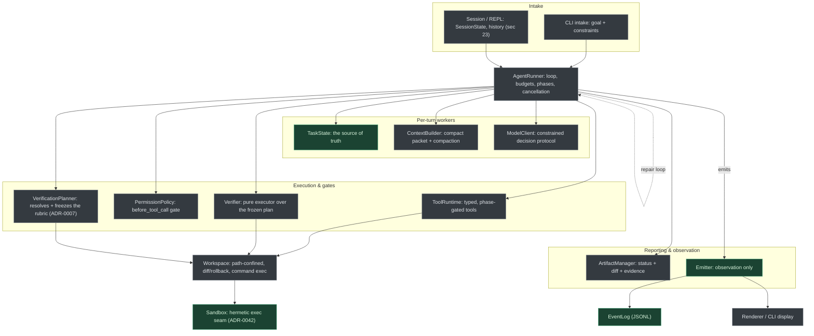
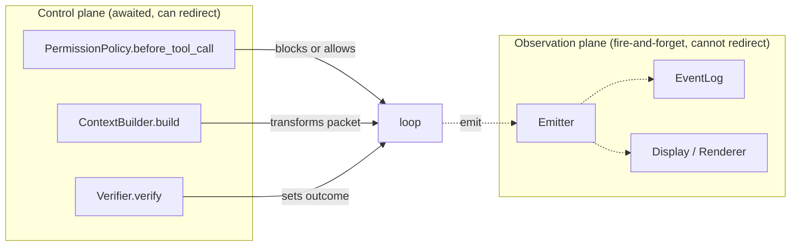
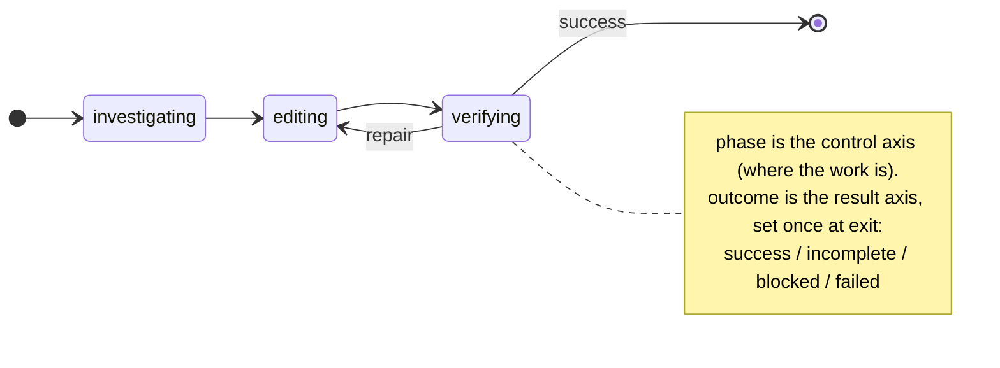
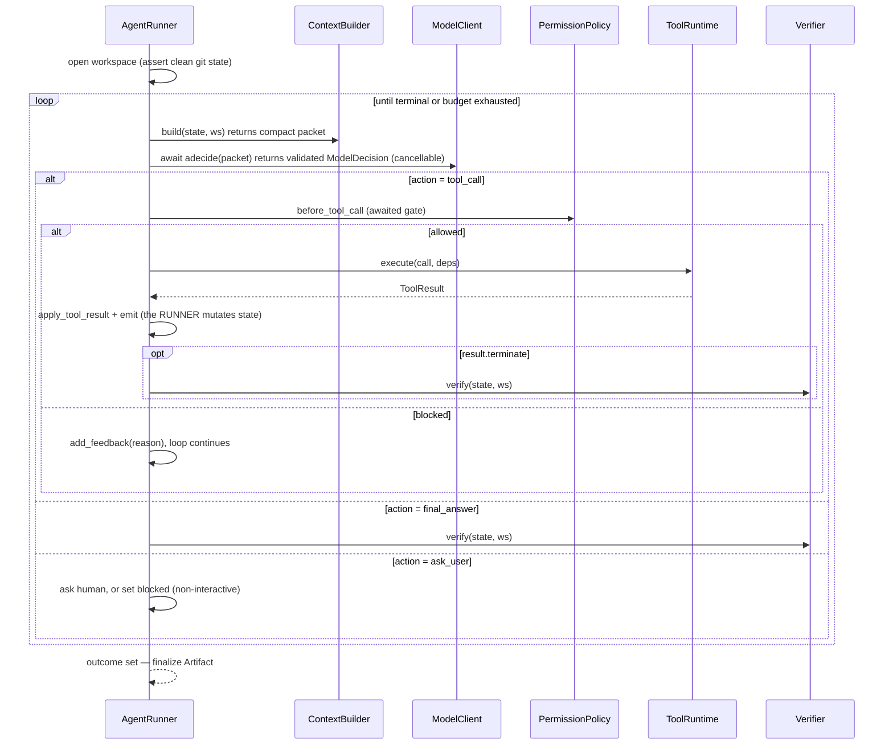
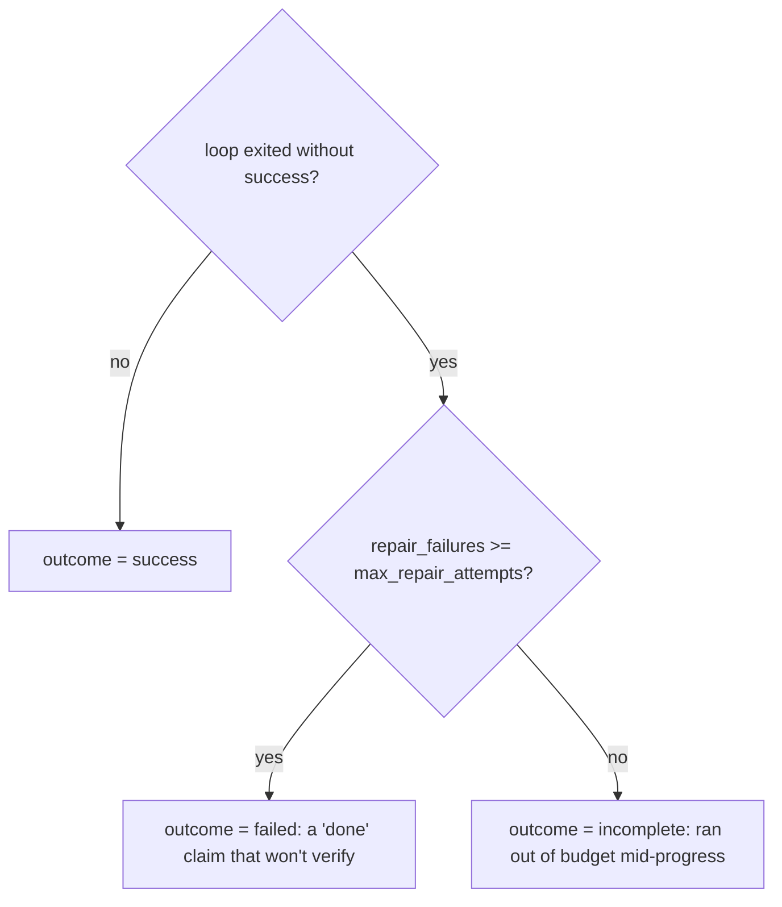
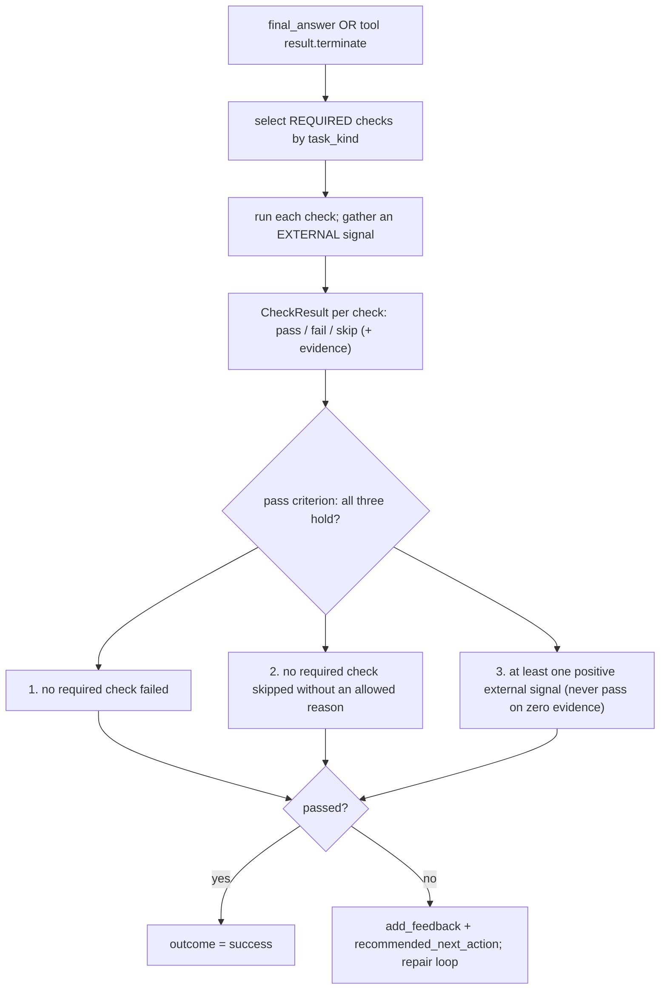
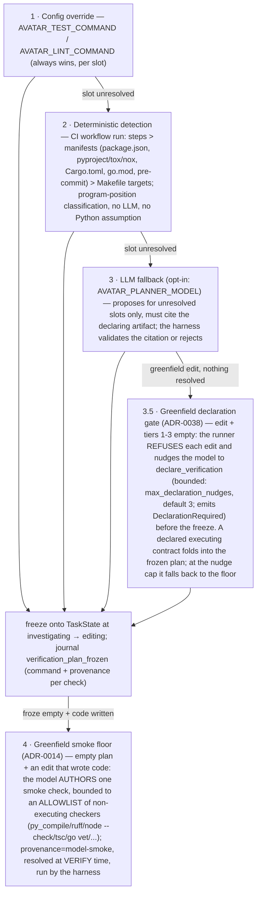
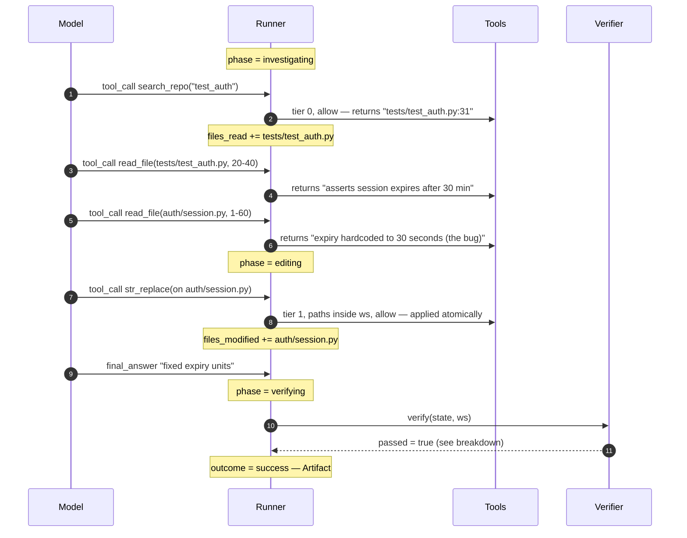

# ARCHITECTURE

A synthesized, visual map of how avatar-harness fits together — the whole-system picture for **broad work** (feature implementation, deep debugging, deep Q&A, onboarding). For *why* a thing is shaped a certain way, see the ADRs under `docs/adr/` (the living decision log), or follow a `§N` link into the **frozen** `docs/archive/HARNESS_DESIGN.md` for the originating rationale. *What's built and what's next* is the status tags in this file (and `CHANGELOG.md` for what shipped). Keep this file — diagrams and status tags included — current whenever a change alters the architecture.

---

## 1. What this system is

A **coding-agent harness**: the runtime *around* an LLM that turns a natural-language task into a bounded, verifiable engineering loop. The defining inversion vs. a chat app:

> The model **proposes** actions; the harness **owns** execution, state, permissions, logging, and verification. The loop terminates on **external verification**, not on a text reply.

Everything below serves five invariants (`§3`): explicit structured state · propose→validate→gate→execute→record→apply · "done" is proven, never self-certified · everything reversible · everything observable.

## 2. High-level architecture

A central **`AgentRunner`** owns the loop and the `TaskState`. Everything else is a stateless worker or a passive store. In interactive use, a **`Session`** (`§23`) wraps the runner in a REPL; batch mode is the degenerate one-task session.



| Component | Role | Status |
| --- | --- | --- |
| `AgentRunner` | Owns the loop, budgets, phase transitions, cancellation. | [Implemented] (async `arun()` is the loop; sync `run()` wraps it; budgets + gate + phase advance/enforce + cancellation + typed-event publishing + awaited approval) |
| `TaskState` | Explicit per-task progress — the source of truth. | [Implemented] |
| `ContextBuilder` | Builds the compact per-turn packet; budgeted compaction + action ledger. | [Implemented] |
| `ModelClient` | Constrained decision protocol; streaming/delta assembly. | [Implemented] |
| `ToolRuntime` | Executes typed tools against the workspace; isolates handler exceptions as failed `ToolResult`s. | [Implemented] |
| `PermissionPolicy` | `before_tool_call` control gate (tiers 0–4 + sensitive-path denylist over declared paths). | [Implemented] (synchronous; async with the REPL) |
| `Verifier` | Proves completion via external evidence; pure executor over the frozen verification plan. | [Implemented] (`investigate`/`edit`/`test_only`) |
| `VerificationPlanner` | Resolves the per-session verification plan (config override → deterministic detection → cited LLM fallback); the runner freezes it at the editing boundary (ADR-0007). Plus the greenfield smoke floor — a model-authored, harness-run check resolved at verify time when nothing else did (ADR-0014). | [Implemented] |
| `Emitter` + `EventLog` | Observation-only events; durable JSONL, grouped by `session_id`; `EventLog` round-trips typed events too. | [Implemented] |
| `HarnessEvent` + `EventBus` | Typed lifecycle union (`event_types.py`) + bounded per-subscriber fan-out (`bus.py`) the async loop publishes through, with the privileged write-ahead `JsonlEventJournal` (`journal.py`). | [Implemented] (3.0 fan-out + Lane 1 bounded queues/drop policy/journal) |
| `ArtifactManager` | Final status + change summary + evidence. | [Implemented] |
| `Workspace` | Path confinement + sensitive-path denylist (resolved-path backstop), diff/rollback, command execution. Every command funnels through one seam (`_run_unlogged`), where an injected `Sandbox` seals the substrate (ADR-0042). | [Implemented] |
| `Sandbox` | Hermetic execution at the command seam (`sandbox.py`, ADR-0042, implements ADR-0009). A pure `prepare() → ExecSpec` transform closing **Threat C** (runtime/substrate gaming): `hermetic-env` (default) scrubs the child env to a language-neutral allowlist so an inherited `PYTEST_ADDOPTS`/`PYTHONPATH` can't rig a check; `sandbox-exec` (macOS) + `bwrap` (Linux) add network-deny + write-confine; `container` (Podman/Docker) is the cross-platform strong mode; `none` inherits (escape hatch). Opt-in `RLimits`. Does *not* cover weak/gutted tests (Threats A/B). | [Implemented] (Increments 1–2: all backends; `bwrap`/`container` shape-tested, guest isolation needs a Linux run) |
| `Harness` | Public facade (`from_env()`/`run()`/`arun()`/`session()`); wires defaults, every seam overridable; the CLI delegates to it. | [Implemented] |
| `Session` | Two-plane boundary over a run — `events()` out, `resolve_approval()`/`cancel()` in (`§13`/`§23`). | [Implemented] (3.0 foundation) |
| `SessionState` + `ReplSession` | The multi-turn scope above `TaskState` (`session_state.py`): history, per-goal tasks, session-scoped grants, mode (incl. `auto`/conversational); drives each goal through a per-goal `Session`; handles local meta commands (`run_meta` → `MetaResult`); seeds `@path` as denylist-checked `grounding` evidence; the plan-flow seam (`start_plan`/`start_build`/`extract_plan`/`plan_is_approvable`/`record_goal`) that both `submit_plan` (headless) and the cockpit reuse. | [Implemented] (Lane 2a + 3.2a–3.2e) |
| `jo` (cockpit — separate `jo-cli` package) | `CockpitApp` (`jo-cli/jo/app.py`) — two modes: **observe** a fixed `session=` stream (`ReplaySession`, tests/`--replay`), or **drive** a live `repl=` `ReplSession` (multi-turn input → meta-locally / observable per-goal `Session`s / plan→`PlanModal`→build; `Ctrl-C` cancels). `jo-cli/jo/modals.py` has `ApprovalModal`/`DiffModal`/`PlanModal`; `load_cockpit()` keeps Textual off package load. A standalone distribution (`jo-cli`) depending on `avatar-harness`, launched by its **own `jo` entry point** (`jo-cli/jo/cli.py`) — a consumer of the core; the batch CLI never imports it (ADR-0023). | [Implemented] (Lane 2b shell + 2c modals + 3.2e launch; extracted to `jo-cli`) |

### The two control planes (don't conflate them — `§13`)



Control hooks are **awaited function calls with return values the runner acts on**. Events are **notifications** — a subscriber that raises is swallowed and can never veto the loop. Making the permission gate a "subscriber" would be the cardinal trap.

## 3. Deep dive — the task lifecycle (execution)

A **task** = one goal handed to the runner, pursued over many turns until it reaches exactly one terminal **outcome**, producing one **Artifact**. One task ↔ one `TaskState`. It is the atomic *unit of the runner's contract*, but internally composite (many turns) and **not** transactional — a non-`success` task can leave partial edits in the workspace (auto-rollback is deferred, `§21`).

Nesting: `Session ⊃ Task ⊃ Turn ⊃ Tool action` (the tool action is the atomic step; an edit — `str_replace`/`write_file` — is all-or-nothing).

### 3.1 Two independent axes: `phase` and `outcome`

These are deliberately separate (`§7`). Conflating them is what leaves "ran out of budget" vs. "couldn't be verified" ambiguous.



- **`phase`** is a *control* axis: it gates which tools are active and how context is built. It advances `investigating → editing → verifying` and can fall back to `editing` during repair.
- **`outcome`** is the *terminal result* axis: `None` while live, then exactly one of four values — which is precisely what the Artifact reports. `terminal` is just `outcome is not None`.

### 3.2 The loop, one turn at a time



Three load-bearing rules: **the verifier is not a tool**; **`terminate`/`final_answer` only *propose* completion — the verifier disposes**; **repair is just the loop continuing** (a failed verification appends evidence that the next context surfaces).

### 3.3 Bounding — why a run never ends silently

Two *kinds* of bound map to two outcomes (`§5`):



General budgets (max iterations, wall-clock, per-tool timeout, max context, consecutive failed actions) → **`incomplete`**. The repair budget (consecutive verification rejections) → **`failed`**. `blocked` comes only from `ask_user` in a non-interactive run. The per-run wall-clock is **nullable** (ADR-0043): the attended cockpit defaults it off — Ctrl-C and `max_iterations` are the backstops there — while batch/eval keep the 600s cap; an explicitly configured cap (env or `.env`) always wins.

## 4. Deep dive — verification

Verification is the concrete form of principle #3 (*"done is proven, never self-certified"*). It is a **harness-owned gate**, not a tool the model can call, skip, or fake.

### 4.0 What the verifier is — and isn't

Two properties that are easy to misread:

- **It runs no model.** The verifier never calls an LLM — not the agent's, not another. An LLM grading an LLM is self-certification in disguise; "external evidence" means a signal that does *not* originate from a model's opinion. Every check resolves to a command exit code, a file/diff fact, or a predicate over structured state. (A model-based *advisory* check — flagging concerns, never solely gating — is conceivable later, but is out of MVP scope and would get its own config.)
- **"Structural inspection" = predicates over `TaskState`.** Because state is explicit and structured (invariant #1), the verifier interrogates it like a record — set membership, string/regex, field access — not by interpreting prose. The `investigate` gate is roughly: *answer present* **and** *the agent inspected something and the answer names a file it read* **and** *the tree nets to zero diff vs the pinned baseline* (ADR-0005: transient tier-1 writes are legal mid-task, so the `files_modified` ledger is reported as evidence but does not fail a reverted tree) **and** *no secret/placeholder markers in any leftover diff*:

  ```python
  cited     = [p for p in state.files_read if p in (state.final_answer or "")]
  inspected = bool(state.files_read or state.commands_run or state.evidence)
  passed    = bool(state.final_answer) and inspected and bool(cited) \
              and not ws.diff()  # net-zero vs the pinned baseline — "no diff at the END", not "no writes ever"
  ```

  The crude `p in answer` substring proves *grounding*, not *correctness* — correctness is delegated to tests (`edit`) or the human (interactive, §23.5). No prose judgment, hence no model.

**Verification reads the *uncommitted* working tree; the harness never commits.** At task start the `Workspace` pins a baseline (HEAD) and asserts a clean tree (§15); thereafter `ws.diff()` is `git diff <baseline>` — the delta the task introduced, **uncommitted**. So `edit` expects a *non-empty* diff and `investigate` expects an *empty* one (any transient instrumentation reverted by answer time — ADR-0005) — **both with nothing committed**. The diff is the deliverable, surfaced for a human (commit/push is tier 4, deferred §21). The primary "did this task change files" signal is the harness's own `state.files_modified` ledger, which is git-independent; diffing against the pinned baseline (not the git index) ensures a stray `git add` cannot hide a change.

### 4.1 What happens in a verification step



A `CheckResult` carries `status: pass | fail | skip` plus an `evidence` string (the actual command + output excerpt); a `skip` **requires** a reason. The verifier returns a `VerifierResult(passed, summary, checks, recommended_next_action)` — and `recommended_next_action` is what turns a rejection into useful repair *direction*, not just a "no".

The key subtlety: **a skipped check is not a passed check.** A naive "nothing failed → pass" would green-light a no-op, so the gate is defined on *required* checks plus a mandatory positive signal. And an *allowed* skip is not a blank cheque: a `kind="test"` check that collects zero tests (pytest exit 5) is tolerated only when the repo genuinely had none — if the **pinned baseline had tests** (`Workspace.baseline_paths()`) and the check now collects nothing, that is suppression (emptied/deleted graded tests) and the verifier **fails, not skips** (ADR-0042, Threat A).

### 4.2 The contract is selected by `task_kind`

`task_kind` is a taxonomy of **verification contracts**, not user intents — which is why there are only three. (`investigate` is the single *net-zero-diff* kind: tier-1 writes are legal mid-task for transient instrumentation, but the tree must net to zero diff vs the pinned baseline at verification — ADR-0005. It subsumes pure explanation and pure command-execution, because all three are judged identically.)

| `task_kind` | Required checks | Positive signal must include |
| --- | --- | --- |
| `edit` | a diff exists; no unexpected files changed; no placeholders/secrets; targeted tests pass *or* an allowed skip; lint/types clean | a passing targeted test, or (if none exists) clean lint/types over the diff |
| `test_only` | tests were added/changed; the new tests run and pass | the new tests executing and passing |
| `investigate` | answer cites concrete evidence (files/lines, command output); no unintended diff (the tree nets to zero vs the pinned baseline; transient tier-1 writes legal mid-task — ADR-0005); no placeholders/secrets in a leftover diff | inspected files / search or command results in the log |

Always-on guards (no edits outside the workspace, no likely secrets) stay `required` for every kind. Checks that don't apply run as `optional` (recorded, never gating).

### 4.3 Where do the verifier's commands come from? — the frozen verification plan (ADR-0007)

**[Implemented]** (was an open question through Phase 3.2; closed by ADR-0007). The verifier knows **which** checks to run (from `task_kind`) and the **pass rule** (fixed). The concrete commands for *this* repo come from a per-session **verification plan** — a list of `PlannedCheck(name, command, kind, provenance)` — resolved once by the harness-owned **`VerificationPlanner`** and **frozen** onto `TaskState` before editing begins. Three concerns are kept deliberately distinct (`§5` survives only if they are):

| Concern | Owner | Mechanism |
| --- | --- | --- |
| **Discovery** — propose candidate commands | `VerificationPlanner` | tiered resolution (below); only ever *proposes* |
| **Commitment** — fix the rubric for the session | `AgentRunner` | freeze at the `investigating → editing` phase boundary; journaled |
| **Execution + judgment** | `Verifier` | pure executor: runs the frozen commands via `ws.run`, reads real exit codes, applies §12 |

Resolution tiers, in order:



Key properties:

- **The model never authors the rubric — with one bounded exception (ADR-0014).** For tiers 1–3 it can only pick among frozen checks (`run_tests`/`run_linter` ride the same plan), never add or forge one. The greenfield smoke floor (tier 4) is the exception: when nothing else resolved, the model *authors* one check — but the harness still **runs** it and reads the real exit code, so it is author-and-run, never self-assertion (the model can't forge a process result). It runs unattended outside the permission gate, so it is bounded to an **allowlist of non-executing checkers** (compile/parse/type-check; no `python -c`/`node -e`/shell wrappers — those are single argvs a denylist can't catch). Lowest precedence (any real contract displaces it) and tagged `provenance=model-smoke` so the weak signal is legible.
- **Python-ecosystem commands are emitted `python -m <tool>`**, so an installed-but-not-on-PATH tool still resolves; a genuinely missing binary surfaces as a failed check (exit 127 from `Workspace.run`), never a crash into the loop.
- **Greenfield edit must declare a contract before editing (ADR-0038).** When tiers 1–3 resolve nothing on an `edit` task, the runner gates the `investigating→editing` boundary: it refuses each edit-intent call and nudges the model to `declare_verification` (emitting a typed `DeclarationRequired` event the cockpit renders), a **bounded nudge** of `max_declaration_nudges` (default 3; `0` disables the gate). A declared executing contract folds into the frozen plan (tiers 1–3 still win when present); at the nudge cap the runner falls back to the smoke floor, so the run is never stranded at declaration. Scoped to greenfield `edit`.
- **The declaration states its change kinds; the diff audits them (ADR-0044).** `declare_verification` carries `change_kinds` (a list — `code` and/or `content`, default `["code"]`), and each declared kind needs one covering check: `code` keeps the "must execute" vacuity rule; `content` (docs/specs) instead demands an **anchored + falsifiable** check — it names a content artifact (`.md`/`.rst`/`.txt`/`.adoc`) and can exit non-zero on a wrong one (inspectors like `grep`/`test` are first-class there; can't-fail `|| true` fallbacks are rejected). At verification time a required `change_kind_coverage` check reconciles reality against the stated intent: every changed path's kind must have been declared (murky config classifies as `code`), so mislabeling code work as `content` to dodge execution checks fails legibly. The kinds freeze with the plan and ride the `verification_plan_frozen` journal event.
- **Shell syntax is rejected, not interpreted, at model-authored command boundaries (ADR-0045).** `Workspace.run` executes a single argv with no shell, so a shared gate (`avatar/shell_syntax.py`) vets every model-authored command *before* it can freeze or run: `&&` normalizes to a conjunction of per-segment checks (segments share a `chain` id; the verifier stops a chain at its first failure, preserving shell short-circuit), while `;`/`|`/`||`/redirects/heredocs — and bare quoted operators like `'&&'` — reject model-correctably with a steer. Applied at `declare_verification`/`alter_verification`, at `run_command` (which rejects all operators, chains included), and to tier-3 LLM plan proposals. Without it, a chained check runs argv-mangled — the dogfood journal's vacuous verification pass.
- **Nothing discovered → the greenfield floor, else a legible failure.** An empty plan over an `edit` that wrote code triggers the tier-4 smoke floor (resolved at verify time, not the freeze boundary — the only late-bound tier). If the floor also declines (non-code task, or the model proposes nothing runnable), the empty plan stands and verification fails legibly ("no verification contract discovered — declare one via `AVATAR_TEST_COMMAND` / `AVATAR_LINT_COMMAND`"), keeping the structural guards (diff present, no secrets).
- **Every run's rubric is auditable**: the frozen plan (each command + its provenance — `config:…`, `ci:…`, `Makefile:test`, `llm:<cited path>`) is a typed `verification_plan_frozen` journal event.
- Smart **test-target inference** ("which tests cover this diff?") remains **deferred** (`§9`, `§21`); the plan is per-session, not per-diff.

### 4.4 Interactive vs. autonomous authority (`§23.5`, ADR-0046)

Verification always *runs, reports, and steers*. A failing verdict drives the repair loop in **every** mode — the model repairs, or proposes a gated `alter_verification` amendment (the mid-loop human-consent path). What shifts is only *who is deferred to at the terminal boundary*: an autonomous (`--auto`) run pronounces repair exhaustion `failed`; a conversational turn **blocks** at exhaustion (an `open_question` hand-off to the human), the last reply + failing verdict left on the state. A failed verdict is never laundered to `success`. `task_kind` still picks *which* checks run — that (not an advisory mode) is what keeps an "explain this" turn from facing an edit-shaped gate.

But steering only reaches tasks that *arrive at* verification, and a fix goal misrouted to `investigate` never does — it edits blind (no execution, and its changes must net to zero) and thrashes. So `task_kind` gains **one sanctioned mid-run transition, `investigate → edit`** (ADR-0048): `run_command` is admitted in `investigating` (it attributes its side effects, so the net-zero contract still holds), and a **consented** `switch_to_editing` flips the kind — the run becomes a normal edit task that binds a contract and steers. Escalation is a proposal (attended asks; unattended → `autonomous_escalation_policy`), triggered mid-run by the model's request or by the harness thrash detector (repeats-with-a-persistent-diff); the *investigation-ended* case (`final_answer` with a leftover diff) is handled by the net-zero contract (revert), not escalation. Detection is resolved from the pinned baseline, so a contract file the agent wrote mid-investigation can never become its own passing rubric.

## 5. Dry run — one task, end to end

**Goal:** "Fix the failing auth test." `task_kind = edit`. This traces both the task lifecycle (§3) and verification (§4). *(The engine that runs this is built (through Phase 2.6) and dogfooded live against a configured model.)*



**The verification step, expanded** (`task_kind = edit`):

| Check (required) | How | Status / evidence |
| --- | --- | --- |
| diff exists | `Workspace` diff | **pass** — `auth/session.py` changed |
| no unexpected files changed | diff vs. expected set | **pass** — only `auth/session.py` |
| no placeholders/secrets | static scan over diff | **pass** |
| targeted tests pass | run the frozen plan's test command *(source: §4.3 verification plan)* | **pass** — `pytest tests/test_auth.py` green |
| lint/types clean | run lint command | **pass** — `ruff` clean |

Pass criterion: no required `fail` ✓ · no disallowed `skip` ✓ · positive signal present (the passing test) ✓ → **`passed = true`** → `outcome = success`.

**Artifact:**

```text
Status: success
Changed files:  auth/session.py
Verification:   pytest tests/test_auth.py passed · ruff check passed
Notes:          Full project suite not run.
```

### 5.1 The repair variant (verification *fails*)

If the patch were wrong, the verifier returns `passed=false`, `recommended_next_action="assertion at test_auth.py:34 still fails; expiry compared in seconds, expected minutes"`. The runner calls `add_feedback(summary)` and **the loop simply continues** — `repair_failures += 1`, `phase` stays/returns to `editing`, the next `ContextBuilder.build` surfaces the failing output verbatim, and the model revises. No special machinery. If this repeats past `max_repair_attempts`, the run exits `failed` (a "done" claim that won't verify) — distinct from `incomplete` (ran out of general budget without ever converging).

## 6. Current implementation footprint

What exists in `avatar-harness/avatar/` today (through Phase 3.2 — the MVP cockpit — plus the post-MVP dogfood hardening):

| Module | Contents | Maps to |
| --- | --- | --- |
| `config.py` | `HarnessConfig` (pydantic-settings, `AVATAR_*` env, budgets, `test_command`/`lint_command` as the plan's override tier, `planner_model`, `approval_timeout_seconds` gate backstop) | `§8` config |
| `state.py` | `TaskState` + `Evidence` / `DecisionRecord` / `CommandRecord` / `CheckResult` / `VerifierResult` / `PlannedCheck`; `terminal`, `add_feedback`, `block`, `freeze_verification_plan` | `§7`, `§12` data shapes |
| `events.py` · `eventlog.py` | `Emitter` (observation-only, stamps `ts` + `session_id`) + `EventLog` (JSONL subscriber; CLI defaults to a per-session `events/<session_id>.jsonl` + `latest.jsonl` pointer) | `§13`, `§23` |
| `workspace.py` | Path confinement, pinned-baseline `diff`, atomic `apply_patch` (`git apply --index`, so created files are tracked + visible in the diff), bounded `run` + ordered `command_log` (a missing binary / empty / unparseable command is a failed `CommandOutput` — exit 127 — never a raise), clean-start assertion | `§8`, `§10`, `§15` |
| `deps.py` | `RunDeps` (incl. the mirrored frozen `verification_plan` for `run_tests`/`run_linter`), `CancellationToken` — run-scoped, no globals | `§8` |
| `event_types.py` | Typed `HarnessEvent` discriminated union (closed/versioned) + `EventSink`/`ApprovalController` protocols + `parse_event`/`dump_event`/`load_events` | `§13`, ADR-0001/0002 |
| `session.py` | `Session` (two-plane: `events()` out · `resolve_approval(remember=)`/`cancel()` in, optional `journal=`; `unattended=` disposes an `ask` by deny-by-default for batch/eval/autonomous runs, `approval_timeout=` backstops a blocking attended wait — both auto-denies recorded `via="auto"`, ADR-0016; opt-out per-tool via the scoped auto-approve knobs `amendment_policy`/`escalation_policy`/`command_policy` (the last is `AVATAR_YOLO` — autonomous `run_command`, ADR-0039/0048/0050)) + `ApprovalGrant` (session-scoped `[a] always`; the gate stays harness-owned, the Session answers from a remembered grant) | `§13`, `§23` |
| `bus.py` | `EventBus` — bounded per-subscriber fan-out (soft cap sheds only `*_update`; lifecycle/control never dropped) + the privileged journal hook; non-blocking, slow/broken subscriber never stalls the loop | `§13`, ADR-0001 |
| `journal.py` | `JsonlEventJournal` — privileged lossless write-ahead sink; one JSON line per event, flushed per event, round-trips via `load_events` | ADR-0001 |
| `tools/` | `base` (`ToolResult`/`ToolDefinition`/`ToolRegistry`/`ToolRuntime` — handler exceptions isolated as failed results), `filesystem`, `search`, `edit` (`str_replace`/`write_file`/`delete_file`, ADR-0015), `commands` (`run_tests`/`run_linter`/`run_command` — `run_command` is tier-3, approval-gated, editing/verifying, and captures its file mutations into the diff) | `§10` |
| `permission.py` | `PermissionPolicy` + `ToolPermission` — the synchronous `before_tool_call` gate | `§11` |
| `model_client.py` | Constrained decision union + `OpenAIModelClient` (lazy client — no key to construct); kind-aware prompt via `_KIND_FRAMING`; async cancellable `adecide` (the runner's call site — `AsyncOpenAI`, ADR-0024) with a sync-wrapping default so non-async clients still work | `§6` |
| `context.py` | `ContextBuilder` + `ContextPacket` (carries `task_kind`) — compact, phase-gated per-turn packet | `§9` |
| `verifier.py` | `Verifier` — `investigate`/`edit`/`test_only` gates; pure executor over the frozen verification plan (config override tier as the no-plan fallback) | `§12`, ADR-0007 |
| `planner.py` | `VerificationPlanner` — per-session plan resolution: config override → deterministic detection (CI > manifests > Makefile, program-position classification) → citation-validated LLM fallback (`AVATAR_PLANNER_MODEL`, opt-in) | ADR-0007 |
| `artifact.py` | `ArtifactManager` + `Artifact` — `status = state.outcome`, files/commands/verification/diff | `§14` |
| `runner.py` | `AgentRunner` — the §5 loop as async `arun()` (sync `run()` wraps it); runner-owned mutation; gate consult + awaited approval; phase advance/enforce + `phase_changed`; budgets + cancellation; typed-event publishing; mirrors `ws.command_log` into `state.commands_run` | `§5`, `§8` |
| `harness.py` | `Harness` facade — wires defaults, every seam overridable; `from_env()` / `run()` / `arun()` / `session()` | `§8` |
| `session_state.py` | `SessionState`/`Turn` (the multi-turn scope above `TaskState`) + `ReplSession` — per-goal sessions over the unchanged engine: history seeding, `@path` grounding, mode routing (override → classifier → heuristic), the plan flow (`submit_plan`), local meta commands, grant carry-over | `§23`, ADR-0002 |
| `intent.py` | `ModeClassifier` — one cheap, schema-constrained `set_task_mode` call routes a goal's `task_kind`; visible + `/mode`-correctable, degrades to the word heuristic on any failure | ADR-0002 D3 (revised) |
| *(cockpit — now the `jo` package)* | The Textual cockpit moved out of this package into the standalone `jo-cli` distribution (`jo-cli/jo/`: `app.py`/`modals.py`/`replay.py`) — a pure observer + control caller over the `Session` surface, never in the loop. Nothing under `avatar/` imports it (ADR-0023). | `§23`, ADR-0002, ADR-0023 |
| `__init__.py` | Curated public API (`__all__`): core (`Harness`/`TaskState`/`Workspace`/`RunDeps`), decisions, tools, **the two-plane async surface** (`Session`/`EventBus`/`JsonlEventJournal`/`EventSink`/`ApprovalController`/`ApprovalGrant`), the **multi-turn scope** (`ReplSession`/`SessionState`/`Turn`), and the typed `HarnessEvent`s | public surface |
| `cli.py` | `run_agent`/`main()` — the **batch** shell: thin callers that delegate to `Harness`; `main()` reports through `ArtifactManager`. TUI-free by design — the cockpit ships as the separate `jo-cli` package (`jo-cli/jo/cli.py`, the `jo` command); journal-layout helpers live in `journal.py` so both shells share one layout | `§5` shell |

Remaining **[Designed]** (per **ADR-0001/0002**): 3.3 — durable resume; plus free-text-goal → `task_kind` intake classification on the *batch* path and §21 extensions. (**The full 3.2 tail — 3.2a meta commands, 3.2b `@path` grounding, 3.2c plan mode, 3.2d conversational-verification authority, 3.2e the cockpit launch (the standalone `jo-cli` package, the `jo` command) — is [Implemented]; the Phase 3 MVP cockpit is complete.**) (**Lane 1 — bounded `EventBus` + write-ahead `JsonlEventJournal`, Lane 2 — `SessionState`/`ReplSession` + the Textual cockpit (shell + modals), and Lane 3 — `run_command` + prefix-scoped `ApprovalGrant` — are [Implemented]**.)
