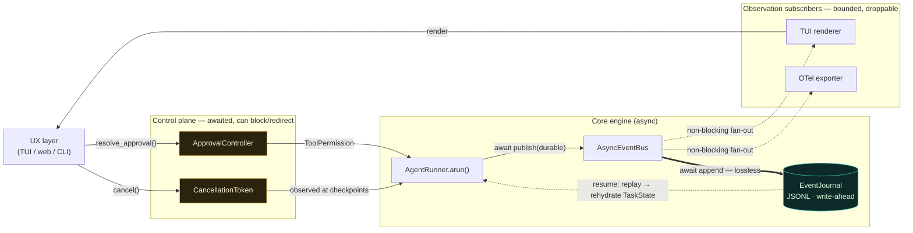
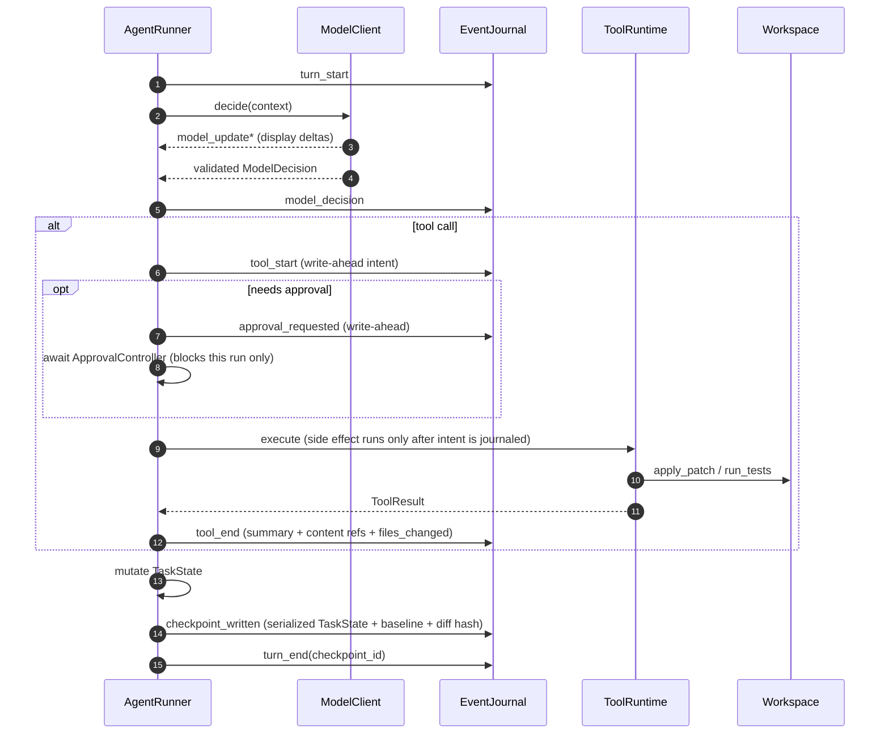
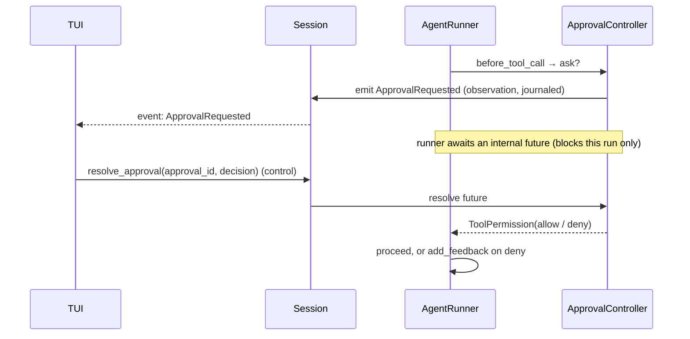
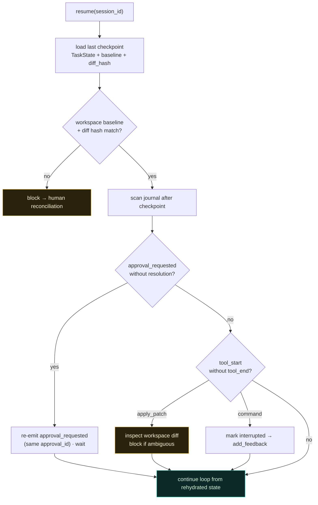

# ADR 0001 — Async lifecycle event bus, two-plane UX integration, and durable execution

- **Status:** Proposed
- **Date:** 2026-06-09
- **Deciders:** Sarthak Joshi
- **Consulted:** Claude (claude-opus-4-8) — design; Codex (gpt-5.4, xhigh) — adversarial refinement
- **Related:** `HARNESS_DESIGN.md` §13 (observation vs control), §23 (interaction layer)

## Context

The non-interactive engine is built through Phase 2.5 and is cleanly decoupled, but three properties block the planned interactive cockpit (TUI) and the committed next frontier, **durable execution**:

1. **The engine is fully synchronous.** `AgentRunner.run()` (`runner.py`) is a blocking `while` loop; `model_client.decide()` and `ws.run()` block for seconds. A TUI's event loop must animate spinners, tick timers, and handle keystrokes (ESC to interrupt) *during* those blocks — impossible on a single thread with a sync loop.
2. **Events are coarse and untyped.** `Emitter.emit()` (`events.py`) fans raw `dict`s to subscribers synchronously; only `tool_execution_end` exists (no `*_start`/`*_update`); `state.phase` is never advanced or emitted; `CancellationToken` (`deps.py`) is a bool nothing consumes. A rich, phase-aware UI needs typed, fine-grained events.
3. **There is no resumability.** The JSONL `EventLog` is an append-only journal, but a run cannot pause, resume, or survive a crash — the conspicuous miss against [12-Factor Agents](https://www.humanlayer.dev/blog/12-factor-agents) (Factor 6) and the 2026 durable-execution frontier (Temporal, Restate, DBOS, LangGraph checkpointers).

These are one problem: the harness must **publish typed lifecycle events asynchronously** so any UX layer can subscribe for realtime updates, **without** letting observation block the loop, and the same event stream must double as the **write-ahead substrate** for durable, resumable execution.

> **Scope line (decided):** the committed frontier ends at durable execution. MCP interop, a middleware pipeline, and graph/declarative topology are deliberately deferred and out of scope for this ADR.

## Decision

1. **The engine becomes natively async.** `AgentRunner.arun()` is the loop; a thin sync `run()` wraps it via `asyncio.run()`. Legacy synchronous model/tool bodies are temporarily offloaded with `asyncio.to_thread()` behind async adapters. A worker-thread bridge around a sync core is **rejected** as the primary model (acceptable only as a transient shim).
2. **Events become a typed, versioned, discriminated union** (pydantic), replacing raw dicts — with `*_start`/`*_update`/`*_end` granularity for the model and tools, plus `phase_changed`, approval, checkpoint, and cancellation events.
3. **An `AsyncEventBus` fans out non-blocking to independent subscribers** (TUI, OTel) via **bounded per-subscriber queues with explicit drop policies**; a slow or broken subscriber can never stall the loop or the other subscribers. Observation stays fire-and-forget — *"async publishing" must never mean "await every subscriber."*
4. **The journal is privileged, not just another subscriber.** It is a **lossless, awaited, write-ahead sink on the engine's commit path** — the durable-execution substrate. App subscribers are optional; the journal is part of the engine.
5. **The two planes stay hard-separated.** Observation flows *out* via `session.events()` (cannot block/redirect). Control flows *in* via explicit awaited methods — `session.resolve_approval()`, `session.cancel()` — and the async `before_tool_call` hook. An event may *announce* that approval is needed; the decision returns through the control method, never through the event stream. A `drive()` generator that returns control values is **rejected** for blurring the planes.
6. **Model output streams for display only.** Adapters emit `model_update(delta, channel="display")`; the action is dispatched exactly once, after a full validated `ModelDecision`. No private chain-of-thought is streamed; deltas never affect state or control.
7. **Durable execution via semantics-aware replay.** Checkpoint at turn end, write-ahead intent before any side effect, and resume by replaying the journal into `TaskState` — **never re-executing side effects** (reuse logged reads; never re-apply a patch; resume into a pending approval). Per the 2026 *Crab* result, checkpoint/restore must be semantics-aware, not a blind snapshot or replay.

## Architecture



Legend: **solid** = engine commit path (awaited, lossless) · **dotted** = non-blocking observation / replay · the **journal** (teal) is part of the engine, the **control plane** (amber) is the only path that can block or redirect the loop.

## Per-turn flow (write-ahead + checkpoint)

Every side effect is preceded by a journaled **intent**, so a crash mid-side-effect is recoverable. The checkpoint at turn end is the resume anchor.



## Two-plane separation (the approval round-trip)

The crux: the event **announces** the need; the **decision returns through a control method**, not the event. This preserves the §13 invariant that an observer can never veto execution.



## Durable resume (semantics-aware replay)

Resume loads the last checkpoint, validates the workspace matches, then reconciles any work that started after the checkpoint **by tool semantics** — never by blind re-execution.



Replay rules for steps already in the journal:

| Logged step | On resume |
| --- | --- |
| `read_file` / `search_repo` / `list_files` | **reuse** the logged `ToolResult`; do not re-run |
| `apply_patch` (completed) | **do not re-apply**; validate the workspace diff hash against the checkpoint; block if mismatched |
| `run_tests` / verifier command (completed) | keep as **historical** evidence; rerun only if the resumed control point asks for fresh verification |
| `tool_start` without `tool_end` (interrupted) | reconcile by kind — `apply_patch`: inspect diff, block if ambiguous; command: mark interrupted, `add_feedback` |
| `approval_requested` without `approval_resolved` | resume **into** the pending approval; re-emit with the same `approval_id` and wait |

## Key types (sketch)

```python
# events.py — typed, versioned, discriminated union
class EventBase(BaseModel):
    schema_version: Literal[1] = 1
    event_id: int                 # global total order, assigned by the bus
    session_id: str
    task_id: str | None = None
    turn: int | None = None
    ts: datetime
    type: str

class PhaseChanged(EventBase):  type: Literal["phase_changed"]; old: str; new: str
class ModelUpdate(EventBase):   type: Literal["model_update"]; delta: str; channel: Literal["display"]
class ToolStart(EventBase):     type: Literal["tool_start"]; call_id: str; tool: str; input: dict
class ToolEnd(EventBase):       type: Literal["tool_end"]; call_id: str; success: bool; summary: str
class ApprovalRequested(EventBase): type: Literal["approval_requested"]; approval_id: str; tool: str; reason: str; input: dict
class CheckpointWritten(EventBase): type: Literal["checkpoint_written"]; checkpoint_id: str
# … agent_start/end, turn_start/end, model_start/end, model_decision, model_error,
#    approval_resolved, tool_update, verification_start/end, resume_started,
#    cancellation_requested/observed

HarnessEvent = Annotated[AgentStart | AgentEnd | TurnStart | TurnEnd | PhaseChanged
    | ModelStart | ModelUpdate | ModelEnd | ModelDecisionEvent | ModelError
    | ApprovalRequested | ApprovalResolved | ToolStart | ToolUpdate | ToolEnd
    | VerificationStart | VerificationEnd | CheckpointWritten | ResumeStarted
    | CancellationRequested | CancellationObserved,
    Field(discriminator="type")]

# the bus: non-blocking fan-out + one lossless journal
class EventJournal(Protocol):
    async def append(self, event: HarnessEvent) -> None: ...        # lossless, awaited
    async def append_checkpoint(self, cp: "StateCheckpoint") -> str: ...

class EventSubscriber(Protocol):
    async def handle(self, event: HarnessEvent) -> None: ...        # bounded queue feeds this

class AsyncEventBus:
    async def publish(self, draft: EventDraft, *, durable: bool = True) -> HarnessEvent: ...
    def subscribe(self, name: str, *, max_queue: int, policy: DropPolicy) -> "EventSubscription": ...

# durable checkpoint
class StateCheckpoint(BaseModel):
    checkpoint_id: str
    event_id: int
    state: TaskState
    workspace_baseline: str       # pinned HEAD
    workspace_diff_hash: str      # detect drift since checkpoint
    pending_approval_id: str | None = None

# deps.py — async cancellation, actually consumed by the loop
class CancellationToken:
    def __init__(self) -> None: self._event = asyncio.Event()
    def cancel(self) -> None: self._event.set()
    @property
    def cancelled(self) -> bool: return self._event.is_set()
    async def checkpoint(self, where: str) -> None: ...   # observe at safe points

# model adapter — streams display deltas, returns one validated decision
class AsyncModelClient(Protocol):
    async def decide(self, context: ContextPacket, events: "ModelEventSink") -> ModelDecision: ...
```

### Backpressure & ordering

- **Global order** is `event_id`, assigned by the bus; the journal receives every durable event in order. Each subscriber receives its events in order; gaps (from drops) are visible as `event_id` skips.
- **Journal:** lossless and awaited. If it can't write, durable execution is unavailable → fail or pause the run (it is not a "subscriber failure").
- **TUI:** bounded queue; never drop lifecycle/control events; coalesce or drop `model_update`/`tool_update` under pressure.
- **OTel:** bounded queue; drop oldest low-priority updates; never block the runner.
- **Broken subscriber:** its task is cancelled/marked failed; it can never veto or crash the loop.

## TUI subscription surface

```python
async with harness.session(goal) as session:
    task = asyncio.create_task(session.run(task_kind="edit"))
    async for event in session.events():                 # OBSERVATION
        tui.render(event)
        if isinstance(event, ApprovalRequested):         # CONTROL — explicit, awaited
            await session.resolve_approval(event.approval_id, await tui.ask(event))
        if isinstance(event, AgentEnd):
            break
    artifact = await task

# ESC handler, separate from the event stream:
await session.cancel("user pressed ctrl-c")              # token → add_feedback
```

## Consequences

**Positive**
- One async core serves the TUI, web/server cockpits, and concurrent multi-session hosting — the "concurrency" gap that is costly to retrofit late is paid once.
- Rich, phase-aware realtime UI falls out of typed `*_start`/`*_update`/`*_end` events + `phase_changed`.
- Durable execution reuses the journal + `TaskState`-as-truth already in place; pause/resume and crash-recovery become first-class. Human-in-the-loop approvals survive a restart.
- The two-plane discipline (§13) is preserved and made explicit in the API, not just the internals.

**Negative / costs**
- `async` colors the stack: `ModelClient.decide`, tool handlers, `ws.run`, the verifier, and the permission hook all gain async signatures. Migration via `asyncio.to_thread` adapters is interim debt to pay down.
- Write-ahead journaling adds an awaited I/O on the commit path; the journal becomes correctness-critical (its failure pauses the run).
- Semantics-aware replay is real logic to build and test per tool kind — not a free snapshot.

**Risks / mitigations**
- *Replay correctness* (the highest risk): mitigate with the explicit per-kind rules above, the workspace diff-hash guard, and a "block → human reconciliation" fallback whenever ambiguous. Never re-run a side effect to "catch up."
- *Phase must become real*: durable/UX value depends on the runner actually advancing `state.phase` and emitting `phase_changed` (today it never does). That enforcement is a prerequisite.
- *Tool-failure isolation* (already an open finding): the async `ToolRuntime` must wrap handlers so a raising tool yields a failed `ToolResult`, not an unwound loop.

## Alternatives considered

1. **Sync engine + worker thread + thread-safe UI bridge.** Rejected as the primary model: it keeps the engine sync (no async web/server story), complicates the bidirectional control round-trip, and doesn't advance durable execution. Acceptable only as a transient shim around still-sync model/tool bodies.
2. **`drive()` async generator that interleaves observation and control return values.** Rejected: it tempts UX code into the control path and blurs the two planes. `events()` + explicit control methods keeps the boundary crisp.
3. **Keep raw-dict events.** Rejected: a realtime renderer needs an exhaustively matchable typed union; raw dicts rot and can't carry a schema version for the journal.
4. **`EventLog` stays "just a subscriber."** Rejected once durable execution is in scope: the journal is the write-ahead commit substrate, with different delivery guarantees (lossless/awaited) than observation subscribers.

## Migration plan (incremental, behind the sync wrapper)

1. Introduce typed `HarnessEvent` models; keep `Emitter` emitting them; `EventLog` writes typed events verbatim. (No behavior change.)
2. Add `AgentRunner.arun()`; make `run()` delegate via `asyncio.run()`; wrap today's sync model/tool/verifier in `to_thread` adapters.
3. Stand up `AsyncEventBus` + `JsonlEventJournal` (lossless) + bounded subscribers; route the runner's emissions through `await bus.publish(...)`.
4. Make `CancellationToken` async-consumed; advance `state.phase` and emit `phase_changed`; add `*_start`/`*_update`/`*_end` granularity; wrap tool handlers for failure isolation.
5. Add per-turn checkpoints + write-ahead intents; implement `resume()` with semantics-aware replay.
6. Build the TUI against `session.events()` + control methods.

## References

- `HARNESS_DESIGN.md` §13 (observation vs control planes), §18 (`asyncio.wait(FIRST_COMPLETED)` cancellation race to reuse), §23 (interaction layer)
- [12-Factor Agents — HumanLayer](https://www.humanlayer.dev/blog/12-factor-agents) (Factor 6: launch/pause/resume; Factor 8: own your control flow)
- Durable execution landscape: Temporal, Restate, DBOS, Inngest; LangGraph checkpointer model; the 2026 *Crab* result on semantics-aware checkpoint/restore for agents
