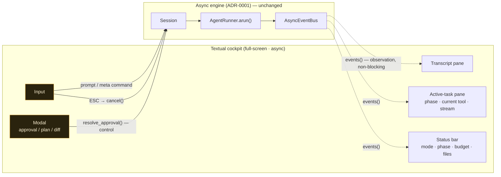
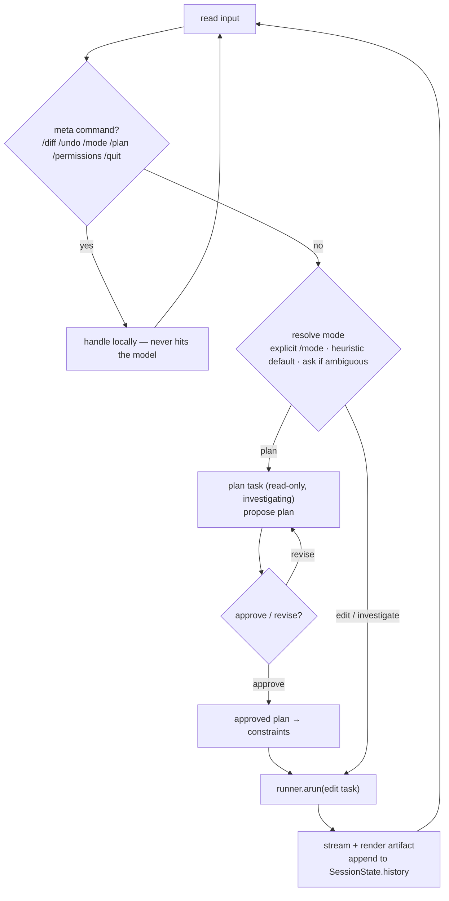
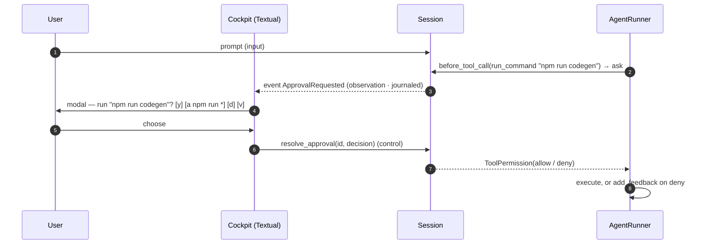

# ADR 0002 — Interactive TUI cockpit and the MVP coding-agent feature set

- **Status:** Accepted — implemented 2026-06-09 (Phase 3 MVP cockpit complete through 3.2e: Textual cockpit + modals, `run_command`, visible/correctable modes, plan mode, conversational-verification authority, CLI launch). D3's mode heuristic was later revised to LLM classification (`DECISIONS.md` 2026-06-10, PR #33 — the objection was hiddenness, not LLM-ness). Closed 2026-06-11.
- **Date:** 2026-06-09
- **Deciders:** Sarthak Joshi
- **Consulted:** Claude (claude-opus-4-8) — design; Codex (gpt-5.5, xhigh) — SOTA cross-validation against shipping coding-agent CLIs (Claude Code, OpenAI Codex CLI, Aider, Gemini CLI, Cursor CLI, OpenCode)
- **Related:** ADR-0001 (async event bus · two-plane UX · durable execution) · `HARNESS_DESIGN.md` §23 (interaction layer), §2 (MVP scope — **this ADR scopes a revision**, see Decision 4), §10/§11 (tools & permission tiers), §12 (verification contract)

## Context

The engine is, today, a **batch task executor**: `Harness.run(task) → TaskState`. The product goal is a **conversational coding agent** — something you talk to in a terminal, that reads, edits, runs, and verifies, with a human in the loop. Two layers already pre-stage that:

- **ADR-0001** decided the async two-plane substrate the UI consumes: `session.events()` (observation, out) · `session.resolve_approval()` / `session.cancel()` (control, in) · a typed async event bus · display-only model streaming · durable replay.
- **`HARNESS_DESIGN.md` §23** sketched the interaction layer: a `SessionState` *above* `TaskState`, a REPL wrapping the task loop, the three UX surfaces each mapped to an *existing* mechanism (stream = event subscriber · approval = `before_tool_call` hook · interrupt = cancel token + `add_feedback`), meta commands, and conversational-mode verification (runs + reports, human is terminal authority).

What remains **undecided** — and is this ADR's job — are three questions that shape the build:

1. **What is the MVP *coding-agent* feature set?** Not "the interaction-layer cut" (§23.6 lists that) but the product-level table-stakes that make this a coding agent rather than a safe-patch demo.
2. **Which TUI framework and render model?**
3. **How does a free-form prompt become a task?** (The conspicuous gap: today only `investigate` is wired from intake; the edit loop is built but unreachable from a natural-language prompt.)

The feature set was **cross-validated by Codex (gpt-5.5)** against the conventions of six shipping coding-agent CLIs. Its material corrections are folded into the decisions below and itemized in [SOTA cross-validation](#sota-cross-validation).

> **Scope line:** this ADR covers the interactive MVP. Durable crash-resume wiring (the mechanism exists per ADR-0001, but the TUI need not surface it yet), multi-session hosting, a web cockpit, and MCP stay deferred.

## Decision

### 1. The MVP coding-agent feature set

The table-stakes set to *be* a coding agent, each mapped to the mechanism it rides on. "Built" = exists today; "wire" = exists but not reachable interactively; "new" = net-new for this phase.

| # | Capability | Built on | Status |
| --- | --- | --- | --- |
| **A** | **Conversational REPL session** — `SessionState` above `TaskState`; history carried across tasks | §23.1–23.2 (new `SessionState`) | new |
| **B** | **Visible, correctable modes + heuristic intake routing** → seeds `task_kind` / verification contract | `task_kind` (§7) + mode surface | new |
| **C** | **Autonomous repo grounding** — `read_file` / `search_repo` / `list_files` | read tools (§10) | built |
| **D** | **Edit-as-diff with human approval** — `apply_patch` behind the approval gate, diff preview | `apply_patch` (§10) + `before_tool_call` (§11) | wire + UI |
| **E** | **`run_command`** — model-chosen command, tier-3, approval-gated, prefix-scoped allow | `Workspace.run` (built) + tier-3 `ask` | new tool |
| **F** | **Verify-and-report** — conversational mode reports, human is terminal authority; `--auto` restores the strict gate | `Verifier` (§12) + §23.5 | wire |
| **G** | **Interrupt & steer** — ESC → cancel → `add_feedback` (feedback, not a new task) | `CancellationToken` (async, ADR-0001) + `add_feedback` | wire |
| **H** | **Live, phase-aware streaming render** — `*_start`/`*_update`/`*_end`, `phase_changed`, display deltas | async event bus (ADR-0001) | consume |
| **I** | **Plan mode** — read-only plan → approve/revise → approved plan seeds the edit task | `investigating → editing` phase gate | new |
| **J** | **Visibility & meta commands** — `/diff` `/undo` `/state` `/quit` `/help` `/mode` `/plan` `/permissions`; minimal `@path` grounding | §23.4 + `git_diff` / undo | new/wire |

**Deferred from the MVP:** durable crash-resume *wiring* (mechanism stays per ADR-0001), multi-session, web UI, MCP, persisted "always allow" across sessions, `/model` switching, image input, full input autocomplete, a `--auto` command allowlist (`AVATAR_AUTO_ALLOW_COMMANDS`).

### 2. Framework — Textual, full-screen cockpit

The render/input layer is **Textual**, run as a **full-screen (alt-screen) multi-pane cockpit**. A transcript-style Rich + prompt_toolkit MVP and a full general shell are **rejected** (see [Alternatives](#alternatives-considered)).

The decisive factors are specific to *this* repo, not generic:

- **Impedance match with the async core.** ADR-0001 made the engine `arun()` + an async event bus. Textual is asyncio-native — subscribing `session.events()` to widgets via workers + `post_message` is the idiom. The transcript alternative would force hand-rolling the input/render/running-task concurrency, which is *exactly* the risk class Codex flagged (stdout ownership, SIGINT, `Live`-vs-prompt terminal contention). Textual deletes that class by owning the loop and the screen.
- **The MVP has three interactive surfaces** — plan review (I), `run_command`/`apply_patch` approval (D/E), and a scrollable diff viewer (J). That is a widget/focus/modal problem (`ModalScreen`, key bindings), Textual's core competency.
- **The destination is a cockpit.** Starting in Textual avoids building the UI twice; Codex's "a later cockpit still needs a new view layer" argues *for* starting here, not for a throwaway transcript.
- **Testability suits the TDD protocol.** Textual ships `App.run_test()` + `Pilot` keypress simulation + snapshot tests — a better test story than ad-hoc transcript assertions.

The two classic objections both have answers: **scrollback** (alt-screen loses native terminal scrollback) → scroll *within* the app + dump a plain transcript on exit; **"TUI testing is hard"** → inverted here by `Pilot`/snapshot.

### 3. Intake — visible, correctable modes, not a hidden classifier

A free-form prompt is routed to a `task_kind` (and thus a verification contract + tool exposure) by a **heuristic default that is shown and overridable** — never a hidden per-prompt model classifier. Shipping agents expose *visible modes* and let the unified agent loop decide concrete actions; they do not silently classify. So:

- A lightweight heuristic picks an initial mode (`investigate` / `edit`); the status bar shows it; `/mode edit`, `/mode ask`, `/plan` override it.
- Ambiguous intent **asks** rather than guessing ("Treat as an edit or just explain?").
- Classification only chooses the *initial contract*; it never silently traps "fix this" in `investigate` or "explain this" in `edit`.

This closes the intake gap (today's hardcoded `investigate`) without a brittle classifier dependency.

### 4. `run_command` — constrained, tier-3, approval-gated (a scoped revision of §2)

§2 cut "a general `run_shell` tool in v1." Real coding agents all run arbitrary project commands (`make`, `npm`, codegen, migrations, custom test targets); without that, the agent stalls on any repo whose verification isn't a single configured `pytest`. We add a **single constrained `run_command` tool** that honors §2's *spirit* (no always-on raw shell) while relaxing its *letter*:

- **Reuses existing plumbing.** It runs through `Workspace.run` — `shlex.split` (no shell metacharacters: no pipes, `&&`, `$(...)`, redirection, globbing), cwd-pinned to the workspace root, timeout-bounded, logged to the command ledger + journal.
- **Tier 3 ⇒ default-blocked, `ask` in the REPL.** Per `permission.py`, tier ≥ 3 returns `ask=True`: batch/non-interactive runs stay **blocked** (no behavior change), and the REPL surfaces an approval prompt. The **human at the prompt is the backstop** — necessary because a command is *opaque to the path denylist* (which only inspects declared paths), so it is strictly more powerful than `apply_patch`.
- **Prefix-scoped session allow.** `[a] always` is scoped to a **command prefix** (e.g. `npm run *`) for the session, never global, never tier-4.
- **Compound work = separate approvals.** No `shell=True`, so multi-step work is issued as distinct commands, each approved once — cleaner UX, smaller blast radius.
- **Invariant #3 preserved.** `run_command` is the *model's* evidence tool; the **verifier still runs its own trusted command and owns `outcome`**. A model running `make test` is data, never self-certification.

### 5. Plan mode

A read-only **plan** surface: the agent proposes a plan (using only read tools), the user **approves or revises**, and the **approved plan seeds the edit task as constraints**. It maps onto the existing phase gate — planning is `investigating` (read-only, mutation blocked at the gate), approval is the transition into `editing`. No new control plane; it's the phase model plus a confirmation step.

### 6. Approval UX & scoped always-allow

The approval prompt renders the proposed call and offers `[y] allow once` · `[a] always (scoped)` · `[d] deny` · `[v] view (diff/command)`. `[a]` writes a **tightly-scoped** session override — keyed by **tool class + path root/glob (for patches) or command prefix (for commands) + permission tier** — never a bare "always allow `apply_patch`," and **tier-4 / irreversible / external is never promotable**. Deny feeds back to the model as `add_feedback`.

### 7. Conversational verification authority (§23.5)

Verification **always runs and always reports** — its evidence is rendered. *Who decides on the result* shifts with who's in the loop: in **conversational** mode the human is terminal authority (a failed check renders as "not verified / failed check," it does **not** block the reply); in **`--auto`** mode the strict §12 verifier gate sets `outcome` and the human is not consulted. `task_kind` still selects *which* checks run.

### 8. Two-plane consumption (from ADR-0001)

The cockpit is an **observation subscriber + control caller**, never inside the loop. It renders from `session.events()` and acts only through `resolve_approval()` / `cancel()` and the input prompt. An event may *announce* that approval is needed; the decision returns through the control method, never through the event stream (§13).

## Architecture — the cockpit over the two planes



Legend: **dotted** = observation fan-out (cannot block/redirect) · **amber** = the only paths that flow control *into* the engine. The engine is unchanged from ADR-0001; the cockpit is purely a subscriber + control caller.

## Cockpit layout (full-screen)

```text
┌─ avatar ─────────────────────────────── mode: edit · phase: editing ─┐
│ Transcript                                                            │
│  you ▸ make the auth test pass                                        │
│  ◆ investigating … read auth/session.py, search "expired"            │
│  ◆ editing … apply_patch auth/session.py (+12 −3)                     │
│                                                                       │
├─ Active task ────────────────────────────────────────────────────────┤
│  ▸ run_command: pytest tests/auth -k expired      (streaming…)       │
├───────────────────────────────────────────────────────────────────────┤
│  phase ▰▰▰▱ verifying   budget 6/25 iters   files +1   ⏎ to send      │
└─ › ───────────────────────────────────────────────────────────────────┘

  ┌─ approve ────────────────────────────────────────────────┐
  │ run_command wants to run:  pytest tests/auth -k expired   │
  │ [y] once   [a] always `pytest *`   [d] deny   [v] view    │
  └───────────────────────────────────────────────────────────┘
```

## REPL · mode · plan flow



## Approval round-trip in the cockpit

The crux (§13): the event *announces* the need; the decision returns through a *control* method, so an observer can never veto execution.



## Key types (sketch)

```python
# session.py — the scope above TaskState (§23.1)
class Turn(BaseModel):
    role: Literal["user", "agent"]
    text: str
    task_id: str | None = None

Mode = Literal["investigate", "edit", "plan", "auto"]

class SessionState(BaseModel):
    session_id: str
    workspace_root: str
    mode: Mode = "investigate"               # visible, correctable — Decision 3
    history: list[Turn] = []                 # carried across tasks
    tasks: list[TaskState] = []
    approval_grants: list[ApprovalGrant] = []  # scoped, session-lived — Decision 6

class ApprovalGrant(BaseModel):              # what "[a] always" writes — never global
    tool: str                                # exact tool class
    tier: int
    path_glob: str | None = None             # for apply_patch
    command_prefix: str | None = None        # for run_command, e.g. "npm run"

# tools/commands.py — Decision 4 (reuses Workspace.run; tier 3 ⇒ ask)
class RunCommandInput(BaseModel):
    command: str
run_command = ToolDefinition(
    name="run_command",
    description="Run a project command (build/test/codegen/...). Approval-gated.",
    input_model=RunCommandInput,
    handler=_run_command,                    # calls deps.workspace.run(args.command, timeout=...)
    phases=frozenset({"editing", "verifying"}),
    permission_tier=3,                       # default-blocked in batch; ask in the REPL
)

# the cockpit consumes the ADR-0001 surface — observation + control, never in the loop
async with harness.session(workspace) as session:
    cockpit.bind(session)                    # subscribes session.events() → widgets
    # input → session.submit(text) ; ESC → session.cancel() ;
    # modal → session.resolve_approval(id, decision)
```

## SOTA cross-validation

Codex (gpt-5.5, xhigh) validated the spine and corrected five things; all folded in above.

| Codex finding | Verdict | Where |
| --- | --- | --- |
| **Running arbitrary commands is table-stakes** (all six CLIs); `run_tests`/`run_linter` alone is "safe-patch harness," not coding-agent parity | **adopted, constrained** | Decision 4 (`run_command`, tier-3, gated) |
| **Plan/review surface is now table-stakes** (Claude Code plan mode, Aider architect, Gemini plan mode) | **adopted** | Decision 5 (plan mode) |
| **Don't run a hidden per-prompt classifier** — shipping agents use *visible modes* + a unified loop | **adopted** | Decision 3 (visible modes) |
| **Minimal `@path` grounding** into MVP (Codex/OpenCode/Cursor/Aider) | **adopted** | Feature J |
| **Scope "always allow" tightly** — tool class + path/command prefix + tier, never global | **adopted** | Decision 6 |
| Transcript (Rich+ptk) is fine *for a generic Python MVP*; mature products go full-TUI (Codex=ratatui, OpenCode=Bubble Tea, Cursor `--fullscreen`) | **diverged toward full-TUI now** — the async core + cockpit goal make Textual the lower-regret start here | Decision 2 |
| Human-is-terminal-authority in conversational mode is correct; strict gate belongs in `--auto` | **confirmed** | Decision 7 |

## Consequences

**Positive**
- A real coding agent: talk to it, it reads/edits/runs/verifies with a human in the loop — closing the intake gap (today's hardcoded `investigate`).
- The cockpit is a pure ADR-0001 consumer; the engine is untouched, the two-plane discipline is explicit in the UI boundary.
- Textual's async model matches the event bus; the whole hand-rolled-concurrency risk class is avoided, and the test story (`Pilot`/snapshot) fits TDD.
- `run_command` earns command parity without an always-on shell; the tier-3/ask gate keeps batch runs unchanged and secure-by-default.

**Negative / costs**
- Textual is a heavier dependency and mental model (CSS, widgets, screens, reactivity) than a transcript loop, and more upfront scaffolding before the first working REPL.
- Full-screen surrenders native terminal scrollback (mitigated: scroll-in-app + transcript-on-exit).
- `run_command` is opaque to the path denylist; its safety rests on the human approval gate, not a static check — a real widening of trust that must be surfaced honestly in the approval UI.
- §2 is revised (scoped), not merely followed — recorded in `DECISIONS.md`.

**Risks / mitigations**
- *Approval fatigue* (every command prompts): mitigate with prefix-scoped `[a]` grants; keep a `--auto` allowlist as a deferred escape hatch.
- *Mode mis-routing* traps a task in the wrong contract: mitigate by making mode visible and correctable, and asking on ambiguity (Decision 3).
- *Terminal restoration / signal handling*: largely Textual's responsibility (a reason to prefer it over hand-rolled transcript), but still covered by `Pilot` tests for ESC/quit/resize.

## Alternatives considered

1. **Transcript MVP — Rich + prompt_toolkit (Aider's stack).** Rejected as the start *for this repo*: with an async core it forces hand-rolled input/render/task concurrency (Codex's risk list), gives no native widget/modal system for the three interactive surfaces, and would be rebuilt in Textual later. It remains the right call for a *sync-core* generic agent — it isn't ours.
2. **Textual inline mode (`inline=True`).** A genuine contender — async-native *and* scrollback-preserving. Rejected for the MVP because the cockpit's identity is the multi-pane realtime view, which wants the full screen; inline stays available as a future compact mode.
3. **Hold the line — no command tool (tests/lint only).** Rejected: honest but stalls on any repo whose build/verify isn't one configured `pytest`; below coding-agent parity.
4. **Full general shell (`shell=True`, tier-2 auto-allow).** Rejected: metacharacter-injection surface, auto-runs without asking, furthest from the typed/reversible ethos. The constrained tier-3 tool gets the capability at a fraction of the blast radius.
5. **Hidden cheap-model intent classifier per prompt.** Rejected per Codex: shipping agents use visible modes; a hidden classifier silently mis-routes and adds a latency/cost dependency.

## Build plan (incremental — becomes the Phase 3 interaction sub-phases)

Tests are proposed per the standing TDD protocol; **maintainer sign-off precedes any production code.**

1. **`SessionState` + REPL skeleton** (no TUI): submit → `arun` → render artifact text → history. Closes the intake gap with visible modes + heuristic routing (Decision 3).
2. **`run_command` tool** (Decision 4): tier-3, `Workspace.run`, default-blocked in batch — proven by gate/permission tests before any UI.
3. **Textual cockpit shell**: panes + status bar + input; subscribe `session.events()` → widgets; ESC → `cancel()`. `Pilot` tests for submit/stream/quit/resize.
4. **Approval modal + scoped grants** (Decision 6) and **diff/plan modals**; `resolve_approval()` round-trip.
5. **Plan mode** (Decision 5): read-only plan → approve/revise → seed constraints.
6. **Conversational verification authority** (Decision 7) + meta commands + minimal `@path` (Feature J).

## References

- ADR-0001 (`docs/adr/0001-async-event-bus-and-durable-execution.md`) — the async two-plane substrate this cockpit consumes
- `HARNESS_DESIGN.md` §23 (interaction layer), §2 (MVP scope — revised here), §10/§11 (tools & permission tiers), §12 (verification contract), §13 (observation vs control)
- Shipping coding-agent CLIs surveyed via Codex: Claude Code (plan/permission modes), OpenAI Codex CLI (`ratatui` TUI, `@` file targeting), Aider (`prompt_toolkit`+`rich`; `code`/`ask`/`architect` modes; `/run`,`/test`), Gemini CLI (Ink; plan mode; shell), Cursor CLI (`@` context; `--fullscreen`), OpenCode (Bubble Tea TUI)
- [Textual](https://textual.textualize.io/) — async app model, `ModalScreen`, `App.run_test()` + `Pilot`, inline mode
