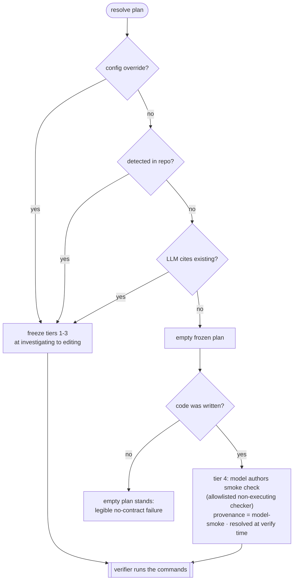
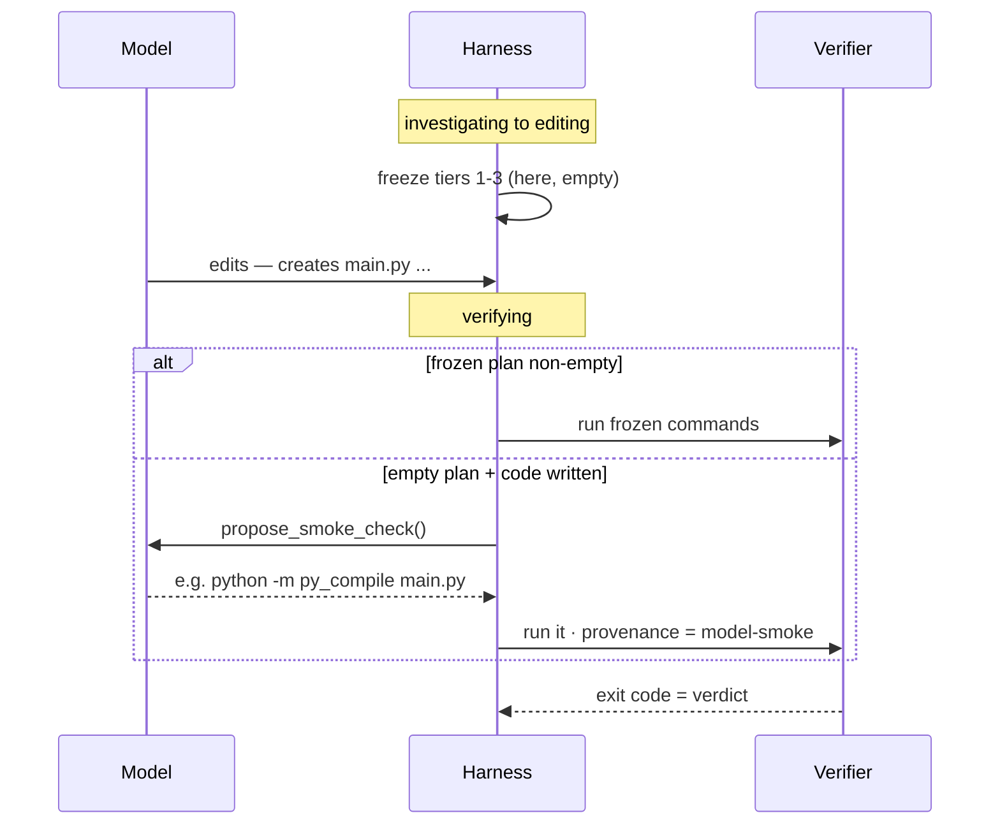

# ADR 0014 — Greenfield self-authored verification (the no-contract floor)

- **Status:** Accepted — implemented 2026-06-14
- **Date:** 2026-06-14
- **Deciders:** Sarthak Joshi
- **Consulted:** Claude (claude-opus-4-8) — 2026-06-14, prompted by a `jo-cli` dogfood run: *"Write an openai api compatible chatbot in python"* in an empty dir wrote `main.py` + `requirements.txt`, then `verification_end passed:false` — *"no verification contract discovered."* The greenfield case [ADR-0007](0007-dynamic-verification-plan-resolution.md) left open.
- **Supersedes:** the greenfield / no-contract **disposition** of ADR-0007 ("deliberately not invented → freeze an empty plan → fail legibly"). ADR-0007's tiers 1–3, freeze-before-editing, pure-executor verifier, and override tier stand.
- **Related:** `HARNESS_DESIGN.md` §5 (no self-certification), §12 (verification contracts); ADR-0008 (non-executable edits — the sibling no-command case); ADR-0011 (verifier integrity — this tier widens that threat model).

## Context

ADR-0007 resolves a per-session verification plan from the repo's *own* declared contract (CI / manifests / Makefile), with a config override above and a citation-only LLM proposal below. It left one case open: a **greenfield repo declares nothing** — nothing to detect, nothing to cite — so the plan freezes empty and verification fails. That makes the most common first interaction ("write me an app in an empty dir") look broken, and `jo-cli` is meant to work out of the box.

ADR-0007 was right to refuse the obvious fix: a model that **authors its own rubric** sets the bar where it clears it (`lint_command="true"`). The narrower question it didn't answer: *can the model produce a real signal for greenfield without self-certifying?* Two constraints fix the answer's shape:

- **No ecosystem overfit** — a Python `compileall` floor bakes one toolchain into a language-agnostic core. Only the model knows the stack it just built.
- **Out of the box** — requiring `AVATAR_TEST_COMMAND` before the first greenfield run fails the product bar.

## Decision (proposed)

Add a fourth, lowest-precedence tier: **the model authors a smoke check; the harness runs it.** The whole ADR turns on one distinction:

| | who picks the check | who renders the verdict | §5 |
| --- | --- | --- | --- |
| **self-assert** (forbidden) | model | the model ("looks done") | the self-grading hole |
| **self-author + harness-run** (this ADR) | model | the **real exit code** | the model can't forge a process result |

Same propose-vs-judge split ADR-0007 already draws for its LLM tier — extended from *cite an existing command* to *author a new one*, because greenfield has nothing to cite.

A declared or detected contract always wins — a passing suite beats "it runs," and stacking a smoke check on a real one only adds noise. The floor exists only so that *no contract* stops meaning *no signal*.

### Late binding — the one architectural change

Tiers 1–3 freeze at the `investigating → editing` boundary. Tier 4 **can't**: the artifact it smoke-tests doesn't exist yet. So it resolves **at verification time**, against what the model actually built — the first and only tier that late-binds.

Mechanically: when the verifier is reached with an **empty** frozen plan and `files_modified` is non-empty, the harness makes one constrained tool call (the existing `_PROPOSE_TOOL` pattern — *offered*, not forced; the model may decline by making no call) for a single smoke command, validates it against the allowlist below, records the survivor as `PlannedCheck(kind="smoke", provenance="model-smoke")`, journals it (legacy emitter **and** typed `VerificationPlanFrozen`), and runs it. The verifier gains no judgment logic — only a new *source*. The live call is attempted at most once per run, so the repair loop never re-spends it.

### Bounding what the model may run (invariant #4)

This is the first tier where the **model authors the literal command**, and the verifier runs it via `Workspace.run` with verifier authority — *outside* the `before_tool_call` permission gate (invariant #4), and **unattended** under `--auto`. That has to be bounded, and the obvious bound does not work:

- `Workspace.run` is **argv-based** (`shlex.split` + `subprocess.run`, no `shell=True`), so shell chaining (`;`, `|`, `&&`, `$()`) is already blocked — **but that does not bound it.** `python -c "..."`, `node -e "..."`, `bash -c "..."` are each a *single argv*, so arbitrary execution hides behind an allowed program name. A denylist therefore cannot win.
- So the floor is an **allowlist** of *non-executing* checkers — programs that parse / compile / type-check without running the project's code — resolved after `effective_invocation` unwraps `python -m`/`npx`/`uv run`/`sudo`. A runner safe only in a check sub-mode carries the required token (`node --check`, `go vet`/`go build`, `tsc --noEmit`, `ruby -c`, `php -l`); args must stay inside the workspace (no absolute / `..` paths). Current set: `py_compile`, `compileall`, `ruff`, `gofmt`, `tsc`, `node`, `deno`, `go`, `ruby`, `perl`, `php`.
- **Deliberately excluded** — tools with a code-execution escape hatch: `pylint` (`--init-hook`), `mypy`/`pyright` (config-declared plugins), `eslint`/`biome` (repo-config plugins), `cargo` (build scripts / proc-macros run at *check* time). The "language-agnostic" claim is thus bounded to the common safe-checker set **by design**; an exotic stack with no allowlisted checker gets no floor (the legible no-contract failure stands).
- **Relationship to ADR-0007.** ADR-0007 already recorded *mid-run artifact tampering* as a model-influenceable-command risk (a frozen `make test` whose Makefile body the model rewrites mid-run). This tier is the **sharper, free-form version of the same threat** — the model authors the command text directly rather than the artifact behind it. The allowlist is the mitigation here; both share the family and the candidate follow-up (pin/fingerprint provenance, or route verification commands through an explicit policy/gate). Worth reading the two together, not only under "self-grading".

### `--auto` (decided)

Allowed in **both** modes; the weak `model-smoke` provenance is surfaced, not gated out.

- **Conversational** — the verdict is advisory anyway, so the floor just stops "no contract" from rendering as a failure.
- **`--auto`** — a self-authored check gating an autonomous run is a *bounded* weakening: bounded in *what runs* (the allowlist of non-executing checkers above) and in *authority* (lowest precedence, displaced by any real contract, journaled `model-smoke` provenance). "Greenfield can never pass autonomously" is worse. Surface, don't suppress.

### When the floor doesn't apply

Empty plan **and** nothing the allowlist can smoke-test (docs-only, non-code, a stack with no safe checker, or the model declines) → the empty plan **stands** and verification **fails legibly** (`no verification contract discovered — declare one via AVATAR_TEST_COMMAND / AVATAR_LINT_COMMAND`). This is the same deliberate no-contract outcome as before this ADR — the floor *adds* a positive-signal path for greenfield code, it does not soften the no-contract failure. (A later ADR-0008 may turn the non-executable-task case into a neutral "nothing to verify"; that is out of scope here.)

## Alternatives considered

| Option | Verdict |
| --- | --- |
| Keep ADR-0007's empty-plan-fails | Rejected — correct, but `jo-cli`'s first interaction looks broken. |
| Model self-asserts "done" | Rejected — pure self-grading, the §5 hole. The line this ADR won't cross. |
| Harness-authored `compileall` / `py_compile` floor | Rejected — deterministic, but overfits one ecosystem. |
| Default `AVATAR_PLANNER_MODEL` on | Rejected — tier 3 only *cites*; an empty dir has nothing to cite. |
| Freeze tier 4 up front like tiers 1–3 | Rejected — impossible; the artifact doesn't exist at the boundary. |

## Consequences

- Greenfield `edit` runs get a real positive signal out of the box; `jo-cli` stops reporting a from-scratch app as failed.
- The verifier stays a pure executor; new machinery is one verify-time resolver path + `kind="smoke"` / `provenance="model-smoke"`.
- **One tier now late-binds.** "Rubric fixed before editing" holds for tiers 1–3 only; readers of `TaskState` / the journal must know the plan can gain one `model-smoke` check *after* the edit phase.
- **Bounded self-grading (the cost, plainly).** The model picks *what* to smoke-test, so it can pick a check it knows passes (`py_compile` proves it parses, not that it's correct). Intended — it's a floor, not a gate. Bounded by: lowest precedence (any real contract displaces it), provenance-tagged for human + eval visibility, *executable* (unforgeable) rather than an assertion, and constrained to the **allowlist of non-executing checkers** (see "Bounding what the model may run"). Does **not** reopen §5 for non-greenfield repos.
- **Unattended execution is allowlist-bounded, not gate-bounded.** The floor runs a model-authored command outside `before_tool_call`; the allowlist (non-executing checkers, check-mode tokens, workspace-confined args) is what keeps that safe under `--auto`. An exotic stack with no allowlisted checker simply gets no floor. This is the sharper sibling of ADR-0007's mid-run-tampering risk and should be tracked with it.
- **ADR-0011 interaction.** A self-authored, late-bound check widens the self-improvement threat surface; ADR-0011's protected-oracle / held-out direction should treat `model-smoke` as untrusted signal. Cross-cutting follow-up, not solved here.
- **ADR-0007 risks inherited.** The floor shares the vacuous-check and mid-run-tampering shapes; same mitigations (provenance visibility; the ADR-0007 follow-up on pinning provenance artifacts). It adds a deliberately-soft tier whose softness is documented.
- **Eval (ADR-0004).** Scoring must distinguish `model-smoke` passes from declared-contract passes.

## Implementation notes (non-binding)

- `PlannedCheck.kind` gains `smoke`; `provenance="model-smoke"`. `TaskState` gains one sanctioned mutation that late-binds the floor **only over an empty frozen plan**, plus a `smoke_floor_attempted` flag so the live call happens at most once per run.
- Resolver `VerificationPlanner.propose_smoke_check(ws, files_modified)` reuses the `_PROPOSE_TOOL` pattern (a single *offered* tool call — the model may decline) on `config.model` (the main model — the floor must work with zero extra config). The proposal is validated against the allowlist; any endpoint failure degrades to "no floor", never blocks.
- Prompt the model toward **dependency-free** checks (parse / compile / `--check`, not `import` that needs an uninstalled dep) and toward the allowlisted checkers specifically — greenfield deps usually aren't installed, so an import-level check fails for the wrong reason. The model knowing the stack is what makes this language-agnostic *and* robust.
- Runner: in `_averify`, when the frozen plan is empty and `files_modified` is non-empty, resolve + journal the smoke check (legacy emitter **and** typed `VerificationPlanFrozen`) before `verifier.verify`. Tiers 1–3 freeze untouched.
- Verifier: a `smoke` check is positive signal (its `name` is already in the plan's positive set), with a `smoke`-specific repair hint; no other change.
- Trigger: now (active `jo-cli` blocker).
