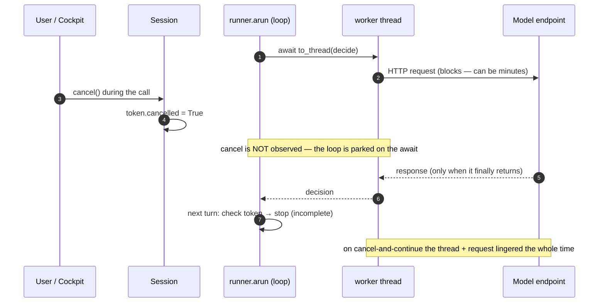
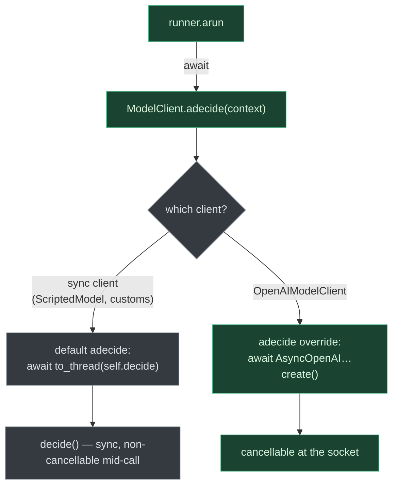
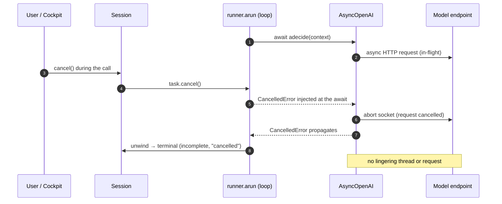

# ADR 0024 — Interruptible runs via an async model client

- **Status:** Accepted — core implemented 2026-06-17 (the `jo-cli` race + signal handlers remain a follow-up)
- **Date:** 2026-06-17
- **Deciders:** Sarthak Joshi
- **Related:** ADR-0001 (async event bus + durable execution — the concurrency foundation this builds on); ADR-0002 (the interactive cockpit, the first consumer that needs prompt interruption); `HARNESS_DESIGN.md` §5 (the runner loop), §23 (cockpit / cancellation); `avatar/deps.py` (`CancellationToken`), `avatar/session.py` (`Session.cancel`). **Supersedes** the *cooperative-only* cancellation model for the model call (the token check at the top of `runner.arun`); the token remains as a cheap turn-boundary fast-path, but is no longer the sole cancellation mechanism.

## Context

A run's loop spends almost all of its wall-clock inside the model call. Today that call is synchronous, dispatched off the event loop with a worker thread:

```python
# runner.arun — current
if self.deps.cancellation.cancelled:      # checked once, at the TOP of each turn
    ...stop...
decision = await asyncio.to_thread(self.model_client.decide, context)   # blocks here
```

Cancellation is therefore **cooperative and coarse**: `Session.cancel()` trips a `CancellationToken` that the loop only observes at the *next* turn boundary — i.e. *after* the current model call returns. Two problems follow:

1. **An in-flight model call cannot be interrupted.** Pressing Ctrl+C (or `Session.cancel()`) during a slow call does nothing until the call completes. With the OpenAI SDK's default timeout of 10 minutes, and a slow model (e.g. `qwen/qwen3-coder` over OpenRouter), the agent feels unkillable while busy. The cockpit currently papers over this with a two-stage Ctrl+C (second press force-quits the *app*), but the *run* still can't be cancelled cleanly.
2. **`asyncio.to_thread` cannot be force-cancelled.** Cancelling the awaiting task abandons the `await` but the worker thread keeps running the HTTP request until it returns or times out. So even a task-level race leaves a **lingering background request** (and its thread) on a *cancel-and-continue* — exactly the common case in a multi-turn REPL, where the user cancels one goal and types the next.

Today — the loop is parked on the threaded call; a cancel can't land until that call returns:



The reference cancellation design we want to match — the adjacent `cli-chat` app (ADR-001 there) — works precisely because its LLM call is **natively async** (`httpx.AsyncClient`): `Task.cancel()` injects `CancelledError` straight into the in-flight request and aborts the socket, with no thread to abandon. Avatar's `§18` reuse note already anticipates lifting that async streaming/tool-call reassembly. The blocker to clean interruption is structural: the model-call seam is sync-over-a-thread, not async.

## Decision

Make the **model call asynchronous and cancellable**, so cancelling the run task aborts an in-flight request at the socket — and keep every existing sync `ModelClient` working unchanged.

1. **Add an async seam to `ModelClient`.** Introduce `async def adecide(self, context) -> ModelDecision` on the ABC with a **default implementation that wraps the sync `decide` in `asyncio.to_thread`**. Existing sync clients (`ScriptedModel`, user customs) keep working verbatim — they are simply non-cancellable mid-call, as today. `decide` stays the abstract method; `adecide` is the cancellable override point.

2. **`OpenAIModelClient` implements a natively-async `adecide`** backed by `AsyncOpenAI` (`await client.chat.completions.create(...)`), sharing the existing parse/retry/usage-tally logic with the sync path through a small transport seam (only the call site differs). `AsyncOpenAI` is backed by `httpx.AsyncClient`, so when the run task is cancelled the `await` raises `CancelledError` and httpx aborts the in-flight request at the socket — no lingering thread. We stay on the **Chat Completions** API (`chat.completions.create`), **not** the newer Responses API, because the harness targets *OpenAI-compatible* endpoints (OpenRouter, vLLM, Ollama, LM Studio) that implement Chat Completions, not the OpenAI-proprietary Responses surface. `AsyncOpenAI` has shipped since `openai` 1.x, so the existing `openai>=1.40` pin already covers it — no version bump, no new dependency (httpx ships inside `openai`).

3. **The runner awaits the async seam.** `runner.arun` calls `await self.model_client.adecide(context)` in place of `asyncio.to_thread(self.model_client.decide, context)`. The turn-top `CancellationToken` check is retained as a cheap fast-path (and for budget/tool cancellation), but a cancel *during* the call now lands immediately as `CancelledError`.

4. **Cancellation discipline.** `asyncio.CancelledError` (a `BaseException`, not `Exception`) must propagate untouched through `arun` → `Session.run` → the cockpit worker. We rely on narrow `except` clauses only (the runner already catches `DecisionParseError`, not bare `Exception`; the cockpit's `except Exception` in `_run_goal` does not catch `CancelledError`). The cancelled run lands in a terminal state (`incomplete`, reason "cancelled"), recorded via the existing `_stop_incomplete` / `CancellationObserved` path.

5. **Bounded by an explicit client timeout.** Construct the async client with a configured `timeout` (a new `AVATAR_REQUEST_TIMEOUT` knob) — `AsyncOpenAI(timeout=…)`, since the SDK default is **10 minutes** — so even a non-cancel path cannot hang for that long. A timeout surfaces as `openai.APITimeoutError` (a system failure the runner surfaces rather than auto-retries, per §10). Two related SDK knobs are set deliberately, not left to chance: the client's own `max_retries` (SDK default **2**, distinct from our `max_parse_retries` for malformed *output*) governs transient-network retries and multiplies wall-clock under the timeout; per-request overrides remain available via `client.with_options(timeout=…, max_retries=…)` if a future call needs them.

6. **Tool calls stay cooperative — for now.** `run_tests` / `run_linter` run a subprocess via `asyncio.to_thread` and remain interruptible only at the token checkpoint, bounded by their per-tool timeouts (and a subprocess is independently killable, unlike a thread). The model call is the dominant unbounded blocker; subprocess-level interruption is a separate, bounded follow-up.

The seam (point 1–3): the runner awaits one async method; sync clients ride a `to_thread` default, only `OpenAIModelClient` is natively cancellable:



Proposed — a cancel during the call injects `CancelledError` at the `await`, aborting the request at the socket; the loop unwinds at once with nothing left running:



This ADR is the **core enabler**. The cockpit-facing work it unlocks — racing `Session.run()` against a cancel event in `_observe` so Ctrl+C frees the UI instantly, plus `loop.add_signal_handler(SIGINT/SIGTERM)` for external kills with graceful shutdown — lands in a **separate `jo-cli` PR** on top of this one.

## Alternatives considered

- **Keep the cooperative token only (status quo).** Rejected — it structurally cannot interrupt an in-flight model call; Ctrl+C during a slow call is dead until the call returns.
- **Race the task and abandon the thread (cockpit-only, no core change).** Rejected as the *primary* mechanism — `to_thread` can't be force-cancelled, so a *cancel-and-continue* leaves a real HTTP request running in a background thread until the client timeout (minutes). It makes the UI responsive but not the system correct; it only masks the problem.
- **Force-kill the worker thread.** Rejected — Python provides no safe way to kill a thread; the request and its socket would still need to drain.
- **Hard process exit (`os._exit`) on interrupt.** Rejected as a cancellation model (kept only as a last-resort escape hatch if ever needed): it abandons the in-flight request on *quit* only by destroying the whole process, does nothing for cancel-and-continue, and in a full-screen TUI risks a **garbled terminal** because Textual's driver teardown (alt-screen + mouse-mode restore) is skipped. `cli-chat` can `os._exit` cleanly precisely because it is *not* full-screen.
- **Make the whole `ModelClient` ABC async (drop sync `decide`).** Rejected — it would break every sync implementation (`ScriptedModel` and user customs) for no benefit. The default `adecide`-wraps-`decide` shim keeps sync clients working and makes async strictly opt-in at the one seam that matters.
- **Subprocess-isolate the model call so it can be `kill`-ed.** Rejected — heavyweight (process spawn + serialization per call) when `AsyncOpenAI` already gives clean socket-level cancellation.

## Consequences

- **Positive.** A cancel (Ctrl+C or `Session.cancel()`) interrupts an in-flight model call cleanly; **no lingering request/thread on cancel-and-continue**; graceful shutdown needs no `os._exit`, so Textual restores the terminal normally; the cockpit can race the loop for instant responsiveness; every run is bounded by an explicit request timeout. Sync `ModelClient`s keep working unchanged.
- **Negative / cost.** `OpenAIModelClient` grows an async transport path parallel to the sync one (shared logic via a transport seam, but two call sites to maintain); it now also depends on `AsyncOpenAI` (same `openai` package, no new dependency). A new async-cancellation test case is needed, and the cancellation discipline (never swallow `CancelledError`) becomes an invariant to uphold in reviews. Custom *sync* clients remain non-cancellable mid-call (acceptable — they opt in by overriding `adecide`). Tool-call cancellation stays cooperative.
- **Follow-ups.** (1) The `jo-cli` PR: race `Session.run()` vs a cancel event in `_observe`, add `SIGINT`/`SIGTERM` handlers + graceful shutdown. (2) Optional: subprocess-level interruption for long tool runs. (3) Revisit whether `decide` (sync) can eventually be retired once all first-party clients are async.
