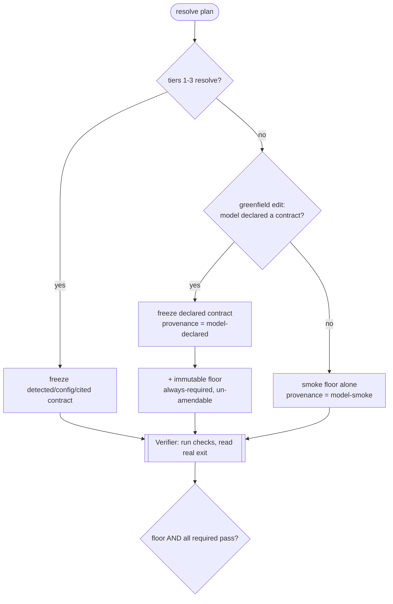

# ADR 0038 — Model-declared semi-frozen verification contract + immutable floor

- **Status:** Proposed
- **Date:** 2026-07-07
- **Deciders:** Sarthak Joshi
- **Consulted:** Claude (claude-opus-4-8[1m]) — 2026-07-07 design session, prompted by a `jo-cli` dogfood Tetris run that ended `incomplete`: greenfield edit with no declared contract, whose only verification would have been the parse-only smoke floor.
- **Supersedes:** the greenfield **disposition** of [ADR-0014](0014-greenfield-self-authored-verification.md) — that the model-authored **smoke floor** *is* the greenfield verification. It is not deleted; it is **repositioned** (see Decision). ADR-0014's late-binding, allowlist-bounded, pure-executor-verifier machinery stands.
- **Related:** [ADR-0007](0007-dynamic-verification-plan-resolution.md) (tiers 1–3 + freeze-before-editing + no invented rubric); [ADR-0039](0039-scoped-autonomous-amendment-disposition.md) (how amendments are gated); [ADR-0040](0040-held-out-verified-vs-self-reported-success.md) (how evals grade this honestly); `HARNESS_DESIGN.md` §5 (no self-certification), §12 (verification contracts); [ADR-0011](0011-verifier-integrity-under-self-improvement.md) (this widens that threat surface).

## Context

ADR-0014 gave greenfield runs a floor: the model authors one **non-executing** checker (`py_compile`/`ruff`/`tsc --noEmit`/…), the harness runs it, the exit code is the verdict. It stopped "no contract" from meaning "no signal." But a parse/compile check proves *"it parses,"* not *"it works"* — a deliberately-soft floor, and for greenfield work (increasingly the tool's use) it is the *only* signal. The Tetris dogfood made the gap concrete: a from-scratch game whose line-clear logic was wrong would still clear a `py_compile` floor.

The richer answer a human would want is a **behavioral** contract (real tests). In greenfield there is nothing declared to detect or cite (ADR-0007 tiers 1–3 resolve empty), and the only actor who knows the stack and the intended behavior is the model. So the model must be allowed to **author a real contract** — while never being allowed to **certify its own pass** (§5, the line ADR-0014 also refused to cross).

The resolution rests on a distinction the rest of the design already draws but that ADR-0014 left implicit:

| axis | who owns it | mechanism |
| --- | --- | --- |
| **definition** of "done" | the model *proposes*; a **gate** ratifies | declare / amend the contract (this ADR + ADR-0039) |
| **attainment** of "done" | the harness-owned **Verifier** | runs the (ratified) checks, reads real exit codes |

The model never renders its own verdict; it proposes *what the bar is*, and a deterministic verifier measures the artifact against it. That is what keeps a self-authored contract from being self-grading.

## Decision (proposed)

**1. Add a model-declared contract as the greenfield verification, above the smoke floor.** Via a new `declare_verification(checks=[…])` tool the model authors a real contract (executing tests/checks), frozen onto `TaskState` like any tier-1–3 plan. It is **mandatory for greenfield `edit` tasks**, and that "mandatory" is *enforced*, not merely prompted: at the `investigating→editing` boundary the runner **refuses each edit-intent call** until a contract is declared, emitting a `DeclarationRequired` event and nudging the model — a **bounded nudge** of `max_declaration_nudges` (default 3). After the cap the runner stops refusing and falls back to the smoke floor (see point 2), so a run is never stranded at declaration. The `edit` mission prompt also states the obligation, so the model is oriented before it hits the gate. (A detected/configured contract, or one the model declares first, skips the gate.)

**2. Demote the smoke floor to the *immutable floor*.** ADR-0014's model-smoke check no longer *is* the contract — it becomes a harness-owned **non-vacuity floor** that is **always appended as a required check** and can **never be removed or amended by the model**. `success` therefore requires **floor AND declared-contract both pass**. A declared contract can only *enrich* the oracle, never *replace* it. If the model **declines** to declare (or nothing is smoke-testable), the floor alone stands — exactly ADR-0014's behavior, now as the explicit fallback.

**3. Make the declared contract *semi-frozen*.** As greenfield design evolves, a check the model declared early can become genuinely obsolete. The model may propose an **amendment** — but only through a **gated action** (`alter_verification`), never silently. Who ratifies the amendment (human when attended; config-gated policy when unattended) is [ADR-0039](0039-scoped-autonomous-amendment-disposition.md).

**4. Guard non-vacuity.** A declared/amended check must *execute the written artifact and be capable of failing*. The harness rejects no-ops (`true`, `assert True`, an empty target) at declaration time, reusing the ADR-0014 allowlist/`effective_invocation` machinery generalized from non-executing checkers to "runs the code and can exit non-zero." The floor's immutability is the backstop: even a weak declared contract can't lower the bar below "it compiles/parses."

The verifier gains no judgment logic — the immutable floor is an always-appended required `CheckResult` (like the existing `_no_secrets`/`_diff_present` guards), and the declared checks are additional required checks in the positive-signal set. The existing gate (`no required fails ∧ no bad skip ∧ ≥1 positive passes`) yields "floor AND declared both pass" for free.

## Alternatives considered

| Option | Verdict |
| --- | --- |
| Keep ADR-0014's smoke floor as the sole greenfield contract | Rejected — parse-only; the signal the Tetris dogfood needed (behavioral) is absent. |
| Let the model-declared contract *replace* the floor | Rejected — a model could declare a vacuous contract and self-certify; the immutable floor is the anchor. |
| Model self-asserts "done" (no verifier run) | Rejected — pure self-grading, the §5 hole (unchanged from ADR-0014). |
| Freeze the declared contract hard (no amendment) | Rejected for the attended case — legitimately-obsolete early checks then strand the run; the gated amendment (ADR-0039) handles obsolescence without silent goalpost-moving. Retained as the *unattended default* (deny). |
| Harness-authored behavioral tests | Rejected — impossible without knowing intended behavior; only the model has it, and it must not grade itself. |

## Consequences

- Greenfield `edit` runs get a **behavioral** contract, not just a compile floor — stronger verification, and (with ADR-0040) an honest eval signal.
- **The floor becomes load-bearing, not soft.** It is now an *always-required, un-amendable* check that gates `success`, so a self-declared contract can never drop the bar below it. This tightens, not loosens, ADR-0014's "bounded self-grading."
- **`success` = floor ∧ declared-contract.** The verifier stays a pure executor; the only new judgment is "the floor is always in the required set."
- **Semi-frozen means one more axis of mutability** (ADR-0007's "rubric fixed before editing" already gave way to ADR-0014's one late-bound tier; now a declared contract can be *amended* mid-run — but only through a gate, audited). Readers of `TaskState`/the journal must know a declared contract can change, always with an `ApprovalResolved` + audit record.
- **ADR-0011 interaction deepens.** A model that authors *and* petitions to change its contract is a larger self-improvement threat surface. The mitigations: the immutable floor, the amendment gate (ADR-0039), and — decisively for measurement — the held-out oracle (ADR-0040) that grades against a check the model never sees.
- **Mandatory-for-greenfield** raises the floor of what greenfield verification *is*. It is enforced by a pre-edit gate (bounded nudge of `max_declaration_nudges`), so a model no longer silently skips declaration — but the decline-fallback is preserved *after* the nudge: at the cap the smoke floor alone stands, so a model that declares nothing still gets graded, never permanently stuck at declaration. The gate is scoped to greenfield `edit` (its declared-contract/smoke-floor plumbing is `edit`-only); `test_only` is unaffected. Setting `max_declaration_nudges = 0` disables the gate (the pre-enforcement behavior).
