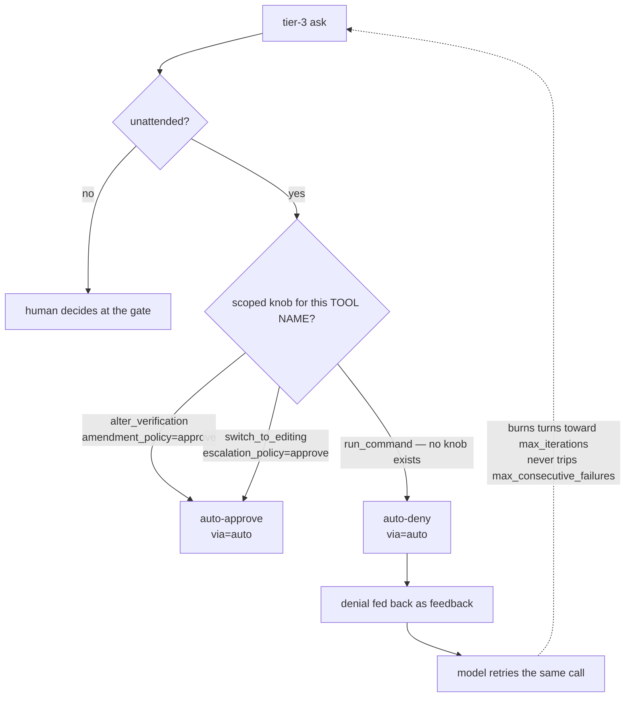
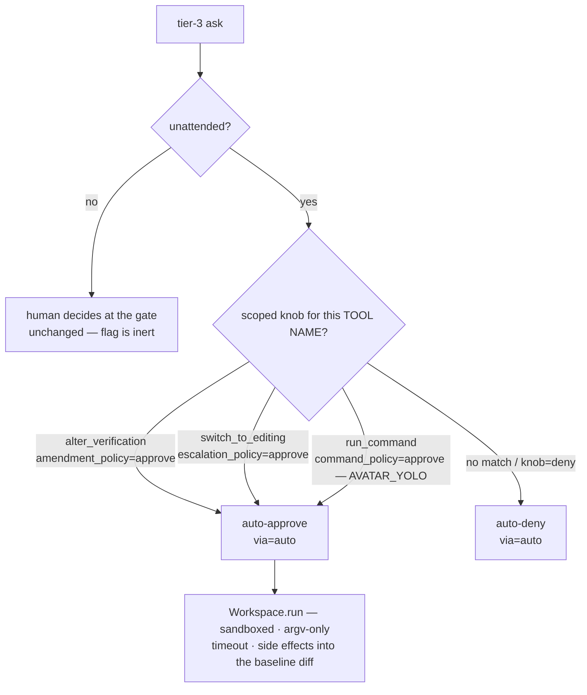

# ADR 0050 — "YOLO" opt-in: an unattended run may auto-approve arbitrary `run_command`

- **Status:** Proposed
- **Date:** 2026-07-17
- **Deciders:** Sarthak Joshi
- **Related:** [ADR-0016](0016-autonomous-approval-disposition.md) (deny-only unattended disposition — this opts one tool out of it) · [ADR-0039](0039-scoped-autonomous-amendment-disposition.md) + [ADR-0048](0048-mid-run-investigate-to-edit-escalation.md) (the two existing scoped auto-approves this mirrors) · [ADR-0042](0042-hermetic-execution-at-the-workspace-run-seam.md) + [ADR-0045](0045-shell-syntax-rejected-at-command-boundaries.md) (the sandbox + argv-only rules that bound an approved command)
- **Seams:** `avatar/config.py` (`yolo`, env `AVATAR_YOLO`) · `avatar/session.py` (`command_policy` in `request_approval`) · `avatar/harness.py` (`session()` threads it)

## Context

- ADR-0016 made an unattended gated call **auto-deny** (no human will ever resolve it). ADR-0039/0048 carved two **name-scoped** exceptions (`alter_verification`, `switch_to_editing`); `run_command` was explicitly excluded.
- That default is right for eval grading — the harness's own verifier/probe runs the contract, so the agent is not meant to run arbitrary shell.
- But it makes a **fully-autonomous** run impossible. In the 2026-07-17 matrix, models attempted `run_command` **97 times** across the grok cells alone; every one auto-denied, each still costing a full model turn. Denials early-return before `_apply_tool_result`, so they never trip `max_consecutive_failures` — they burn only toward `max_iterations`. The agent flailed at a wall it couldn't see was permanent.
- The existing partial answer — configure `test_command`/`lint_command` and use the ungated tier-2 `run_tests`/`run_linter` — covers "run the tests", not "run *anything*".

## Decision

One opt-in flag, `config.yolo` (env `AVATAR_YOLO=1`), adds `run_command` to the same scoped auto-approve map the other two knobs use. Everything else is unchanged.

### Before — `run_command` always denies

### After — `command_policy` admits it

The properties that make it defensible:

1. **Scoped by tool name, never tier.** Only `run_command`. `alter_verification` still denies — YOLO executes commands, it does not let a run self-ratify the contract that grades it. Conflating the two would let an agent write the test *and* approve running only the tests it likes.
2. **Inert when attended.** An attended session routes every ask to the human regardless.
3. **Observable.** Journaled `ApprovalResolved(allowed=True, via="auto")` exactly like a deny (invariant #5) — replay and the eval classifier see that a command was auto-*approved*, not merely that it ran.
4. **Same residual envelope.** Sandboxed (ADR-0042), argv-only (ADR-0045), workspace-confined, timed out, side effects in the baseline diff. The file denylist still gates the file tools. It does *not* stop `python -c "…"` from doing anything Python can — that is the accepted cost, and the flag name says so.
5. **Default `False`.** Every run that doesn't opt in behaves exactly as before.

## Alternatives considered

| Alternative | Rejected because |
| --- | --- |
| Approve **all tier-3** unattended | Sweeps in `alter_verification`/`switch_to_editing` — an autonomous run could self-ratify its own rubric. Name-scoping keeps each dangerous action behind its own switch. |
| A `Literal["deny","approve"]` `autonomous_command_policy` as the only surface | More granular than the need; the ask was one memorable flag. A boolean escape hatch is the honest shape — a policy field can still be added later. |
| A **program allowlist** (`ApprovalGrant`) instead of blanket approve | Safer, and still the recommendation for anyone who can enumerate trusted programs — but it's a different feature, and remains available. YOLO is deliberately the blunt instrument for operators who won't maintain a list. |
| Lift the tier-3 gate on `run_command` outright | Would change the *attended* default too, breaking the REPL approval flow. The disposition must stay a per-session knob resolved at the gate, not a tier change. |
| Add a denial-thrash guard instead | Orthogonal and still worth doing — but it treats the symptom (flailing) rather than giving the operator the commands they wanted to run. |

## Consequences

- **Fully-autonomous runs are possible** with `AVATAR_YOLO=1` + `unattended=True` — the intended use for autonomous dogfood/eval runs where the agent must exercise its own output.
- **The deny-only default is untouched.** The three scoped knobs (`amendment`, `escalation`, `command`) now share one shape and one vocabulary, resolved by a single tool-name lookup.
- **Blast radius is the operator's to accept.** No sandbox/argv/timeout/denylist weakening — but arbitrary code execution is arbitrary code execution. Env-gated and loudly named; docs carry the warning.
- **Eval-grading integrity preserved.** Command execution only, not the contract — self-authoring *and* self-ratifying a rubric still needs `amendment_policy="approve"` separately. Held-out probe grading stays the source of truth.
- **New test surfaces:** `command_policy="approve"` approves `run_command` and only it; default still denies; the approve is observable (`allowed=True, via="auto"`); `config.yolo` threads through `harness.session()`; `AVATAR_YOLO` env parsing.
