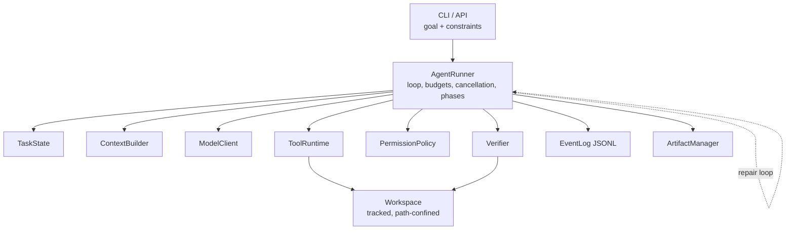
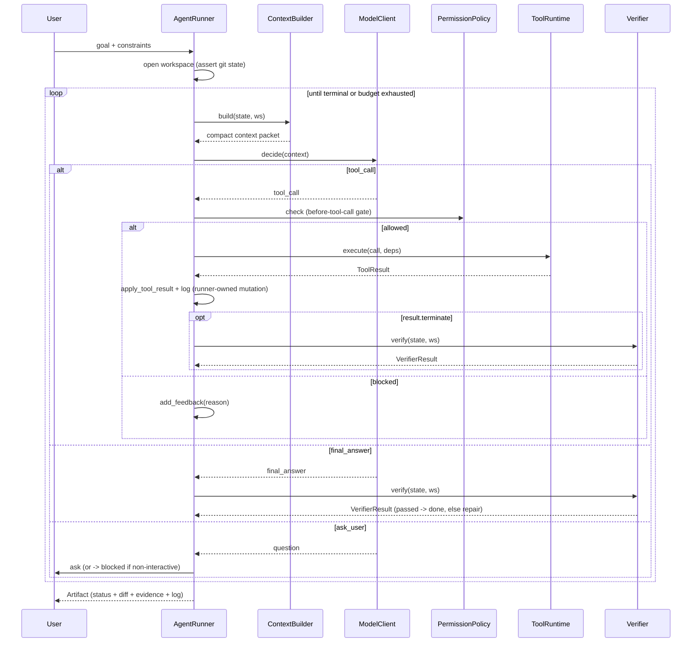
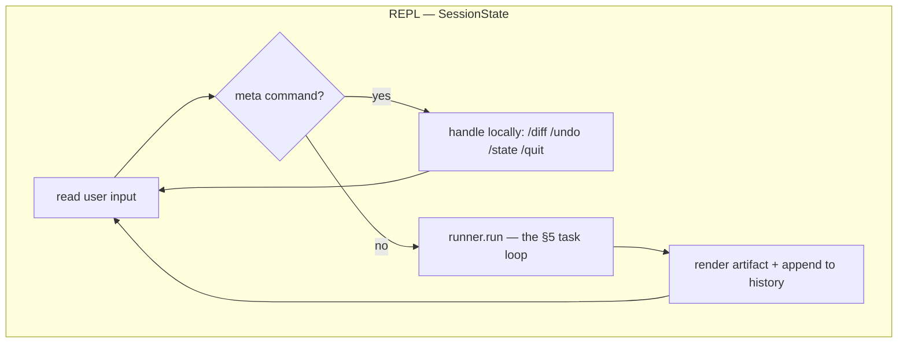

# Coding Agent Harness — Design

> **⚠️ Frozen as of 2026-07-17 — the originating design spec, retained as a citable archive; do not add to it.** This document captured the ground-up design and rationale, and roughly two dozen ADRs still anchor to its `§N` sections — so it is kept in place, not deleted. But it is no longer the living source of truth: it drifted behind the as-built system, and the two concerns it once held are now split —
>
> - **Current design + rationale** (chosen approach, rejected alternatives, trade-offs, the record going forward) live in the **ADRs** under [`docs/adr/`](../adr/); where an ADR and a `§N` here disagree, the ADR is newer and wins.
> - **The current system map** — component graph, control-flow deep dives, and implementation status — is [`ARCHITECTURE.md`](../../ARCHITECTURE.md); *what shipped* is [`CHANGELOG.md`](../../avatar-harness/CHANGELOG.md).
>
> The sections below are retained as the historical rationale the `§N` citations point at; treat them as a snapshot of the design at authoring time, not as current status. (The former `PROGRESS.md` build ledger, referenced in a few places below, has been retired — build status now lives in `ARCHITECTURE.md`'s status markers and the changelog.)
>
> **Status (at freeze):** The engine is implemented through Phase 2.6 (hardening) and the **Phase 3.0 foundation** (async `arun()` core, typed event bus, two-plane session) is built; the Phase 3.1+ cockpit and §21 extensions remain designed. Phase 3 design now lives in [ADR-0001](../adr/0001-async-event-bus-and-durable-execution.md) and [ADR-0002](../adr/0002-interactive-tui-cockpit-and-mvp-feature-set.md), which supersede the forward-looking detail in §13/§23 below.
> **Scope:** A ground-up, minimally functional but correctly shaped coding agent harness — a new standalone Python project, not an extension of the current CLI chat app.
> **Posture:** Build the *shape* completely (loop, structured state, permission gate, verification, event log, reversibility); keep each component's *implementation* thin. A shallow-but-complete harness beats a deep-but-partial one, because the shape is what's expensive to change later.

This document is the canonical design/rationale spec. `PROGRESS.md` is the authoritative build ledger; `ARCHITECTURE.md` is the current system map with implementation-status markers; `README.md` is user-facing usage documentation. When the code and this document diverge, treat that as design drift to resolve explicitly, not as an implicit code change. Major decisions taken *after* this spec are recorded as ADRs in `docs/adr/` (earlier ones, through 2026-06-11, are in the frozen `DECISIONS.md` archive); where an ADR and this spec disagree, the ADR is newer and wins for that decision.

## 1. Purpose

Turn an LLM from a "smart text generator" into a "useful worker" for coding tasks. The model is not the product — the **harness** is. It turns a natural-language task into a bounded engineering loop:

```text
Goal
  -> build relevant context
  -> ask model for next action
  -> execute a typed tool safely
  -> update structured state
  -> verify with external evidence
  -> return a patch, result, or blocker
```

The central principle: **the model proposes actions; the harness owns execution, state, permissions, logging, and verification.**

## 2. Non-goals (MVP)

Stated up front because each is a deliberate safety or scope boundary:

- No multi-agent orchestration.
- No A2A / cross-process agent integration.
- No browser automation.
- No autonomous dependency installation by default.
- No automatic git commit, push, PR creation, or deployment.
- No reliance on the chat transcript as the source of truth — `TaskState` is primary.

These are deferred, not designed out; the architecture stays compatible with them (§20).

## 3. North-star principles

Every decision below derives from five principles:

1. **State is explicit and structured** — not the model's hidden memory, not a raw message list.
2. **The model proposes; the harness executes.** Every action flows: propose → validate → permission gate → execute → record → apply.
3. **"Done" is a proposal, verified by external evidence** — never "the model thinks it's done."
4. **Everything is reversible** — operate on a tracked workspace; every edit is an inspectable diff.
5. **Everything is observable** — a structured append-only event log gives debugging, replay, and eval data for free.

## 4. High-level architecture

A central **AgentRunner** owns the loop and the task state. Everything else is a stateless worker or a passive store.



| Component          | Responsibility                                                                       |
| ------------------ | ------------------------------------------------------------------------------------ |
| `AgentRunner`      | Owns the main loop, iteration budgets, cancellation plumbing, and runner-owned mutation. |
| `TaskState`        | Explicit task progress: phase, evidence, files touched, commands run, verifier results. |
| `ContextBuilder`   | Builds a compact working packet from state, repo data, diffs, and recent evidence.   |
| `ModelClient`      | Sends structured prompts; receives and validates constrained model decisions.        |
| `ToolRuntime`      | Executes typed tools against the workspace; returns structured results.              |
| `PermissionPolicy` | Allows, blocks, or asks for approval before tool execution.                          |
| `Verifier`         | Checks whether the task is actually complete via tests, lint, diff, and policy.      |
| `EventLog`         | Writes durable JSONL events for replay, debugging, auditing, and evals.              |
| `ArtifactManager`  | Produces the final patch summary, command summary, status, and user-facing answer.   |

## 5. The core loop

The defining departure from a chat app: the loop terminates on **verification**, not on a text reply.

> **Implementation note (Phase 3.0):** the canonical loop is now **async** — `AgentRunner.arun()` is the real loop and sync `run()` wraps it via `asyncio.run()`. The pseudocode below is the unchanged *shape*; the async engine, typed event bus, and two-plane session are specified in ADR-0001.

```python
state = TaskState(goal=..., constraints=[...])
ws    = Workspace(root, allow_dirty=...)   # asserts clean-or-acknowledged tracked git state (§15)
deps  = RunDeps(workspace=ws, config=config, cancellation=token)
events.emit("agent_start", state=state)

while not state.terminal and within_budget(state, config):
    events.emit("turn_start", state=state)
    context  = context_builder.build(state, ws)        # compact working packet (§9)
    decision = model_client.decide(context)            # validated ModelDecision (§6)
    action   = decision.action                         # ToolCall | FinalAnswer | AskUser

    match action.type:
        case "tool_call":
            tool = registry.get(action.name)
            perm = permissions.check(tool, action.input, state, ws)    # control hook (§11)
            if perm.blocked:
                state.add_feedback(perm.reason)                 # model learns, loop continues
                events.emit("permission_blocked", call=action, reason=perm.reason)
                continue
            result = tool_runtime.execute(action.name, action.input)
            events.emit("tool_execution_end", call=action, result=result)
            runner._apply_tool_result(state, result)            # the RUNNER applies, not the tool (§8)
            if result.terminate:
                _verify(state, ws)                              # terminate proposes; verifier disposes

        case "final_answer":
            state.final_answer = action.answer
            _verify(state, ws)

        case "ask_user":
            if config.interactive:
                answer = ui.ask(action.question)
                state.record_user_answer(action.question, answer)
            else:
                state.block(reason=f"needs input: {action.question}")   # sets outcome = "blocked"

    events.emit("turn_end", state=state)

if not state.terminal:                       # loop exited on a budget, not a verified result
    state.outcome = exit_reason(state, config)  # "failed" if repair budget hit, else "incomplete" — §14
events.emit("agent_end", state=state)
return artifacts.finalize(state, ws)         # status := state.outcome


def _verify(state, ws):
    events.emit("verification_start")
    report = verifier.verify(state, ws)                 # EXTERNAL signals only (§12)
    events.emit("verification_end", report=report)
    state.verifier_results.append(report)
    if report.passed:
        state.outcome = "success"                       # terminal; loop exits next check
    else:
        state.repair_failures += 1
        state.add_feedback(report.summary)              # repair: evidence feeds the next context
```

`ask_user` in a non-interactive run calls `state.block(...)`, which sets `outcome = "blocked"`. So every terminal path sets `outcome` exactly once: `success` (verifier passed), `blocked` (needs human input), `incomplete` (ran out of budget mid-progress), or `failed` (exhausted repair attempts on a completion claim).

### Bounding conditions

Two *different kinds* of bound exist, and they map to different outcomes — this is the distinction that keeps `incomplete` and `failed` from being ambiguous:

**General budgets → `incomplete`** (the run never converged on a verifiable result):

- Maximum iterations.
- Total wall-clock timeout.
- Per-tool timeout (a single tool, not the run).
- Maximum context size.
- Maximum *consecutive failed actions* — tool/action errors in a row (catches thrashing).

Current enforcement (through Phase 2.6): the runner enforces maximum iterations, maximum consecutive failed actions, repair attempts, **wall-clock timeout, and context-token budget** (the last two landed in Phase 2.6); command execution enforces per-command timeout.

**Repair budget → `failed`** (the run *did* converge on a completion claim, but it can't be verified):

- Maximum *consecutive verification failures* (`repair_failures`) — i.e. the model proposed `final_answer`/`terminate`, the verifier rejected it, and this repeated past the cap.

So `exit_reason` is simply: if `state.repair_failures >= config.max_repair_attempts` → `failed`; otherwise → `incomplete`. A run that thrashes on tool errors without ever reaching a verification attempt is `incomplete`; a run that keeps claiming "done" on work that won't pass is `failed`. The loop never ends silently — every exit names an outcome.

### Turn lifecycle



Three load-bearing decisions:

- **The verifier is not a tool.** The model may *also* call `run_tests` to investigate — fine, complementary. But the gate that sets `outcome = "success"` is harness-owned and runs on a completion proposal. The model never self-certifies.
- **`terminate` proposes; the verifier disposes.** A tool returning `terminate: true` (or a `final_answer`) marks the task *ready for verification* — it does not end the run on its own.
- **Repair is just the loop continuing.** A failed verification appends structured evidence; the next `context_builder.build` surfaces it; the model revises. No special machinery.

## 6. Model decision protocol

The model returns a **constrained, validated decision** — not arbitrary prose.

```json
{
  "thought_summary": "I need to inspect the failing test before editing.",
  "action": {
    "type": "tool_call",
    "name": "search_repo",
    "input": { "query": "test_auth" }
  }
}
```

```python
class ToolCall(BaseModel):
    type: Literal["tool_call"] = "tool_call"
    name: str                                  # must match a tool active for the current phase
    input: dict                                # validated against that tool's input_model

class FinalAnswer(BaseModel):
    type: Literal["final_answer"] = "final_answer"
    answer: str                                # completion claim; verifier checks evidence (§12)

class AskUser(BaseModel):
    type: Literal["ask_user"] = "ask_user"
    question: str

class ModelDecision(BaseModel):
    thought_summary: str
    action: ToolCall | FinalAnswer | AskUser   # discriminated union on action.type
```

The loop dispatches on `decision.action.type` and operates on `decision.action` directly — the `thought_summary` is for logging and context, never for control flow.

| `action.type`  | Meaning                                                    |
| -------------- | ---------------------------------------------------------- |
| `tool_call`    | Request one typed tool execution.                          |
| `final_answer` | Claim the task is complete (subject to verification).      |
| `ask_user`     | Ask for missing information when no safe assumption exists. |

`ask_user` is first-class: it is how "low confidence → ask a human" becomes an action the model can take rather than a guess it's forced to make. In non-interactive runs it transitions the task to `blocked` (§14).

The harness **validates** every decision before acting. `parse_decision` validates the JSON shape into `ModelDecision`; the tool runtime and registry then validate known tool names and tool input. Invalid decisions and invalid tool calls are logged and fed back to the model as recoverable errors, never executed.

## 7. Task state — the heart

Structured, pydantic, append-mostly. The model's message history is **derived from this** for each call — it is not the source of truth.

```python
class Evidence(BaseModel):          # test output, command result, file finding, error
    step: int
    kind: str
    summary: str
    detail: str | None = None

class DecisionRecord(BaseModel):    # why the agent chose what it chose
    step: int
    rationale: str
    chosen: str
    rejected: list[str] = []

class TaskState(BaseModel):
    goal: str
    constraints: list[str] = []
    task_kind: Literal["edit", "investigate", "test_only"] = "edit"

    # Two independent axes (see below): phase = WHERE the work is; outcome = HOW it ended.
    phase: Literal["investigating", "editing", "verifying"] = "investigating"
    outcome: Literal["success", "incomplete", "blocked", "failed"] | None = None

    iterations: int = 0
    consecutive_failures: int = 0       # tool/action errors in a row -> "incomplete" at cap (§5)
    repair_failures: int = 0            # verification rejections in a row -> "failed" at cap (§5)
    files_read: set[str] = Field(default_factory=set)
    files_modified: set[str] = Field(default_factory=set)
    commands_run: list[CommandRecord] = Field(default_factory=list)

    evidence: list[Evidence] = Field(default_factory=list)
    decisions: list[DecisionRecord] = Field(default_factory=list)
    verifier_results: list[VerifierResult] = Field(default_factory=list)

    current_plan: list[str] = Field(default_factory=list)
    open_questions: list[str] = Field(default_factory=list)
    latest_error: str | None = None
    final_answer: str | None = None

    @property
    def terminal(self) -> bool:
        return self.outcome is not None
```

Good state answers: What is the goal? What kind of task is it? What constraints are active? What has been inspected? What has been changed? What evidence exists? What has failed? What still needs verification?

**`phase` and `outcome` are deliberately separate.** `phase` is a *control* axis — it gates which tools are available (§10) and how context is assembled. It advances through `investigating → editing → verifying` — the runner auto-advances on the first edit intent and on verify, emitting a `phase_changed` event (Phase 2.6). `outcome` is the *terminal result* axis — `None` while the run is live, then exactly one of `success` / `incomplete` / `blocked` / `failed`, which is what `ArtifactManager.status` reports (§14). Conflating the two (e.g. a single `phase` that also holds `done`/`failed`) is what leaves budget-exhaustion and verification-failure underspecified, so we keep them apart.

**`task_kind` selects the verification contract** (§12). It is classified at intake (or inferred from the goal) and prevents edit-shaped verification ("a diff must exist") from being forced onto read-only tasks (investigation, explanation, or, once narrow command tools exist for it, running a command to report its output). It is a taxonomy of *verification contracts*, not of user intents — which is why there are only three (§12).

## 8. Run dependencies

Tools receive their dependencies through a small **run-scoped object**, never globals.

```python
@dataclass
class RunDeps:
    workspace: Workspace             # handle: path confinement, diff, command exec
    config: HarnessConfig
    cancellation: CancellationToken
```

`workspace` is a `Workspace` *handle*, not a bare root path. It encapsulates path confinement, modified-file tracking, diffing, atomic patch application, and command execution — so a tool physically cannot reach outside the workspace or run an untracked, untimed command. Passing only a root path would push that discipline into every tool and let any one of them quietly break it.

Rules — these keep the loop debuggable:

- Tools touch the filesystem and run commands **only** through `workspace` — never raw paths or bare subprocess calls.
- Tools do **not** discover workspace state from globals.
- Tools do **not** mutate `TaskState`; they return a `ToolResult`.
- The **runner** applies tool results to state *after* logging and permission checks.
- Services (model client, shell runner, file reader) are passed explicitly or owned by `ToolRuntime`.

MVP note: `RunDeps` is intentionally small today (`workspace`, `config`, `cancellation`). `TaskState` and `EventLog` stay outside tool dependencies: the runner mutates state, and the emitter/EventLog observes what the runner emits.

The invariant "tools are pure-ish; the runner owns all mutation" is what makes a run replayable from the event log.

## 9. Context builder

The component a chat app has zero of, and the one that most determines a coding agent's quality. It assembles a **compact working packet** per iteration — not the whole repo.

```text
- User goal + constraints
- Current phase + current plan
- Relevant snippets (search/read results)
- Files already read / modified
- Recent tool results (summaries plus bounded detail when needed)
- Current diff summary when relevant
- Latest test / lint output (verbatim when repairing)
- Allowed next tools (for the current phase)
```

Selection prefers, in order: recent failing command output; files changed in this task; files the model explicitly requested; search results related to the goal; repo conventions (`README.md`, `pyproject.toml`, `Makefile`, `AGENTS.md`/`CLAUDE.md`).

Two rules:

- **The model discovers context incrementally** through search/read tools — it does not receive the repository by default.
- **A future compaction hook** can transform state before it goes to the model: prune old evidence to summaries, keep recent verifier output verbatim, stay under the context budget. Recency + relevance over completeness.

Retrieval, MVP vs. later:

| MVP                          | Defer                           |
| ---------------------------- | ------------------------------- |
| `rg` text search             | AST / symbol indexing           |
| `read_file` with line ranges | Dependency graph awareness      |
| recent evidence + files read | Test-target inference           |

## 10. Tool runtime

Tools are narrow, typed, observable, timeout-limited, and permissioned.

```python
@dataclass(frozen=True)
class ToolDefinition:
    name: str
    description: str
    input_model: type[BaseModel]                 # pydantic -> JSON schema for the LLM
    handler: ToolHandler
    phases: frozenset[str]                       # phase-gating
    permission_tier: int                         # 0..4 (§11)
```

The model sees only tools allowed for the current phase; the runner re-validates every call regardless. The MVP keeps tool metadata thin (`name`, `description`, pydantic input model, handler, active phases, permission tier). Richer prompt snippets, side-effect declarations, streaming progress callbacks, and retry policy metadata are useful extensions, but not needed for the current implementation.

### MVP tools

| Tool                          | Purpose                              | Side effects            |
| ----------------------------- | ------------------------------------ | ----------------------- |
| `search_repo(query)`          | Search repository text with `rg`.    | None                    |
| `list_files(glob)`            | List files matching a pattern.       | None                    |
| `read_file(path, range?)`     | Read a bounded file or snippet.      | None                    |
| `apply_patch(diff)`           | Apply a unified diff to the workspace. | Local edits           |
| `run_tests(target?)`          | Run the configured test command, optionally scoped to a target. | Local command execution |
| `run_linter()`                | Run configured lint / type checks.   | Local command execution |
| `git_status()`                | Report changed / untracked files.    | None                    |
| `git_diff()`                  | Return the current diff or a summary. | None                    |

Implemented MVP surface: `search_repo`, `list_files`, `read_file`, `apply_patch`, `run_tests`, and `run_linter`. `git_status` and `git_diff` remain part of the intended narrow tool surface, but the current engine gets diff/status evidence directly through `Workspace` and artifacts rather than exposing those as model-callable tools yet.

Avoid a general `run_shell(command)` in v1. **Revised by ADR-0002:** Phase 3.1 adds a *constrained* `run_command` — a model-chosen command run through `Workspace.run` (no shell metacharacters), at **tier 3** so it is default-blocked in batch and approval-gated + prefix-scoped in the REPL. This earns command parity (build/codegen/migrations/custom targets) without an always-on raw shell; the human approval gate is the backstop and the verifier still owns `outcome`. A general `run_shell` stays out.

#### Patch application

`apply_patch` takes a unified diff that **may span multiple files** in a single call (this matches how models naturally emit edits). Before anything is written, the `Workspace` validates the patch atomically:

- Every target path resolves **inside** the workspace (no escapes, no symlink traversal); otherwise the call is denied (§11, tier 1).
- New-file and delete hunks are allowed only when the diff says so explicitly.
- The diff must apply **cleanly** against current file contents. A failed apply is a *model-correctable* error (stale context — §10 retry semantics), returned with the rejected hunks so the model can re-read and retry; it is never a partial write.

Application is all-or-nothing: either the whole diff applies and the touched paths are recorded in `files_modified`, or nothing changes.

### Tool result shape

```python
class ToolResult(BaseModel):
    tool_name: str
    success: bool
    content: str = ""                # what the model MAY see
    summary: str                     # one-line; feeds context budgeting
    error: str | None = None         # set when success is False
    files_read: list[str] = []
    files_changed: list[str] = []
    terminate: bool = False          # "ready for verification" (NOT "stop now")
```

The `content` boundary matters: the model only ever sees `content` (or a summary/detail excerpt the context builder chooses). Raw command output is captured by `Workspace.run` and surfaced through tool `content` or verifier evidence only when useful, rather than being blindly appended to every prompt.

### Retry semantics

Retries are narrow and deliberate. Only **model-correctable** errors loop back through the model:

- Invalid path format.
- Missing required tool argument.
- Patch failed to apply because context was stale.
- Test target not found.

**System failures are surfaced, never auto-retried** — masking them robs the agent of the chance to learn:

- Permission denied.
- Command timeout.
- Network blocked.
- Tool implementation bug.
- Filesystem access outside the workspace.

## 11. Permission policy

Explicit numeric tiers, evaluated by a hook before every execution.

| Tier | Tools                                                           | Default                  |
| ---- | -------------------------------------------------------------- | ------------------------ |
| 0    | `read_file`, `search_repo`, `list_files`, `git_status`, `git_diff` | Allow                |
| 1    | `apply_patch`                                                  | Allow if all target paths validate inside the workspace (§10) |
| 2    | `run_tests`, `run_linter`, `run_formatter`                     | Allow with timeout       |
| 3    | dependency install, broad shell, file deletion                 | Ask or block             |
| 4    | commit, push, PR creation, deploy, external side effects       | Ask                      |

Policy considers: workspace boundaries, command allowlist, timeout, network use, credential exposure, reversibility, and whether the action touches files outside the task.

Current MVP: `run_tests` and `run_linter` are implemented at tier 2; `run_formatter` is a planned tier-2 tool, not currently registered.

Implemented as an explicit **before-tool-call control hook** (`PermissionPolicy.check`) that the runner calls before every execution — *not* a lifecycle-emitter subscriber. The distinction matters (§13): the hook must be able to **block and redirect control flow**, so it returns a decision the runner acts on. Observation events, by contrast, are fire-and-forget and cannot. Keeping permission as a direct call is the right model for the MVP; async approval is reserved for the Phase 3 REPL.

```python
def check(tool: ToolDefinition, raw_input: dict, state: TaskState, ws: Workspace) -> ToolPermission:
    if tool.permission_tier >= 3:
        return ToolPermission(blocked=True, ask=True, reason="blocked pending approval")
    return ToolPermission(blocked=False)
```

This follows Pi's extension-hook shape while keeping the policy built into the harness rather than exposed as a plugin API. A `--trusted` / autonomous mode may promote `ask → auto` for unattended runs; irreversible or external actions stay gated.

The synchronous direct call is the right model for the batch engine. The **async two-plane approval** for the interactive cockpit is already built at the Phase 3.0 foundation: `Session.request_approval` / `resolve_approval` (ADR-0001). The gate *announces* a tier-3 `ask` via an event; the human decides via a control method; the run blocks only itself until then. An event can never silently approve a call (§13).

## 12. Verification

Verification is **mandatory** before any success result. But "mandatory" must not mean "passes vacuously": several checks are inherently conditional (tests only when a target exists, project checks only when affordable), and a naive verifier that treats a skipped check as a passed one can green-light a no-op. So each check carries an explicit status, and the *gate* is defined in terms of required checks — not "nothing failed."

```python
class CheckResult(BaseModel):
    name: str
    kind: Literal["required", "optional"]
    status: Literal["pass", "fail", "skip"]
    evidence: str                                 # the external signal: command + output excerpt
    skip_reason: str | None = None                # REQUIRED when status == "skip"

class VerifierResult(BaseModel):
    passed: bool
    summary: str
    checks: list[CheckResult]
    recommended_next_action: str | None = None    # feeds repair DIRECTION, not just pass/fail
```

**Pass criterion** — the run is verified only when *all three* hold:

1. No **required** check has `status == "fail"`.
2. No **required** check was skipped without an *allowed* `skip_reason` (e.g. "no test target exists in this repo" is allowed; "tests were slow" is not).
3. At least one **positive external signal** exists appropriate to the task (defined per `task_kind` below) — a verifier may never pass on zero evidence.

**The required set is selected by `task_kind`** (§7), so non-edit tasks aren't forced through edit-shaped verification:

| `task_kind`  | Required checks                                                        | Positive signal must include            |
| ------------ | --------------------------------------------------------------------- | --------------------------------------- |
| `edit`       | a diff exists; no unexpected files changed; no placeholders/secrets; targeted tests pass *or* an allowed skip; lint/types clean | a passing targeted test, or (if none exists) clean lint/types over the diff |
| `test_only`  | tests were added/changed; the new tests run and pass                  | the new tests executing and passing     |
| `investigate`| answer cites concrete evidence (files/lines, command output); **no unintended diff** unless explicitly requested | inspected files / search or command results in the log |

Checks that don't apply to a kind run as `optional` (recorded, never gating). The always-on guards — no edits outside the workspace, no likely secrets — stay `required` for every kind.

**`investigate` is the single read-only kind.** It subsumes pure *explanation* (read → describe) and, in the target design, narrow pure *execution* tasks (run an allowed command → report its output), because both share one verification contract: the answer must cite real evidence from the log and leave no unintended diff. Current MVP has read tools for `investigate`; `run_tests`/`run_linter` are registered for edit/verification phases and there is deliberately no general `run_shell`. There is no separate `explain` or `execute` kind — `task_kind` classifies *how completion is judged*, not which individual tool action was used.

**Open edge — non-executable edits.** An `edit` to a file with no tests *and* no meaningful lint/types (docs, a static config, an asset) has no command-based positive signal: tests skip, lint skips, and the verifier may never pass on zero evidence. Such an edit must fall back to a weaker external signal — a diff that parses/validates for its file type, plus the always-on secret/placeholder guard — or, when even that is unavailable, route to human confirmation (`ask_user` → `blocked`). This edge is known and only partly addressed today: the verifier can use a clean lint command as positive signal when no test target exists, but truly non-executable/non-lintable edits still need a better contract.

`recommended_next_action` turns a failed verification into a useful repair signal rather than a bare rejection. The distinction that separates serious harnesses from demos:

> Don't ask "does the model think it succeeded?" Ask "what external evidence proves it succeeded?"

## 13. Observability — event log + runtime events

One structured record per step, append-only JSONL — replay, debugging, audit, and eval data almost for free:

```json
{"type":"agent_start","goal":"Fix failing auth test"}
{"type":"turn_start","iteration":1}
{"type":"model_decision","action_type":"tool_call","action":"search_repo({'query':'test_auth'})"}
{"type":"tool_execution_end","tool":"search_repo","success":true,"summary":"found matches"}
{"type":"verification_end","passed":true,"summary":"edit verified"}
{"type":"agent_end","outcome":"success"}
```

**A minimal lifecycle emitter handles observation.** The runner emits typed in-process events; subscribers react. Crucially, these are **observation-only**: subscribers are synchronous, fire-and-forget, and *cannot* block or redirect the loop. The **EventLog** is a subscriber; so is the CLI display, and a future UI.

This is a deliberate, narrow line — do **not** route control through the emitter:

| Concern | Mechanism | Why |
| --- | --- | --- |
| Logging, display | Observation event (sync, fire-and-forget) | Reacts to what happened; never alters it |
| Permission gate (§11) | `PermissionPolicy.check` **control hook** | Must block / redirect execution |
| Context build + compaction (§9) | Explicit runner step | Must transform the packet before the model call |

Conflating the two — making the permission gate an "event subscriber" — is the trap: an observer that can silently veto execution is neither observable nor predictable. Control hooks are function calls with return values; events are notifications.

MVP event types:

| Event                                          | Meaning                                          |
| ---------------------------------------------- | ------------------------------------------------ |
| `agent_start` / `agent_end`                    | A run began / ended (success/incomplete/blocked/failed). |
| `turn_start` / `turn_end`                      | One model/tool iteration started / ended.        |
| `model_decision`                               | The model's thought summary and selected action. |
| `decision_error`                               | A malformed model decision was fed back for repair. |
| `permission_blocked`                           | A proposed call was denied by the permission gate (carries the reason). |
| `tool_execution_end`                           | Tool execution result, including input, summary, and bounded content/error. |
| `phase_changed`                                | The control phase advanced (`investigating`/`editing`/`verifying`) — Phase 2.6. |
| `out_of_phase`                                 | A tool call not active in the current phase was fed back as model-correctable — Phase 2.6. |
| `verification_start` / `verification_end`      | Verifier checks ran.                             |

The Phase 3.0 foundation adds a **typed, versioned `HarnessEvent` discriminated union** (`event_types.py`) alongside the raw-dict emitter, with `*_start`/`*_end` granularity, `phase_changed`, approval (`approval_requested`/`_resolved`), and `model_update(channel="display")` events — fanned out by the async bus to independent subscribers, with the journal a privileged lossless sink (ADR-0001). Full streaming *render* (the cockpit) is Phase 3.1 work.

Keep the emitter deliberately small: synchronous handlers, a fixed event list, no dynamic plugin loading. The goal is decoupling, not a general extension framework. The JSONL event log is the machine trace; a separate human-readable session log is optional later UI work.

## 14. Artifact output

The final artifact includes: status (`success` / `incomplete` / `blocked` / `failed`), a short answer/change summary, files changed, commands run, verification summaries, and a patch/diff reference.

```text
Status: success
Changed files:
  - auth/session.py
  - tests/test_auth.py
Verification:
  - pytest tests/test_auth.py passed
  - ruff check passed
Notes:
  - Full project test suite was not run.
```

`status` is exactly `state.outcome` (§7) — the artifact never re-derives it. The four values are distinct and each maps to a specific exit (the `exit_reason` in §5): `success` (verifier passed), `blocked` (needs human input, paired with `ask_user`), `incomplete` (ran out of iteration/time budget mid-progress), and `failed` (exhausted repair attempts on a completion claim). Keeping them separate is what lets a caller tell "I gave up, give me more budget" from "this can't be verified" from "I need an answer from you."

## 15. Sandbox model

The MVP runs inside a local workspace; the design leaves room for stronger isolation.

MVP safeguards:

- Operate only inside a configured workspace root; refuse edits outside it.
- Require a clean (or explicitly acknowledged dirty) tracked git state before starting, and **pin that HEAD as the diff baseline**. Untracked files are ignored by the clean-start guard because they do not affect `git diff <baseline>`. `Workspace.diff()` compares the working tree against this pinned baseline (not the git index), so the task's delta is well-defined and a stray `git add` cannot hide a change. The harness **never commits** — the uncommitted diff is the deliverable (verification reads it; a human applies it).
- Track all modified files via `state.files_modified` (a git-independent ledger the runner maintains as `apply_patch` runs); every edit is an inspectable diff (reversibility).
- Command timeouts; capture stdout/stderr; avoid network by default.

> **Honest gap:** true isolation (ephemeral container/VM, resource limits, credential scoping) is the real demo-to-production line. The MVP runs in-process against a tracked workspace; containerization is a deliberate later step, not a solved problem.

```text
future sandbox:
  ephemeral container / VM
    -> repo checkout
    -> limited network
    -> no secrets by default
    -> CPU / memory / time limits
    -> disposable environment
    -> patch output
```

## 16. Failure handling

Agents fail constantly; the harness expects it.

| Failure              | Harness response                                          |
| -------------------- | --------------------------------------------------------- |
| Model-correctable error | Feed the error back; model retries (§10)               |
| System failure       | Surface it; do **not** auto-retry (§10)                   |
| Verification fail    | Repair loop with `recommended_next_action` (§12)          |
| Bad patch            | `git apply --check` fails before write; nothing is applied |
| Looping              | Max-consecutive-failures + iteration budget → `incomplete` |
| Missing context      | Context builder retrieves more next turn                  |
| Low confidence       | Model emits `ask_user` → answered or `blocked`            |
| Dangerous action     | Permission gate blocks or asks                            |

## 17. Suggested package layout

```text
avatar-harness/avatar/
  __init__.py        # curated public SDK surface (Harness, Session, event types, …)
  cli.py
  config.py
  harness.py         # Harness facade: default wiring, run()/arun()/session() (Phase 2.6/3.0)
  runner.py          # AgentRunner: the async arun() loop (sync run() wraps it), budgets, gate consult
  state.py           # TaskState, Evidence, DecisionRecord
  context.py         # ContextBuilder compact per-turn packet
  model_client.py    # constrained decision protocol, OpenAI-compatible client
  permission.py      # tiers + before-tool-call hook
  verifier.py        # composite gate + checks
  events.py          # raw-dict lifecycle emitter (sync path / CLI back-compat)
  event_types.py     # typed HarnessEvent union + EventSink/ApprovalController protocols (Phase 3.0)
  session.py         # two-plane Session + EventBus (Phase 3.0)
  eventlog.py        # JSONL subscriber (raw-dict + typed events)
  artifact.py        # ArtifactManager
  deps.py            # RunDeps, CancellationToken
  workspace.py       # tracked workspace, path confinement, diff, atomic patching
  tools/
    __init__.py
    base.py          # ToolDefinition, ToolResult, registry
    filesystem.py    # read_file, list_files
    search.py        # search_repo
    edit.py          # apply_patch
    commands.py      # run_tests, run_linter
```

## 18. Reusable plumbing to lift

"Ground-up" does not mean "reinvent the plumbing." The current CLI chat app (`cli_chat/`) already solved several fiddly, bug-prone problems orthogonal to this design. Lift these patterns/modules rather than re-deriving them:

| Pattern (from `cli_chat/`)                                   | Reuse for                                              |
| ------------------------------------------------------------ | ------------------------------------------------------ |
| Cancellation race (`asyncio.wait(FIRST_COMPLETED)`)          | Per-tool timeouts and instant cancel of test/shell runs |
| Streaming + tool-call delta reassembly                       | `model_client.py` (deferred until streaming support)   |
| LLM-valid history construction (`tool_call_id` pairing)      | Deriving model messages from `TaskState`               |
| Pydantic settings, vendor-agnostic OpenAI-compatible client  | `config.py`, `model_client.py`                         |
| File-only session logging scaffold                           | The human-readable trace under the JSONL log (optional later) |

These are the parts that are tedious to get right and already debugged — inheriting them is the one real advantage of building adjacent to the existing project.

## 19. Patterns adapted from Pi

[Pi](https://pi.dev) (`@earendil-works/pi-coding-agent`) is a mature open-source terminal coding harness that independently arrived at much of this shape. We copy its low-level mechanics, not its product shape.

**Adopt:** model-visible `content` separated from event/artifact detail · cancellation tokens for commands and future interactive aborts · the lifecycle event emitter (observation only) · a before-tool-call control hook distinct from the emitter (§13) · tool registry with phase/capability-based active selection.

**Still deferred from Pi's shape:** `after_tool_call` hooks, streaming `on_update` callbacks, richer per-tool prompt contributions, and an extension/plugin system.

**Adapt (diverge deliberately):** Pi is message-centric (`state.messages` is truth) — we keep `TaskState` primary and derive messages. Pi's `terminate: true` ends the loop — we route it through the verifier. Pi compacts via a `compactionSummary` message — we compact `evidence` in structured state.

**Avoid for now:** the full extension/plugin system, dynamic command registration, custom TUI rendering, the multi-package split, and provider abstraction beyond an OpenAI-compatible `base_url` (we already get that).

> Net effect: Pi validates the shape and hands us several drop-in mechanics. Most of them *shrink* the MVP by collapsing separate concerns onto one mechanism (the emitter especially).

## 20. MVP build plan

Order chosen so each step plugs into the previous:

1. CLI task intake + config loading. **[Implemented]**
2. `TaskState`. **[Implemented]**
3. JSONL `EventLog` + lifecycle emitter. **[Implemented]**
4. `Workspace` (path confinement, modified-file tracking, diff, atomic patching, command exec) + `RunDeps`. *Tools depend on this — build it before any tool.* **[Implemented]**
5. Read-only tools: `search_repo`, `list_files`, `read_file`. **[Implemented]** (`git_status`/`git_diff` are still deferred as model-callable tools.)
6. `PermissionPolicy` (tiers + before-tool-call hook). *Build before any side-effecting tool.* **[Implemented]**
7. `apply_patch` under the permission gate. **[Implemented]**
8. Bounded `run_tests` and `run_linter`. **[Implemented]**
9. `ModelClient` with the constrained decision protocol. **[Implemented]**
10. `AgentRunner` loop with budgets. **[Implemented]**
11. `Verifier`. **[Implemented]**
12. `ArtifactManager` final summary. **[Implemented]**

### MVP success criteria

The first useful version can: accept a natural-language task; inspect relevant files; apply a small patch; run at least one verifier command; stop after bounded attempts; produce a clear summary with changed files and evidence; and leave an event log that explains what happened. This engine is implemented through Phase 2.6, plus the Phase 3.0 async foundation. CLI intake still defaults to `investigate`; ADR-0002 replaces goal *classification* with **visible, correctable modes** (set the initial contract, shown and overridable) for the cockpit.

> The 12 steps above order the *engine* components. The interactive terminal session that wraps them (§23) is built as a later phase. `PROGRESS.md` holds the authoritative phased build plan — grouped into demonstrable, test-gated milestones — and the live status; this section is the component-level decomposition it draws from.

## 21. Later extensions

Once the MVP is reliable: AST/symbol-index retrieval · test-target inference · dependency-graph awareness · patch rollback on failed attempts · human approval checkpoints · branch-per-task workflow · PR creation · remote sandbox execution · multi-agent roles · A2A integration.

### Capability groups

As the tool surface grows, group tools by capability and expose only the relevant group for the current phase. A capability is just a named list of tool definitions plus a predicate over `TaskState`.

| Capability              | Tools                                  | Load when                                |
| ----------------------- | -------------------------------------- | ---------------------------------------- |
| `repo-inspection`       | `search_repo`, `read_file`, `list_files` | Always.                                |
| `editing`               | `apply_patch`                          | After ≥1 relevant file has been read.    |
| `verification`          | `run_tests`, `run_linter`, `git_diff`  | After edits, or when investigating failures. |
| `dependency-management` | dependency install/update tools        | Only after approval.                     |
| `publishing`            | commit, push, PR tools                 | Only after approval and passing verification. |

## 22. Key tradeoff

Harness design balances autonomy ↔ control, speed ↔ reliability, power ↔ safety. The wrong instinct is to maximize autonomy first.

> Make the agent **reliable** first, then slowly increase autonomy.

The useful first product is not a fully autonomous engineer. It is a bounded assistant that can inspect, edit, verify, and explain its work — with enough structure that failures are observable and recoverable.

## 23. Interaction layer — the interactive terminal session

> **Superseded in part by [ADR-0002].** This section's *shape* stands — one code path, `SessionState` above `TaskState`, the three UX surfaces mapped to existing mechanisms — but the concrete MVP has moved on: the cockpit is a **Textual full-screen app** (not the `RichRenderer` sketched below), approval is the **async two-plane round-trip** (ADR-0001, not a synchronous hook return), and the feature set adds **plan mode** and **visible modes** over a hidden classifier. ADR-0002 is the current interaction design; the detail below is the originating rationale.

§1–22 specify the **engine**: `run(goal) → Artifact`, a task executor that hands off, runs to a terminal outcome, and returns. The end goal — a terminal coding agent in the shape of a conversational assistant — is a **persistent session** that wraps that engine in a REPL. This section adds the session; **the engine is unchanged.** The interaction layer is purely additive, and it reuses three mechanisms the harness already owns rather than introducing new control paths.

> **Load-bearing claim:** interactive and batch are *one code path*, not two products. Batch mode is the degenerate session — exactly one task, no REPL, approvals pre-decided by policy. Everything below toggles on config.

### 23.1 Two state scopes

`TaskState` (§7) is per-task and stays exactly as specified. The session adds a scope *above* it:

| | `TaskState` (§7) | `SessionState` (new) |
| --- | --- | --- |
| Lifetime | one goal → one terminal outcome | the whole terminal session |
| Holds | phase, evidence, files, verifier results | conversation history, the sequence of tasks, session-scoped policy |
| Truth for | "how is *this task* going" | "what has the *user and agent* discussed/done" |

```python
class Turn(BaseModel):
    role: Literal["user", "agent"]
    text: str
    task_id: str | None = None          # agent turns link to the TaskState they ran

class SessionState(BaseModel):
    session_id: str
    workspace_root: str
    config: HarnessConfig
    history: list[Turn] = []            # conversational context, carried across tasks
    tasks: list[TaskState] = []         # each user request spins up one TaskState
    session_policy_overrides: dict = {} # "always allow X" promotions, session-scoped only
```

### 23.2 The REPL wraps the task loop

```python
session = SessionState(session_id=..., workspace_root=ws.root, config=config)
while True:
    user_input = ui.read()                       # blocking prompt
    if is_meta_command(user_input):              # /diff, /undo, /state, /quit — never hit the model
        handle_meta_command(user_input, session, ws); continue

    state = TaskState(goal=user_input, constraints=session.config.constraints)
    state.seed_from_history(session.history)     # conversational context becomes initial evidence
    artifact = runner.run(state, ws, deps)       # the §5 loop, verbatim — no changes
    session.tasks.append(state)
    session.history.append(Turn(role="agent", text=artifact.summary, task_id=state.task_id))
    ui.render(artifact)
```



### 23.3 Three UX surfaces, each mapped to an existing mechanism

The interaction layer introduces **no new control plane**. Each surface is a thin adapter over a mechanism already specified:

| UX surface | Built on | How |
| --- | --- | --- |
| Live streaming of thoughts, tool calls, and output | **event bus (§13, ADR-0001)** — observation only | The renderer (the **Textual cockpit**, ADR-0002) subscribes via `session.events()` and paints the terminal. Streaming is just another subscriber; it cannot alter the loop. |
| Real-time tool approval | **two-plane control (ADR-0001)** | A tier-3 `ask` is *announced* by an `approval_requested` event; the human decides via the `session.resolve_approval()` control method (built at Phase 3.0). The decision returns through the control plane, never the event stream. |
| Interrupt & steer mid-task | **cancellation token (§8) + `add_feedback` (§5)** | ESC/Ctrl-C trips the existing `CancellationToken`; the in-flight tool aborts via the `FIRST_COMPLETED` race (§18). The runner catches the cancellation, records the user's interjection as `add_feedback`, and returns control — to the model next turn, or to the prompt. A mid-task message is feedback, **not** a new task. |

Approval UX (the hook rendering itself):

```text
● apply_patch wants to edit auth/session.py  (+12 −3)
  [y] allow once   [a] always allow apply_patch (this session)   [d] deny   [v] view diff
```

`[a]` writes to `session_policy_overrides` — it promotes `ask → allow` **for this session only**, never globally and never for irreversible/external (tier 4) actions, which stay gated regardless.

### 23.4 Meta commands

A thin, optional set that operates on the session/workspace and **never goes through the model** — so they are always safe and instant:

| Command | Effect |
| --- | --- |
| `/diff` | Show the current workspace diff (§10 `git_diff`). |
| `/undo` | Roll back the last applied patch via the workspace (reversibility, §15). |
| `/state` | Dump the current/last `TaskState` for debugging. |
| `/quit` | End the session. |

### 23.5 Verification in interactive mode (revised — ADR-0046)

> **Superseded stance.** An earlier version made interactive verification *advisory*: the verifier ran and reported, but `final_answer` was delivered as `outcome="success"` regardless of the verdict, with no repair loop. Dogfood journals (`tetris_grok2`, 2026-07-10) showed this let the model self-certify — a failed verdict, and even a failed *immutable floor*, were laundered to `success`. **ADR-0046 supersedes it:** the verifier **steers in every mode**; interactivity changes only *who is deferred to at the terminal boundary*, never whether a failed verdict is honored.

The strict "verifier gates `success`" thesis (§12) is right for *autonomy*, and the worry that it would force every "explain this function" through an edit-shaped gate is answered by `task_kind` (§7), **not** by disabling the gate: an `investigate` turn passes on producing a grounded explanation, so it never faces an edit-shaped check. With that concern handled, verification **always runs, always reports, and always steers**:

- **Autonomous task** (`--auto`, or the user explicitly says "go do X and verify it"): full §12 gate. The verifier sets `outcome`; repair exhaustion is `failed`. The human is not consulted.
- **Conversational task** (default interactive): *identical steering* — a failing verdict feeds the repair loop, so the model repairs or proposes a gated `alter_verification` amendment (§11/ADR-0038, the mid-loop human-consent path). The human is consulted **continuously** through the permission gate (every mutating tool, and the ungrantable tier-3 amendment), and is **deferred to at repair exhaustion**: the turn `blocks` with an `open_question` ("verification still failing after N attempts — how should I proceed?"), the last reply + failing verdict on the state for rendering. A failed verdict is **never** short-circuited to `success`.

This preserves the engine's guarantee (verification always runs, always steers, evidence always surfaced) while keeping casual use fluid: `task_kind` (§7) selects *which* checks run, and interactivity changes only *who is deferred to*, and *when* — after the verifier has steered to success or exhaustion, never before.

### 23.6 Interaction-layer MVP cut

Built in the interaction phase (see `PROGRESS.md` for phased build order and exit criteria):

- **In:** REPL read-loop · streaming render via an event subscriber · allow-once / deny approval · Ctrl-C cancellation · `/quit` and `/diff`.
- **Defer:** persisted "always allow" across sessions · the full meta-command suite · rich mid-task steering (beyond cancel-and-refeed) · context carry-over richer than history concatenation · session persistence to disk / resume.
