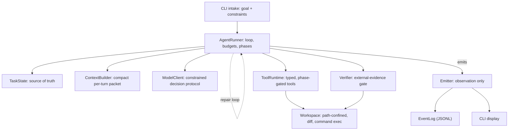

A central **`AgentRunner`** owns the loop and the `TaskState`. Everything else is
a stateless worker or a passive store.

## The per-turn cycle

1. **`ContextBuilder`** assembles a compact packet from `TaskState` — goal, phase,
   recent evidence, and the tools allowed for the current phase. The model
   discovers the repo incrementally through tools, never receiving the whole repo.
2. **`ModelClient`** returns exactly one validated `ModelDecision` (`tool_call`,
   `final_answer`, or `ask_user`). Malformed output is fed back as a recoverable
   error, never executed.
3. **`ToolRuntime`** validates and dispatches tool calls. Tools reach the
   filesystem only through the **`Workspace`**, which confines paths to the repo
   root and pins a diff baseline.
4. The **`AgentRunner`** applies the result to `TaskState` and emits observation
   events. A `final_answer` triggers the **`Verifier`**.

## Verification, not self-certification

The `Verifier` runs **no model**. Every check is a predicate over structured
`TaskState` plus the workspace diff, selected by `task_kind` (`edit` /
`investigate` / `test_only`) so the right contract applies. It passes only on
*required* checks with positive external signal — never vacuously on skipped
checks.

<Info>
  This page is a synthesized overview. For the full design rationale, each
  component's docstring (see the **API reference**) cites the relevant design
  section.
</Info>
