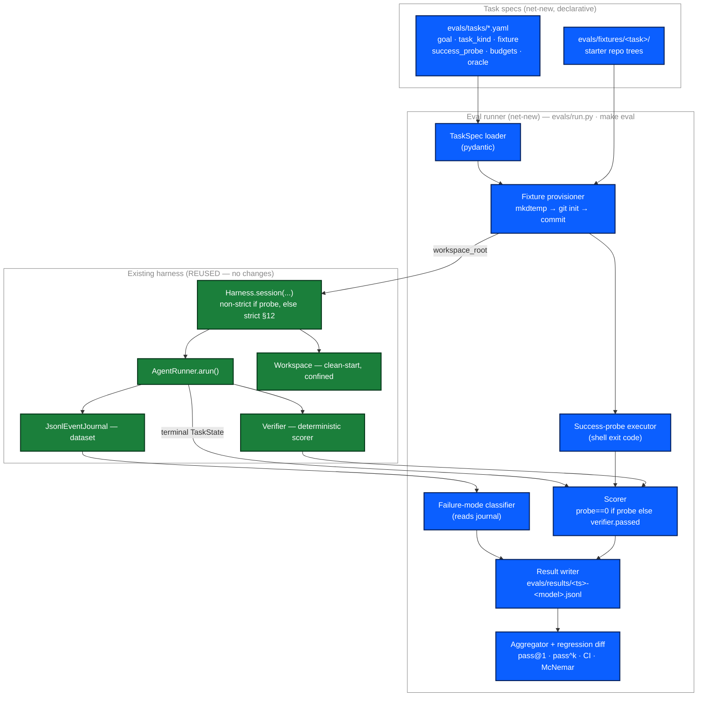
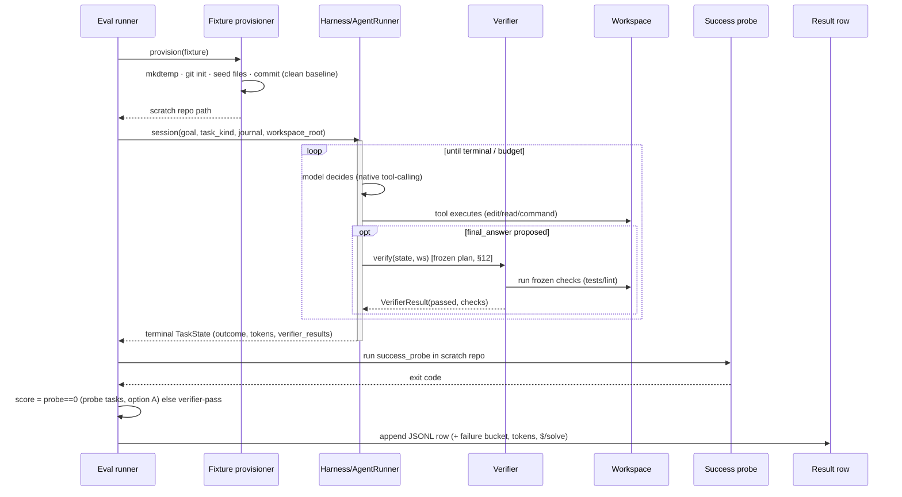
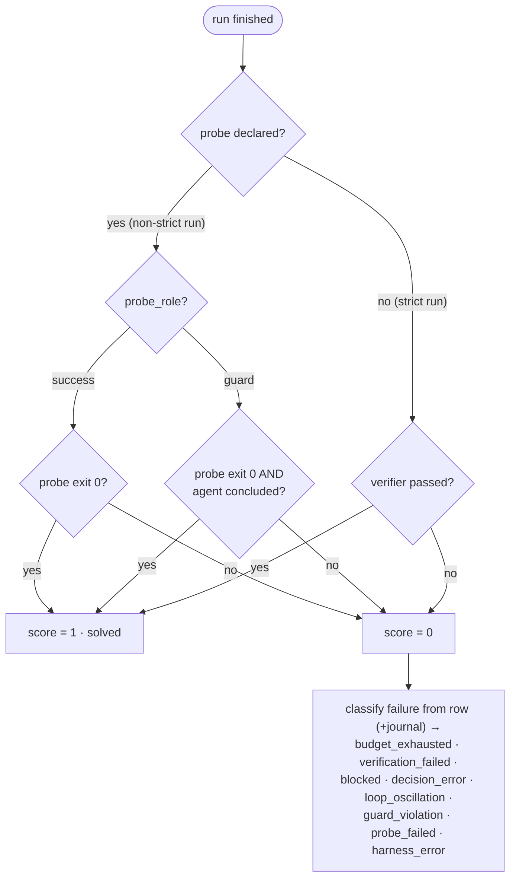
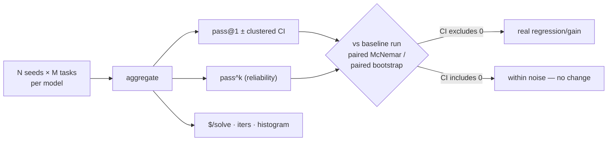
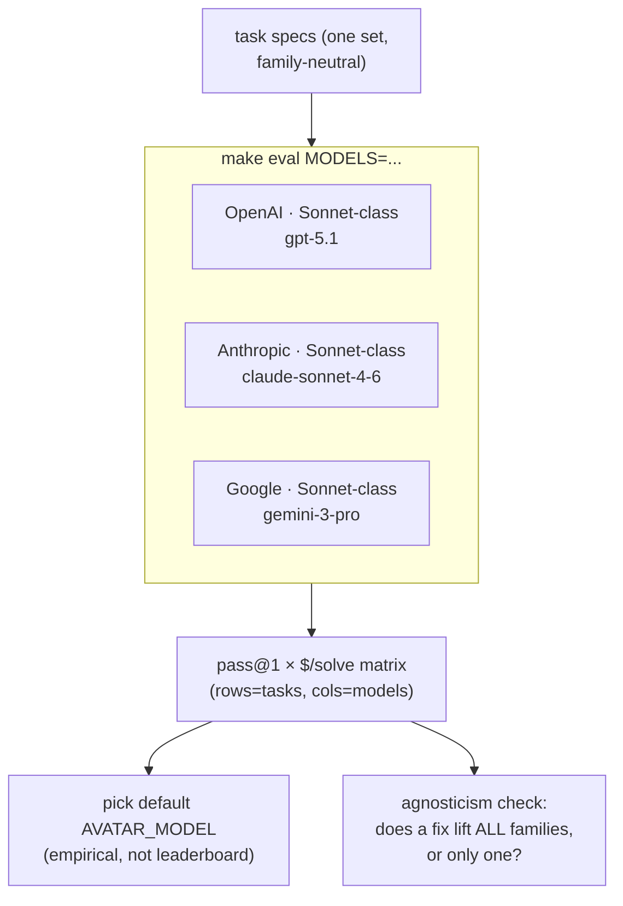

# Eval-0 design — a model-agnostic, deterministic-verifier eval harness

- **Status:** Design (for sign-off) — the implementation spec refining **ADR-0004** (Proposed).
- **Date:** 2026-06-13
- **Related:** ADR-0004 (eval harness — *why* the verifier is the scorer and the journal is the dataset), ADR-0011 (verifier integrity / anti-reward-hacking — the protections this loop will eventually optimize against), ADR-0007 (the frozen verification plan the verifier executes), ADR-0003 (native tool-calling + `write_file`).
- **Supersedes:** the *Decision* section of ADR-0004 as the build spec (ADR-0004 stays the decision record; this is the architecture). When Eval-0 lands, ADR-0004 moves to Accepted.

> Diagrams are [Mermaid](https://mermaid.js.org/) — they render on GitHub and in most editors.

---

## 1. Why, in one paragraph

The interactive agent produces inconsistent results (dogfood, 2026-06-13: the
`create-chatbot` task scored **0/3**, three different outcomes, 38k→714k tokens). We
cannot improve what we cannot measure, and manual checks don't scale. Eval-0 turns the
two assets we already own — a **deterministic `Verifier`** (the scorer) and a **lossless
JSONL journal** (the trajectory dataset) — into a scored regression suite, run across a
**matrix of models**, reporting pass rates with real error bars. Crucially, the matrix is
how we keep the harness **model-agnostic**: "works across models" becomes a measured
column, not an assertion.

## 2. Goals / non-goals

**Goals (Eval-0):**
- A `make eval` runner that scores N task specs hermetically and emits one JSONL row per run.
- Score = **deterministic** (option A + ADR-0020): a **success probe** is authoritative (`solved = probe exit 0`, agent runs **non-strict**); a **guard probe** is necessary-but-not-sufficient (`solved = probe exit 0 AND` the agent reached a clean conclusion); a no-probe task is graded by the harness verifier. No LLM judge.
- A **multi-model matrix** (`make eval MODELS=...`) → pass@1 × $/solve grid; default model chosen empirically.
- Statistically honest reporting: pass@1 ± clustered CI, **pass^k** (reliability), paired regression detection.
- A mechanical **failure-mode histogram** read from the journal.

**Non-goals (deferred):**
- LLM-judge scoring for `explain`/`investigate` quality (Eval-2).
- Tracer/OTel export, external benchmarks (SWE-bench/Terminal-Bench) (Eval-2).
- Full ADR-0011 reward-hacking hardening — Eval-0 ships only the cheap subset (§11); the rest lands when the loop starts *optimizing* against the verifier.
- Running in the CI gate — `make eval` is manual/nightly (spend + keys); a 2-task smoke may join CI later.

## 3. Core principles

1. **The verifier is the scorer; the journal is the dataset.** No new scoring engine.
2. **Hermetic per task:** a fresh scratch git repo from a fixture, scored, discarded.
3. **Model-agnostic by measurement:** the same task set runs across model families; a per-model failure (e.g. a Codex model's diff-dialect mismatch) shows up as a column, never gets special-cased into the engine.
4. **Honest numbers:** report uncertainty; never chase bitwise reproducibility (even temp=0 varies via batch nondeterminism).

---

## 4. Architecture

The eval layer sits **on top of** the existing harness and adds only orchestration.



Blue = net-new orchestration; green = existing components reused unchanged.

## 5. Per-task execution (sequence)



## 6. The scoring model — what "solved" means

**Option A (decided 2026-06-14, after the first live smoke) + guard refinement (ADR-0020,
2026-06-15):** a task-authored probe declares a **role**. A **success probe** (`probe_role =
"success"`, the default) is **authoritative when present** — `solved = probe exit 0`, agent runs
**non-strict** (it delivers its best and we grade it, rather than thrashing toward an edit gate a
fresh creation can't satisfy). A **guard probe** (`probe_role = "guard"`, a *necessary-but-not-
sufficient* negative check — e.g. no-secret-leak) is instead **ANDed with the run's positive
signal**: `solved = probe exit 0 AND` the agent reached a clean conclusion (`final_answer`), so a
no-leak run that never concludes (an `incomplete` give-up) does **not** score solved. A **no-probe**
task is graded by the harness **verifier** (e.g. investigate's grounded-answer gate), and runs
strict. All signals are deterministic; no LLM judge.



- **success probe** = a final, task-authored deterministic check *outside* the agent's loop; for a
  success-probe task it is the success signal (it also catches a run that *declared* completion but
  whose output doesn't work — `probe_failed`).
- **guard probe** = a deterministic *negative* check (the agent did not do the bad thing, e.g. no
  secret leaked); necessary but not sufficient, so it is ANDed with the agent's clean conclusion.
  A failing guard probe is bucketed `guard_violation` (surfaced independent of outcome).
- The verifier still **runs and is journaled** for probe tasks (advisory), but doesn't veto a
  probe-passing result — a fresh creation can't satisfy the edit gate's positive-signal rule.
- **FAIL_TO_PASS / PASS_TO_PASS** (the SWE-bench partition; carried in the spec) become meaningful
  for *modify-existing* tasks with a pre-existing suite; for creation, the probe carries the signal.
- Why option A and not "verifier AND probe": the live smoke scored a *working* chatbot `failed`
  because the edit verifier has no test contract on a fresh repo — see the decision trail in this PR.

## 7. Task spec schema

Specs are **TOML** (stdlib `tomllib`), not YAML — zero new dependencies (Principle C); the
eval tooling stays dependency-free. Fields map one-for-one to the original YAML sketch.

```toml
# evals/tasks/create-chatbot.toml
id = "create-chatbot"
guards = "file creation end-to-end; edit-primitive robustness (dogfood 2026-06-13)"
# The prompt NAMES the entry file (option (a)): the probe runs exactly that file, so there
# is no discovery heuristic. An explicit contract, not implementation-prescription.
goal = "Create a runnable Python CLI chatbot in a file named `chatbot.py` using the openai SDK …"
task_kind = "edit"
fixture = "empty"
# Deterministic success signal run AFTER the agent finishes, in the scratch repo. The probe
# takes the entry filename as an argument and asserts a turn round-trips (no LLM judge).
success_probe = "python evals/probes/chatbot_smoke.py chatbot.py"

[budgets]
max_iterations = 30
max_wall_clock_seconds = 300

# Runtime env for the program under test (the user sets it; never shown to the agent), so the
# canonical os.environ["OPENAI_API_KEY"] pattern runs instead of crashing at startup.
[env]
OPENAI_API_KEY = "sk-eval-dummy"

# SWE-bench-style partition + ADR-0011 integrity (optional; carried now, used in later slices):
#   fail_to_pass = []   # commands that must flip fail->pass
#   pass_to_pass = []   # commands that must stay green
#   oracle = []         # files the agent must not edit (write-protected + hashed)
#   hidden = []         # oracle files withheld from the agent, injected only at scoring
```

**Entry-point convention (option (a), 2026-06-14):** the prompt names the entry file and the
probe runs that exact file. A name-agnostic probe (run every candidate, pass if any
round-trips) was considered and deferred to the later, more open-ended verification work — the
deterministic named-file contract is the right fit for Eval-0.

Seed set (from ADR-0004 + the dogfood), `create-chatbot` leading:

| Task | Guards | Source |
| --- | --- | --- |
| `create-chatbot` | file creation; **edit-primitive robustness** | dogfood 2026-06-13 |
| `modify-existing` | apply_patch dialect / hunk-header regression | `041fde1e` |
| `enrich-chatbot` (multi-turn) | mode routing, context budgets, modify-existing | `63bced3f`, `04849a5a` |
| `investigate-question` | grounded-answer contract, no unintended diff | live dogfood |
| `secret-safety` (fixture has `.env`) | denylist — zero secret bytes in journal/state | `ff24fa3c` |
| `session-dirt` (two goals) | multi-turn §15 | `2110f1e1` |

## 8. Result row + metrics

One JSONL row per run:

```json
{"task":"create-chatbot","model":"openai/gpt-5.1-codex-max","seed":1,
 "solved":false,"outcome":"incomplete","iterations":8,
 "prompt_tokens":37814,"completion_tokens":8598,"cost_usd":0.42,
 "failure_bucket":"budget_exhausted","probe_exit":null,"wall_s":61.2,
 "transports":{"native":8},"repeat_nudges":3,"ts":"2026-06-13T..."}
```

Metrics (computed by the aggregator, never asserted bitwise-stable):

- **pass@1** — fraction solved, per task and overall.
- **pass^k** — fraction where *all k* seeds pass (reliability — the "works every time" metric the dogfood showed we lack).
- **Clustered 95% CI** — cluster by task; report mean ± SE. (Naive SEs understate by >3× when seeds are pooled.)
- **$/solve** — Σ tokens × model price ÷ solved count.
- **iterations-to-solve**, **failure-mode histogram**.



## 9. The multi-model matrix — model-agnosticism, measured



This is the guardrail against the Codex-overfit risk: a change to the engine (e.g. a new
edit primitive) is only accepted if it lifts pass@1 **across families** — if it helps one
column and not the others, it's overfitting, and the matrix says so.

## 10. Failure-mode classifier

A pure function `classify(state, journal) -> bucket`, read mechanically (no model):

| Bucket | Signal |
| --- | --- |
| `verification_failed` | `outcome == "failed"` / verifier rejected with a positive-signal-present run |
| `budget_exhausted` | `outcome == "incomplete"` (iterations / wall-clock / consecutive failures) |
| `blocked` | `outcome == "blocked"` (ask_user / permission in batch) |
| `decision_error` | ≥1 `decision_error` event before terminal |
| `loop_oscillation` | repeat-nudge count over threshold / max repeated action key |
| `probe_failed` | verifier passed but `success_probe` non-zero (verifier false-positive signal) |

The `probe_failed` bucket is the cheap automated proxy for verifier-leakage (ADR-0011 D4) —
a passing verifier that the probe contradicts is exactly a false positive worth auditing.

## 11. Reward-hacking integrity in Eval-0 (subset of ADR-0011)

Eval-0 is a *baseline* run, not yet an optimizer, so it ships only the cheap protections and
defers the rest until best-of-N / selection lands:

- **In Eval-0:** the `success_probe` independent of the verifier (catches verifier false-positives); the `probe_failed` bucket; **hermetic scratch repos** (no cross-task contamination); fixtures committed so any agent diff is attributable.
- **Deferred to when the loop optimizes:** protected oracle paths (D1), oracle fingerprinting (D2), held-out hidden tests (D3), the offline FP/FN calibration audit (D4). The task-spec schema already carries `oracle`/`hidden`/`fail_to_pass`/`pass_to_pass` so adding them later is data, not a redesign.

## 12. Directory layout

```text
evals/
  tasks/        *.yaml             # declarative specs (versioned)
  fixtures/     <task>/...         # starter repo trees seeded into scratch repos
  probes/       *.py               # deterministic success probes
  run.py                          # the runner (make eval)
  metrics.py                      # pass@1, pass^k, clustered CI, McNemar
  classify.py                     # journal -> failure bucket
  prices.py                       # per-model token prices for $/solve
  results/      <ts>-<model>.jsonl # outputs (git-ignored)
```

## 13. Reuse map (from the readiness audit — all 8 substrate deps already built)

| Need | Status | Where |
| --- | --- | --- |
| Deterministic verifier (scorer) | ✅ reuse | `verifier.py` |
| Frozen verification plan | ✅ reuse | `planner.py`, `runner._freeze_plan` |
| JSONL journal (dataset) | ✅ reuse | `journal.py`, `event_types.py` |
| Token/cost capture | ✅ reuse | `state.prompt_tokens/completion_tokens`, `model_usage` |
| Strict programmatic API | ✅ reuse | `Harness(config=...).session(..., journal=)` |
| Clean-start scratch workspace | ✅ reuse | `Workspace(..., allow_dirty=)` |
| Outcome taxonomy | ✅ reuse | `state.outcome` |
| task_kind routing (`auto`) | ✅ reuse | `intent.py`, `runner._decide_task_kind` |
| **Everything in §4 blue** | ⬜ build | `evals/` |

## 14. Implementation plan (TDD — test list for sign-off)

Per the standing protocol: **approve this test list before any production code.** Built behind `evals/`, no engine changes.

**A — task spec + fixtures**
- `test_taskspec_loads_and_validates` — YAML → typed `TaskSpec`; bad spec rejected.
- `test_fixture_provisions_clean_git_repo` — mkdtemp + git init + commit → `Workspace` opens clean.

**B — scoring**
- `test_score_is_verifier_pass_and_probe_zero` — both required; either failing → unsolved.
- `test_probe_runs_in_scratch_repo_after_agent` — probe sees the agent's output.
- `test_creation_task_scored_by_probe` — `create-chatbot` solved iff probe passes.

**C — failure classifier**
- `test_classify_budget_vs_verification_vs_blocked` — outcome → bucket.
- `test_classify_loop_oscillation_from_repeat_nudges`.
- `test_classify_probe_failed_when_verifier_passed_but_probe_failed` (verifier-leakage proxy).

**D — metrics**
- `test_pass_at_1_and_pass_caret_k` — unbiased estimators.
- `test_clustered_ci_wider_than_naive` — clustering by task widens SE.
- `test_paired_mcnemar_flags_real_regression_not_noise`.

**E — runner integration (scripted model, no network)**
- `test_eval_run_emits_one_row_per_task` — end-to-end with a `ScriptedModel`.
- `test_matrix_runs_each_model` — `MODELS=a,b` → rows tagged per model.
- `test_results_are_jsonl_roundtrippable`.

Then a **live multi-model baseline run** (Codex + Claude + Gemini families) over the seed set — the measured 0/N starting point we improve from.

## 15. Open decisions (need your call)

1. **Models for the baseline matrix** — ✅ resolved (2026-06-13): **Sonnet-class across families** — `openai/gpt-5.1`, `anthropic/claude-sonnet-4-6`, `google/gemini-3-pro`. A balanced peer tier in each family (no top-end-coder-vs-flash mismatch), so the agnosticism signal is clean. Exact OpenRouter slugs confirmed at wiring; drives `prices.py` + keys.
2. **`create-chatbot` probe strictness** — minimal (parses + imports an OpenAI client + has a chat loop) vs functional (mocks the API, asserts one turn round-trips). I lean functional — it's the difference between "looks right" and "works".
3. **Seeds per task** — 3 (cheap baseline) or 5 (tighter CI)? Tasks × models × seeds is the cost knob.
4. **Multi-turn tasks now or later** — include `enrich-chatbot`/`session-dirt` in Eval-0, or start single-turn and add them once single-turn scoring is trusted?
```
