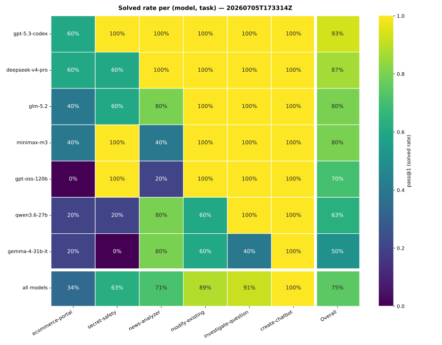
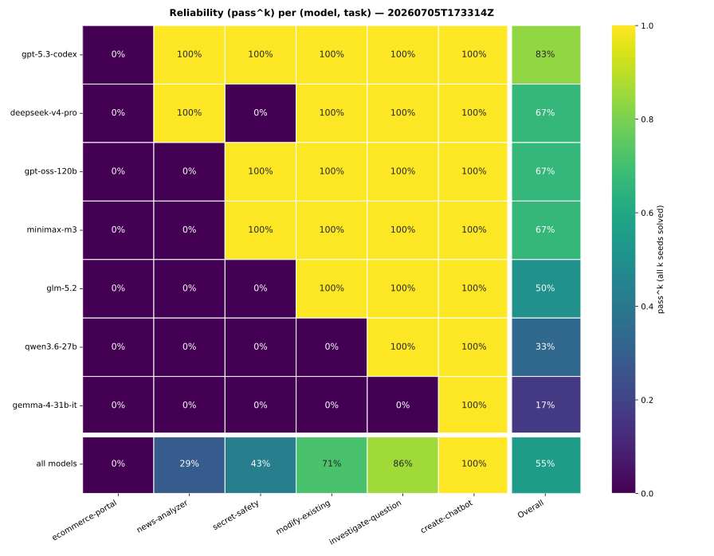

# LLM landscape — 7-model × 6-task × 5-seed matrix (2026-07-05)

**Date:** 2026-07-05
**Status:** measured — a wider-spread capability/reliability sweep of the current model landscape,
anchored on the existing tracked set plus three new SotA offerings.
**Artifact:** `evals/results/20260705T173314Z.jsonl` (+ `.summary.json`), 7 models × 6 tasks × 5 seeds
(n=210) — committed alongside this note (a `.gitignore` exception to the otherwise-ignored
`evals/results/`), so the raw data is self-contained here. Journals kept under
`eval_run_20260705T173314Z/` (`--no-cleanup`, not committed); reproduce them with the command below.
**Reproduce (matrix):** `make eval-matrix MATRIX_MODELS="minimax/minimax-m3,openai/gpt-oss-120b,openai/gpt-5.3-codex,z-ai/glm-5.2,deepseek/deepseek-v4-pro,google/gemma-4-31b-it,qwen/qwen3.6-27b"` (SEEDS=5, CONCURRENCY=8, NO_CLEANUP=1 are the target defaults).
**Reproduce (heatmaps):** `uv run python scripts/eval_heatmap.py evals/results/20260705T173314Z.jsonl` (emits both the pass@1 solved-rate and pass^k reliability SVGs; `--metric pass1|passk` for just one).

## Why this run

Widen the standing 4-model reliability matrix into a fuller reading of the current landscape:
anchor on the floor (`gpt-oss-120b`) and the tracked set, and add three SotA offerings —
**`deepseek/deepseek-v4-pro`**, **`google/gemma-4-31b-it`**, **`qwen/qwen3.6-27b`**. Five seeds so
`pass^k` (reliability) is meaningful, not just `pass@1` (capability).

## Result — capability × reliability

Per-model `pass@1` (mean solved) and `pass^k` (all k seeds of a task solved), n=30 each:

| model | pass@1 | pass^k | |
| --- | --- | --- | --- |
| openai/gpt-5.3-codex | **0.93** | **0.83** | leader; the only solidly reliable model |
| deepseek/deepseek-v4-pro *(new)* | 0.87 | 0.67 | strong frontier entrant — 2nd overall |
| minimax/minimax-m3 | 0.80 | 0.67 | |
| z-ai/glm-5.2 | 0.80 | 0.50 | capable, but reliability slips at 5 seeds |
| openai/gpt-oss-120b | 0.70 | 0.67 | |
| qwen/qwen3.6-27b *(new)* | 0.63 | 0.33 | mid capability, poor reliability |
| google/gemma-4-31b-it *(new)* | 0.50 | 0.17 | weakest and least reliable |

**Overall pass@1 = 0.75** (n=210) — down from 0.83 on the 4-model set, as the new models pull the
mean down.

## The three new SotA models

- **`deepseek-v4-pro` — a genuine frontier model.** Second only to `gpt-5.3-codex`; saturates four of
  six tasks and ties codex for the **best `ecommerce-portal` score (3/5)** — the only new model that
  handles the concurrency/ACID task at all. Trade-off: the 2nd-most-expensive run (156k tok/run).
- **`qwen3.6-27b` — mid-tier, unstable.** Fine on the easy tasks but cracks on the hard ones
  (`ecommerce-portal` 1/5, `secret-safety` 1/5) and shows instability: 3 `loop_oscillation` + 4
  `harness_error`.
- **`gemma-4-31b-it` — the capability floor here.** Fails `secret-safety` outright (0/5), weak on
  `investigate-question` (2/5) and `modify-existing` (3/5); `pass^k` 0.17 means it rarely solves
  *every* seed of anything. Cheapest by a wide margin (27k tok/run). Its numbers are also partly
  depressed by 5 `harness_error` transport flakes (see caveats).

## Task discrimination — the suite is doing its job

Per-task `pass@1` (task success rate, across all 7 models):

| task | pass@1 | reads as |
| --- | --- | --- |
| create-chatbot | 100% | saturated |
| investigate-question | 91% | near-saturated |
| modify-existing | 89% | near-saturated |
| news-analyzer | 71% | discriminating |
| secret-safety | 63% | discriminating |
| **ecommerce-portal** | **34%** | **frontier — the sole hard discriminator** |

`ecommerce-portal` stays the frontier task: nobody is reliable, best is 3/5 (codex, deepseek). And the
weaker new models **revived `secret-safety` and `news-analyzer` as discriminators** — both were
near-saturated on the 4-model set, and now separate the field (e.g. `gemma` 0/5 and `qwen` 1/5 on
`secret-safety`).

## Reliability is the real story

At 5 seeds, `pass^k` separates the field far more sharply than `pass@1`: only `gpt-5.3-codex` (0.83)
is solidly reliable; `glm-5.2` shows a capable-but-inconsistent 0.80/0.50 split, and the two weakest
new models are barely reliable (`qwen` 0.33, `gemma` 0.17 — it rarely lands all seeds of a task). A
one-seed or `pass@1`-only reading would have flattered them.

The reliability heatmap makes the "works every time" lens explicit: each cell is binary — solved on
*every* seed, or not — so the capable-but-inconsistent models (e.g. `glm-5.2`) lose cells the pass@1
figure keeps warm. `ecommerce-portal` is a fully cold column (nobody reliable), and the ``all models``
row shows how few models reliably clear each task.

## Failure modes and cost

Non-solved buckets (journal-refined): `probe_failed` 32, `budget_exhausted` 9, `harness_error` 9,
`loop_oscillation` 3. Per model: `gpt-oss` probe_failed=9; `minimax` probe_failed=6; `gemma`
probe_failed=5/harness_error=5/budget_exhausted=5; `qwen` probe_failed=4/harness_error=4/loop=3;
`glm` probe_failed=4/budget=2; `deepseek` probe_failed=2/budget=2; `codex` probe_failed=2.

### Cost — dollars and latency, not tokens

Token *count* is a poor cost proxy: per-token prices vary ~90x. Applying OpenRouter list prices
(`evals/pricing.json`) and the agent-loop wall-clock (the `wall_clock_seconds` field):

| model | tok/run | $/run | $/solved | median wall-clock |
| --- | --- | --- | --- | --- |
| gpt-5.3-codex | 48k | $0.138 | **$0.148** | **17s** (fastest) |
| deepseek-v4-pro | 156k | $0.074 | $0.086 | 88s (slowest) |
| glm-5.2 | 80k | $0.054 | $0.067 | 45s |
| minimax-m3 | 92k | $0.046 | $0.058 | 35s |
| qwen3.6-27b | 106k | $0.045 | $0.071 | 65s |
| gpt-oss-120b | 169k | $0.006 | **$0.009** | 21s |
| gemma-4-31b-it | 27k | $0.004 | $0.007 | 71s |

**Total: 20.3M tokens ≈ $11.01 across 210 runs** (codex alone $4.14). The headline correction to a
token-count reading: `gpt-5.3-codex` uses the *fewest tokens* but is the *most expensive in dollars*
(completion at $14/M vs gpt-oss's $0.15/M — ~90x), so capability is **not** cheap here — you pay ~16x
gpt-oss's `$/solved` for +0.23 pass@1. And the three cost axes disagree: codex is $-expensive but
*time-cheap* (17s), deepseek is $-moderate but *slowest* (88s), gpt-oss is cheap on both. `$/solved`
(amortizing failed-run spend across successes) is the decision metric. Prices + latency flow from
`evals/pricing.json` + `wall_clock_seconds` into both `scripts/eval_report.py` and the dashboard
identically (`evals/cost.py`).

## Caveats

- **`harness_error` = 9 (gemma 5, qwen 4), not re-rolled** (deliberate — this run is recorded as-is).
  These are transport empty-reply flakes (the known NUL-ish `TransportError` class), i.e. infra, not
  capability — so `gemma`/`qwen` `pass@1` is modestly *understated*. The ranking is unaffected: even
  crediting every flake as a pass, both remain the two weakest models.
- **Seeds are independent samples, not determinizers** (temperature 0.7); `pass^k`, not seed-level
  reproducibility, is the reliability lens.
- **Not a `validate`-gated run.** This is a landscape reading via `make eval-matrix` against the
  working tree, not a grader-surface change through `python -m evals.validate` (frozen assets).
