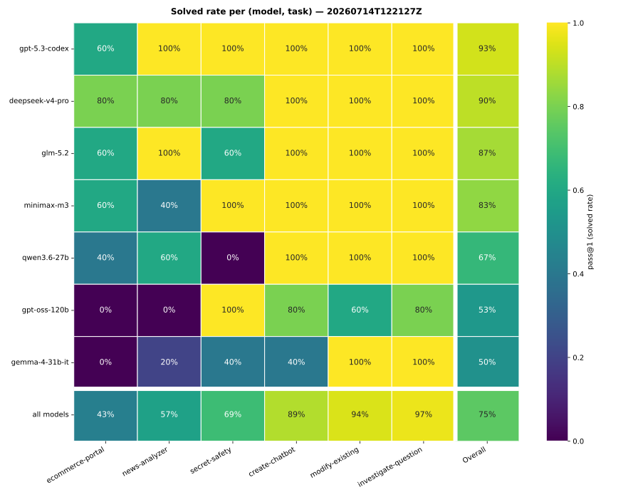
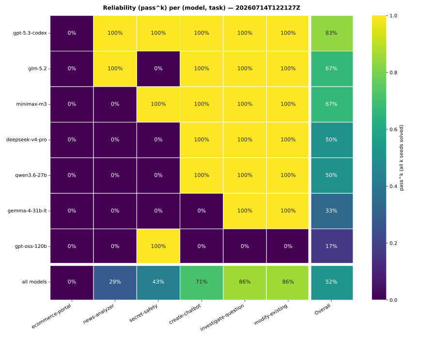
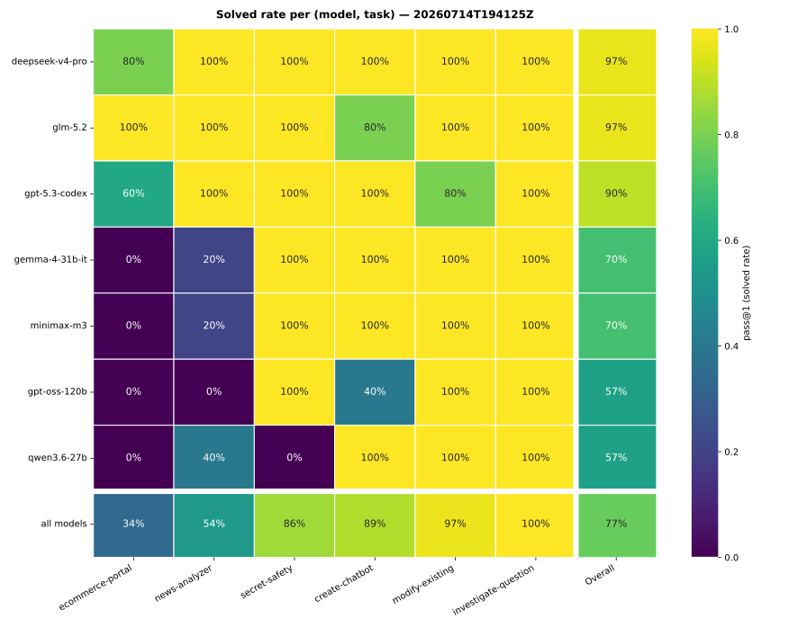
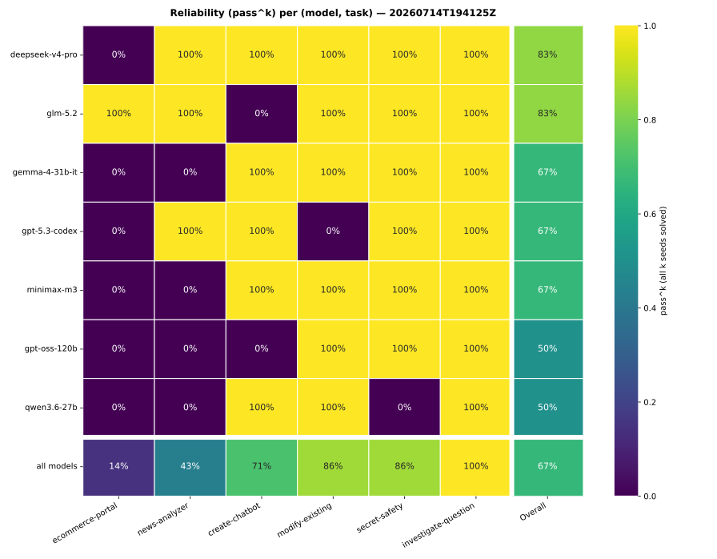

# Landscape regression — declared-verification tree vs the 2026-07-05 standard

**Date:** 2026-07-14
**Status:** measured — a cell-for-cell rerun of the 2026-07-05 landscape matrix
(`docs/research/2026-07-05-llm-landscape.md`) against the current working tree
(`feat/tetris-tui-eval-task`, stacked on `feat/declared-verification-contract`), to regression-test
the harness changes since then (the ADR-0038+ declaration gate, verification hardening) against the
recorded standard. **Run twice** on the identical tree — the second run measures the metrics'
own run-to-run noise (see "Run 2").
**Artifact:** `evals/results/20260714T122127Z.jsonl` and `evals/results/20260714T194125Z.jsonl`
(+ `.summary.json` each) — 7 models × 6 tasks × 5 seeds (n=210 per run). Not committed (unlike the
baseline's exception): the headline figures, per-cell tables, and heatmaps in this note carry the
evidence, and the run is reproducible with the command below. Journals kept under
`eval_run_20260714T122127Z/` and `eval_run_20260714T194125Z/` (`--no-cleanup`, not committed).
**Baseline:** `evals/results/20260705T173314Z.jsonl` (same models, tasks, seeds, temperature).
**Reproduce:** `make eval TASKS="create-chatbot,investigate-question,modify-existing,news-analyzer,secret-safety,ecommerce-portal" MODELS="minimax/minimax-m3,openai/gpt-oss-120b,openai/gpt-5.3-codex,z-ai/glm-5.2,deepseek/deepseek-v4-pro,google/gemma-4-31b-it,qwen/qwen3.6-27b" SEEDS=5 CONCURRENCY=8 NO_CLEANUP=1`
(tasks pinned explicitly — `eval-matrix` has no task filter and would now also sweep the tetris
tasks, which are not part of the baseline).
**Diff verdict:** `make eval-diff BASELINE=evals/results/20260705T173314Z.jsonl CANDIDATE=evals/results/20260714T122127Z.jsonl`
**Reproduce (heatmaps):** `uv run python scripts/eval_heatmap.py evals/results/20260714T122127Z.jsonl` (emits both the pass@1 solved-rate and pass^k reliability SVGs; `--metric pass1|passk` for just one).

## Headline — the harness holds the standard

Overall `pass@1` = **0.75 → 0.75** (n=210), and `evals.diff` finds **no statistically significant
per-model change** (McNemar on paired cells). Failure-mode buckets are near-identical
(`probe_failed` 32→32, `budget_exhausted` 9→8, `loop_oscillation` 3→3, `harness_error` 9→10).
Total cost is flat: **$11.01 → $10.91**.

| model | pass@1 (base→now) | pass^k (base→now) | diff verdict |
| --- | --- | --- | --- |
| openai/gpt-5.3-codex | 0.93 → 0.93 | 0.83 → 0.83 | unchanged; still the leader |
| deepseek/deepseek-v4-pro | 0.87 → 0.90 | 0.67 → 0.50 | no significant change |
| z-ai/glm-5.2 | 0.80 → 0.87 | 0.50 → 0.67 | no significant change |
| minimax/minimax-m3 | 0.80 → 0.83 | 0.67 → 0.67 | no significant change |
| **openai/gpt-oss-120b** | **0.70 → 0.53** | **0.67 → 0.17** | **reg=5 imp=0, p=0.062 — see below** |
| qwen/qwen3.6-27b | 0.63 → 0.67 | 0.33 → 0.50 | no significant change |
| google/gemma-4-31b-it | 0.50 → 0.50 | 0.17 → 0.33 | no significant change |

Task discrimination also holds: `ecommerce-portal` remains the frontier discriminator
(0.34 → 0.43), `secret-safety` and `news-analyzer` still separate the field. `create-chatbot`
slipped off saturation (1.00 → 0.89) — entirely transport/harness-error cells, not capability.

The reliability heatmap is where the gpt-oss finding is most visible: its row went from four warm
cells on the baseline to one (`secret-safety`, its only 5/5 task this run) — the binary
all-seeds-solved lens amplifies the 8 scattered transport deaths into a near-cold row, while every
other model's row is stable or warmer than the baseline.

## The one real finding: gpt-oss-120b × Groq × the declaration gate

gpt-oss-120b's drop (−0.17 pass@1, −0.50 pass^k; the sole `reg=5 imp=0` model, p=0.062) is **not a
capability regression** — it is a new, systematic harness×provider interaction. **8 of its 30 runs
(27%) died as `harness_error`**, versus 0 in the baseline:

- **7 × Groq server-side tool-call validation:** `Tool call validation failed: attempted to call
  tool 'declare_verification' which was not in [the request's tools]`. Mechanism:
  `declare_verification` is deliberately **investigating-phase-only** (`runner.py:484`), but the
  system prompt names it (`runner.py:109/115/950`). Mid-task — journals show real work, e.g.
  `modify-existing` seed0 died at turn 9 after landing edits — the model reaches for the tool from
  `editing` phase. Most providers return such a call in-band, where the harness's constrained
  `ModelDecision` validation would feed back a recoverable unknown-tool error (§10 narrow retry).
  **Groq validates tool names server-side and 4xxes the whole request**, which the transport
  surfaces as `TransportError` → system-failure path → run dies, never retried.
- **1 × Groq strict JSON parsing:** `Failed to parse tool call arguments as JSON` — same family:
  a model-correctable malformation upgraded to a fatal transport error by provider-side validation.

The baseline's 9 `harness_error`s were random empty-reply flakes (gemma 5, qwen 4). The candidate's
10 are a *different composition*: 8 systematic gpt-oss deaths + 1 qwen empty-reply + 1 new harness
bug (below). Five of the eight gpt-oss deaths were baseline-solved cells — that alone accounts for
the entire apparent drop.

**Follow-up options (not implemented here):** (a) catch provider-side tool-validation /
argument-parse 4xxes in the transport and re-present them to the model as recoverable
invalid-decision feedback — the general fix, matching how in-band invalid decisions already work;
(b) keep the verification tools schema-visible in all phases and let the existing
`_refuse_for_declaration` machinery refuse out-of-phase calls in-band. (a) also covers the
JSON-parse case; (b) only the phase-gating one.

## Second finding: a genuine harness crash (1 cell)

`google/gemma-4-31b-it` × `create-chatbot` seed1 died with
`TypeError: 'NoneType' object is not subscriptable` — a harness-side exception, not a transport
flake (journal: `eval_run_20260714T122127Z/google-gemma-4-31b-it__create-chatbot__seed1__*/`,
dies immediately after `turn_start` 12). Not yet root-caused; filed as an open item.

## Latency moved; work did not

Median wall-clock rose broadly (minimax 35→122s, glm 45→122s, qwen 65→211s, gemma 71→240s,
codex 17→32s, deepseek 88→127s) **while per-run tokens stayed flat** (e.g. minimax 92k→65k,
qwen 106k→104k, codex 48k→47k). Flat tokens with higher wall-clock reads as **provider-side
latency variance on the day**, not extra harness turns — the declaration gate did not measurably
inflate the work done per run. (gpt-oss 169k→53k tokens and gemma 27k→53k are artifacts of the
early deaths and longer retries above.)

## Run 2 — measuring the metric itself

A second, byte-identical run (`20260714T194125Z`, same tree, same command, ~7h later) was executed
to answer a standing doubt: *the pass@1 ordering moves too much across the task axis to trust.*
The two same-tree runs differ only by sampling (temperature 0.7; seeds are independent samples,
not determinizers) plus provider-side nondeterminism — so their disagreement **is the noise
floor**, and it is large:

- **Seed-level agreement between identical runs: 176/210 (84%).** One cell in six flips outcome
  with zero code change.
- **Model-level pass@1 moved up to ±0.20** (gemma 0.50→0.70) between identical runs; the 7-model
  ordering's Kendall tau between them is **+0.48** — no higher than either run's agreement with
  the 07-05 baseline (+0.86 / +0.43). The mid-pack order (deepseek/glm/minimax/codex, all
  0.70–0.97) is **not resolvable at n=30**.
- **Per-task model orderings are noise at n=5 seeds/cell**: tau(r1, r2) per task ranges **0.00 to
  +0.81** (`investigate-question` 0.00, `modify-existing` −0.05). A 5-trial binomial cell has a
  ~±0.4 95% interval — task-axis rank churn of this size is exactly what the arithmetic predicts,
  and would persist on any harness.
- **pass^k is the noisiest statistic in the report: 10/42 cells (24%) flipped** between identical
  runs (22→28 warm). All-5-of-5 is `p^5` — at true p=0.9 a cell is warm only 59% of the time, so
  single-run pass^k should be read as directional, never as a per-cell fact.
- **The per-model significance test fires spuriously at this n**: `evals.diff` flags gemma
  r1→r2 as a significant IMPROVEMENT (p=0.031, reg=0 imp=6) *between two identical trees* — with
  7 models tested per comparison, one p<0.05 hit is the expected multiple-comparisons false
  positive. Treat single-model p-values near 0.05 as noise unless the mechanism is identified.

**What survives all three runs** (the actually-load-bearing facts): codex is stable at the top
(0.90–0.93); `ecommerce-portal` is always the frontier discriminator (0.34–0.43);
`investigate-question`/`modify-existing`/`create-chatbot` sit at/near saturation; gemma, qwen and
gpt-oss form the bottom tier. Pooling today's two runs (n=60/model), **every model's CI overlaps
its baseline** — including gpt-oss (0.70±0.16 → 0.55±0.13, borderline).

Run 2 also recontextualizes the gpt-oss finding: it had **zero** harness errors in run 2 (failure
modes: `probe_failed` 44, `budget_exhausted` 3, `loop_oscillation` 2 — no `harness_error` at all)
yet still scored 0.57. The Groq tool-validation mechanism from run 1 is real — 7 identical error
strings — but **intermittent**, consistent with OpenRouter routing gpt-oss to a different upstream
on the second run. It cannot be confirmed post-hoc because **neither result rows nor journals
record the serving provider** — filed as a harness follow-up (record provider/routing metadata per
request). The pass@1 cost of the mechanism is therefore not separable from sampling noise at this
n; the transport-hardening follow-up stands on the mechanism's evidence, not the score delta.

**Prescriptions for reading this report class going forward:** (1) model-level pass@1 carries
±0.13–0.17 at n=30 — compare runs only via the paired diff (`evals.diff`), never raw deltas;
(2) per-task model rankings need ~20+ seeds/cell to resolve 0.2 gaps — do not read rank order
across the task axis at n=5; (3) treat pass^k(k=5) as directional; pooling repeated runs (k=3 over
10 seeds, or a beta-binomial estimate) would stabilize it; (4) one significant per-model p-value
per 7-model comparison is the expected false-positive rate.

## Caveats

- Seeds are independent samples (temperature 0.7); paired-cell diff (`evals.diff`) is the lens,
  and it clears every model — gpt-oss's p=0.062 is suggestive, not significant, but the 8/30
  deterministic error signature makes the mechanism unambiguous regardless.
- Not a `validate`-gated run: a working-tree regression reading via `make eval`, matching how the
  baseline itself was produced.
- The tetris tasks (`tetris-easy`, `tetris-hard`) were deliberately excluded — they postdate the
  baseline. The standard compared here is exactly the 2026-07-05 six-task surface.

## Conclusion

The declared-verification tree **meets the 2026-07-05 standard**: no significant capability or
reliability regression on any model across two independent runs (overall pass@1 0.75 / 0.77 vs
0.75), flat cost, and the task suite's discrimination structure intact. The runs surfaced three
actionable harness items — the Groq×declaration-gate transport death (mechanistically confirmed,
intermittent across runs), one un-root-caused `NoneType` crash, and the absence of
provider/routing metadata in result rows and journals. The paired same-tree runs also calibrated
the metrics themselves: at 5 seeds, per-task rank order and single-run pass^k are noise-dominated;
only paired-diff verdicts and cross-run-stable structure should be treated as findings.
