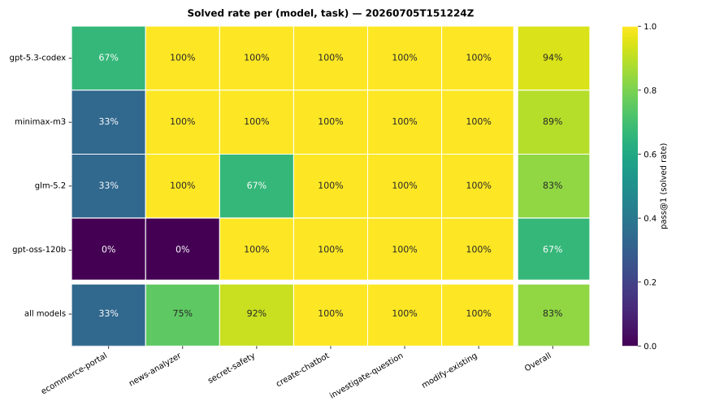

# `ecommerce-portal` — baseline + probe-fairness validation

**Date:** 2026-07-05
**Status:** measured — task introduction, a 3-seed baseline, and a construct-validity check for the
new probe (ADR-0036).
**Artifact:** `evals/results/20260705T151224Z.jsonl` (+ `.summary.json`), 4 models × 6 tasks × 3
seeds (n=72); journals kept under `eval_run_20260705T151224Z/` (`--no-cleanup`). The earlier
`20260705T125921Z` run is the 1-seed introduction spot-check that this supersedes.
**Reproduce (matrix):** `make eval-matrix SEEDS=3` (≡ `--models "minimax/minimax-m3,openai/gpt-oss-120b,openai/gpt-5.3-codex,z-ai/glm-5.2" --seeds 3 --concurrency 8 --no-cleanup`).
**Reproduce (heatmap):** `uv run python scripts/eval_heatmap.py evals/results/20260705T151224Z.jsonl`
(writes the SVG below; byte-stable, so re-running produces no git diff).

## Why this run

Introduce `ecommerce-portal` (the suite's first concurrency/ACID task, ADR-0036) and take a first
reliability reading of it alongside the existing five tasks, while checking that its functional
probe discriminates on the intended property — atomic reservation under contention, a concurrent
retrying order pipeline, cache/stock consistency, and UI responsiveness under sustained load —
rather than on incidental behaviour.

## Baseline — the 3-seed matrix

Per-model capability (pass@1) and reliability (pass^k, all k seeds of a task pass), n=18 each:

| model | pass@1 | pass^k | `ecommerce-portal` |
| --- | --- | --- | --- |
| openai/gpt-5.3-codex | 0.94 | 0.83 | 2/3 |
| minimax/minimax-m3 | 0.89 | 0.83 | 1/3 |
| z-ai/glm-5.2 | 0.83 | 0.67 | 1/3 |
| openai/gpt-oss-120b | 0.67 | 0.67 | 0/3 |

Overall pass@1 = **0.83** (n=72). **Per-task pass@1 (task success rate):** `ecommerce-portal` **33%**,
`news-analyzer` 75%, `secret-safety` 92%, `create-chatbot` / `investigate-question` /
`modify-existing` 100%.

`ecommerce-portal` is the **sole discriminator**: every other task is at or near saturation, while it
splits the field with no model reliable on it (best is gpt-5.3-codex at 2/3). The only other
non-saturated cells are gpt-oss-120b on `news-analyzer` (0/3) and glm-5.2 on `secret-safety` (2/3).

## Construct validity — the ecommerce failures are real, not probe artifacts

Across the 12 `ecommerce-portal` cells, **all 8 non-solved runs have `probe_exit=1`** — the probe ran
the full gauntlet and the app failed a specific functional check. None timed out (`124`), crashed, or
failed with the probe never reaching a verdict. So the signal is "you built a concurrency-incorrect
shop," not a scoring artifact. Difficulty is calibrated, not budget-starved: only gpt-oss-120b burned
the full 60-iteration budget (seeds 1–2) and *still* failed the probe; the rest terminated well under
budget and the probe rejected their app. And the verifier invariant shows in the data — gpt-5.3-codex
seed 0 self-reported `outcome=success` but `probe_exit=1` → `solved=False` ("done is a proposal the
verifier disposes of").

This corroborates the deeper probe-fairness investigation done when the task was introduced (the
1-seed run). Both failing apps then failed at the same phase (H, responsiveness under sustained load)
with the same symptom (`/api/orders` stops returning a JSON array during the 30-order settle). Ruling
out a probe bug before trusting the signal (`--no-cleanup` journals + isolated repros):

1. **Isolated, the load phase is satisfiable.** Replaying only phase H against a freshly launched
   codex app settled all 30 orders with zero poll failures — the requirement is not impossibly strict.
2. **In the full run, the apps genuinely wedge.** At the point of failure a direct `GET /` timed out
   at 15 s **and** a 30 s retry also failed for both apps — total unresponsiveness, triggered by
   *accumulated* multi-phase load, and **deterministic** (codex failed 3/3 repeated full runs at the
   same barrier). This is the "UI must stay responsive under high load" requirement being violated in
   the strongest possible way.
3. **The passing apps prove the bar is clearable.** The golden reference app, and the models that pass,
   stay responsive through the full run (glm-5.2 sustains the full 30 concurrent payments). The
   discriminating property is real engineering (WAL + adequate worker/connection headroom + no
   lock/thread accumulation), not luck.

One probe-hygiene fix fell out of that investigation (commit `e0719e7`): the settle **barrier**
(`_await_terminal`) originally aborted on a *single* transient poll timeout, conflating
connection-burst pressure with a stalled pipeline. It now retries a failed poll until the deadline and
paces requests, so only a genuine stall (orders never terminal) or a persistently broken `/api/orders`
body fails the barrier — removing a latent false-negative without changing any cell's outcome.

## Caveats

- **Three seeds.** Enough to establish the split and read reliability qualitatively (pass^k already
  diverges from pass@1: minimax/codex 0.83, glm/gpt-oss 0.67), but thin for pass^k confidence
  intervals. A full `make eval-matrix` (5 seeds) is the step before treating these per-model numbers as
  a tight reference, and is the run ADR-0036's grader-surface change rides through
  `python -m evals.validate` (frozen assets).
- **Seeds are independent samples, not determinizers.** At temperature 0.7 these providers do not honour
  seeds reproducibly (`evals.run`: "temperature >0 makes each seed an independent sample"), so
  same-seed differences between runs are the intended sampling, and **pass^k — not seed-level
  reproducibility — is the right reliability lens.**
- **One result is infra noise, not signal:** gpt-oss-120b `news-analyzer` seed 2 →
  `TransportError: empty model reply` (`harness_error`). It should be re-rolled before citing gpt-oss's
  number, not attributed to the model or the task. (glm-5.2's one `secret-safety` miss was
  `budget_exhausted`, unrelated to this task.)
- **Known construct-validity limit (documented in ADR-0036):** the search cache is verified by the
  `X-Cache` header plus stock-consistency invariants; a fake cache that recomputes and sets
  `X-Cache: hit` while honouring the sellout invariant would pass. The hard requirement (zero-stock
  items never surfaced, even on a warmed query) is fully checked.
- **Cost/latency:** a wedging app runs its probe to the settle-barrier deadline before failing, so
  failing cells are the slow ones; the task's `probe_timeout_seconds = 900` accommodates this (it
  clears the worst-case sum of the ~8 sequential 90 s settle barriers, so a slow-but-correct app is
  never failed as a false timeout — a genuinely stalled app fails fast at a barrier instead).

## Figure provenance

The heatmap is generated by `scripts/eval_heatmap.py` (matplotlib/seaborn), chosen from a tooling
review of static vs. interactive eval-viz options. It uses a perceptually-uniform, colorblind-safe
`viridis` scale for the ordered [0,1] pass-rate data — deliberately *not* the notebook builder's
`RdYlGn`, since a red↔green diverging map is the canonical CVD-unsafe choice for sequential data. The
SVG is determinism-pinned (fixed `svg.hashsalt`, glyphs-as-paths, stripped `Date` metadata) so the
committed figure regenerates byte-for-byte from the JSONL. An interactive dashboard
(Observable/Quarto over the same JSONL) is scoped as separate follow-up work.
