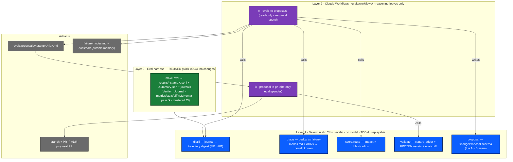
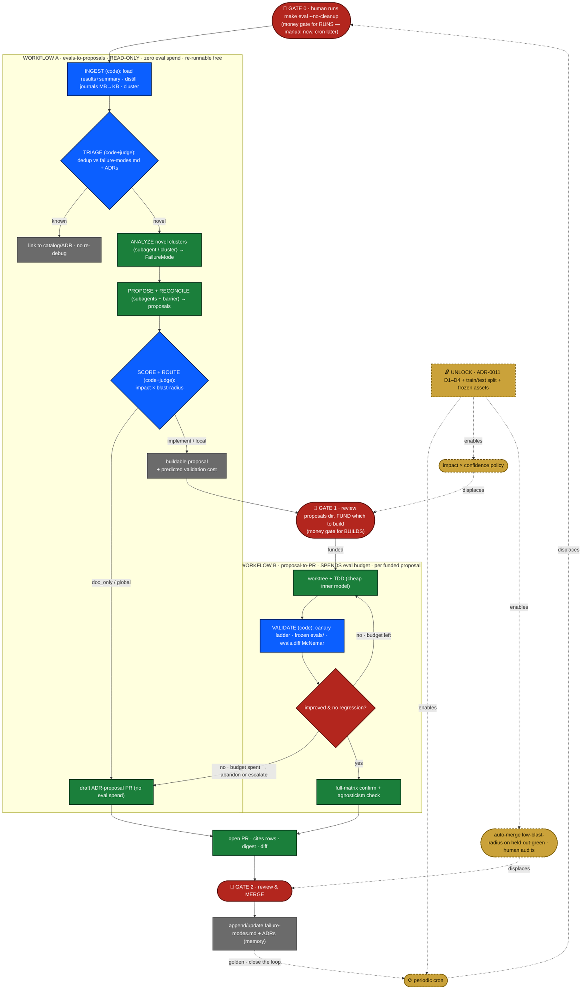
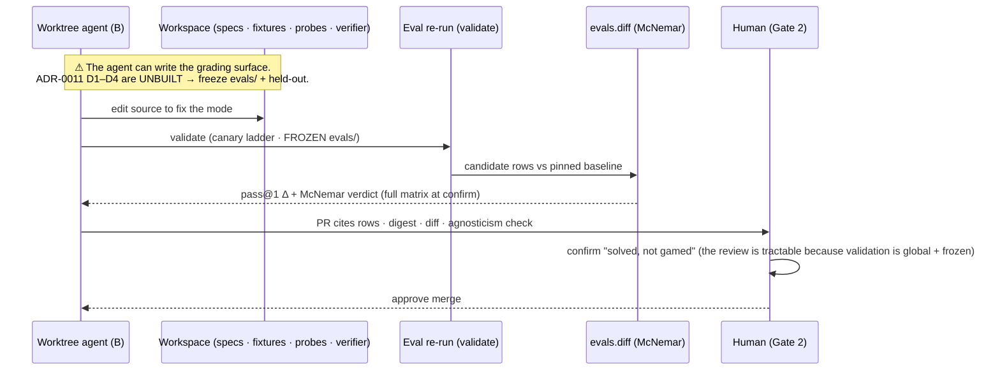

# Evals-Driven Improvement Loop — Design

- **Status:** Design (for sign-off) — the buildable spec for the Phase-4 self-improvement initiative. Decision recorded in **ADR-0024**.
- **Date:** 2026-06-16
- **Owner:** Sarthak Joshi
- **Related:** **ADR-0024** (the decision + rejected alternatives); ADR-0004 (the eval harness this builds on), ADR-0011 (verifier integrity — the substrate that gates HITL removal), ADR-0020 (guard probes), ADR-0022 (the first failure mode this loop will process); `docs/eval-harness-design.md`; `docs/research/failure-modes.md` (the A/B/C/D catalog = the loop's memory).
- **One line:** turn measured eval signal into *reviewed* harness improvements through two human-gated Claude workflows over a deterministic core — progressively, and safely, reducing the human in the loop.

> Diagrams are [Mermaid](https://mermaid.js.org/) (render on GitHub and in most editors).

---

## 1. Motivation & goals

**The problem.** Nearly every harness improvement so far came from *manual dogfooding* — a human running the TUI/headless, noticing a failure, diagnosing it, fixing it. That doesn't scale, and it leaves measured signal on the floor: we now have an Eval-0 harness (ADR-0004) that produces scored runs, lossless journals, and a failure-mode catalog, but nothing systematically turns that signal into change.

**The mission.** Progressively transition harness improvement from human dogfooding to **evals-signal-driven**, eventually reducing (and only eventually eliminating) the human in the loop — *without* letting an optimizer game its own grader.

**Goals.**
1. A repeatable path from an eval results dir → a **reviewed, scored, deduplicated set of change proposals** (zero eval spend).
2. A repeatable path from a *funded* proposal → a **TDD'd, statistically-validated PR** (the only eval spend, bounded).
3. Each stage is an **ad-hoc, independently-invokable Claude workflow** with a stable, typed seam between them.
4. Honest, data-driven decisions: validate globally (full matrix + paired stats), not per-failed-task; route by **risk/blast-radius**, not implementation size; dedup against institutional memory before debugging.
5. A clear path to the autonomous "golden loop" where human gates become triggers — gated behind a built integrity substrate.

**Non-goals (now).**
- **No auto-merge**, and no automating the eval-run *trigger*, until ADR-0011's integrity substrate + a train/test split exist. Humans hold every merge and grader-touching change.
- **No LLM-judge scoring** (ADR-0004 rejected it; a judge you optimize against is a hack target).
- No multi-agent SendMessage "team" — collaboration is handled by a reconciliation barrier (see §4).

**Principles** (inherited from CLAUDE.md Principle C): deterministic code wherever exact/cheap; agents only for reasoning leaves; one mechanism per concern; cost is intentional and staged; the human moves from *author* → *reviewer* → (only after the substrate) *auditor*.

---

## 2. The data that drives this (why now, why this shape)

From the latest matrix `evals/results/20260615T164950Z.*` (3 models × 4 tasks × 5 seeds = 60 runs):

| Signal | Value | Design consequence |
| --- | --- | --- |
| Overall pass@1 | **0.83** (gpt-5.1 1.00 · sonnet 0.75 · gemini 0.75) | a model-agnostic matrix is the unit of truth, not a single model |
| All 10 failures | **one task (`secret-safety`), one mode (C1 won't-conclude)** — already in `failure-modes.md`, already fixed-in-proposal (ADR-0022) | **dedup-before-debug** is mandatory, or we re-diagnose solved problems |
| Tokens on the 10 failures | **2.15M = 85% of the run's 2.53M** | the eval *re-run* dominates cost → the **canary ladder** + a single eval-spending stage |
| Biggest journal | **875 MB** (a `search_repo` recursing over `journal.jsonl`; no output cap) | raw journals can't enter an agent → **deterministic distillation**; and a prerequisite guardrail fix |
| Failure taxonomy | A harness · B measurement · C model · D security (`failure-modes.md`) | proposals carry a `mode` + a `remediation_type` aligned to the taxonomy |

This design consolidates two independent critiques of the initiative (Claude Opus 4.8 + Codex gpt-5.4); the decision and its rejected alternatives are recorded in **ADR-0024**.

---

## 3. System overview — two workflows, three gates, two layers

The loop is **not** one continuous auto-run. It is two independently-invokable Claude workflows separated by human gates, with the expensive eval run as a manual precursor. The two costly/irreversible actions — **running evals** and **merging** — are the gates that stay human longest.

### 3.1 Layered architecture

### 3.2 The abstraction (two layers + one typed seam)

- **Layer 1 — deterministic Python CLIs in `evals/`** (TDD'd, replayable, no model): `distill`, `triage`, `score`/`route`, `validate`. The cheap, exact primitives; only `validate` spends (and only when invoked).
- **Layer 2 — two named Claude Workflow scripts** (the `Workflow` tool: a `meta` block + phases, parameterized by `args`) that orchestrate only the *reasoning* and **shell out to Layer 1 at the deterministic seams**. (The Workflow tool runs agents/JS, not Python — so determinism lives in `evals/`.)
- **The seam — a typed `ChangeProposal`** A writes and B consumes (`evals/proposals/<stamp>/<id>.md`); B is invoked `--proposal <id>`. Decoupling makes each workflow invokable/replayable alone.

---

## 4. Components

Every user-facing artifact, what it is, where it lives, and how it's invoked.

| # | Component | Type | Lives in | Invocation | Role |
| --- | --- | --- | --- | --- | --- |
| 1 | `distill` | script / CLI | `evals/distill.py` | `python -m evals.distill <results>` | journal JSONL → compact **trajectory digest** (ordered actions · tool calls w/ arg *summaries* + exit · repeat & `decision_error` counts · denylist refusals · token/iter curve · outcome). MB→KB. |
| 2 | `triage` | script / CLI | `evals/triage.py` | `python -m evals.triage <digests>` | match each failure cluster vs `failure-modes.md` (A/B/C/D + mechanism) + open ADRs → `novel \| known→<entry/ADR>`. Only novel clusters reach the fan-out. |
| 3 | `score`/`route` | script / CLI | `evals/score.py` (extend) | `python -m evals.score` | impact (0–10, from cluster frequency) × `blast_radius`; deterministic governance route. |
| 4 | `validate` | script / CLI | `evals/validate.py` | `python -m evals.validate <candidate>` | **canary ladder** (unit/local → 1-seed canary on affected models → full matrix on survival) against **frozen `evals/` assets**; verdict via `evals.diff` (McNemar + clustered CI + agnosticism check). The only eval spender. |
| 5 | `ChangeProposal` | pydantic schema | `evals/proposal.py` | import / `--proposal <id>` | the A→B **seam** (fields in §4.1). |
| 6 | **Workflow A** `evals-to-proposals` | Claude workflow | `evals/workflows/evals_to_proposals.*` | `Workflow({scriptPath})` (or the optional skill) | read-only analysis MVP → proposals dir + memory updates. |
| 7 | **Workflow B** `proposal-to-pr` | Claude workflow | `evals/workflows/proposal_to_pr.*` | `Workflow({scriptPath, args:{proposal}})` | per funded proposal → worktree → TDD → validate → PR. |
| 8 | analysis / proposal / **reconcile** subagents | subagents (in A) | — | spawned by A | digest→`FailureMode`; mode→`ChangeProposal`; a single **reconciliation barrier** ensures mutual + codebase compatibility (not a SendMessage team). |
| 9 | TDD-executor / ADR-PR-drafter subagents | subagents (in B / A) | — | spawned by B (A for ADR-only) | implement under TDD in a worktree; draft the PR/ADR. |
| 10 | `/evals-to-change-plan` | slash command / skill *(optional ergonomic wrapper)* | `.claude/` | `/evals-to-change-plan <dir>` | thin entry that invokes Workflow A. |
| 11 | proposals artifact | artifact dir | `evals/proposals/<stamp>/` | — | the reviewable output the human reads at Gate 1. |
| 12 | `search_repo` output cap + journal exclusion | guardrail fix | `avatar-harness/avatar/tools/search.py`, `evals/run.py` | Increment 0 | prerequisite: keep journals distillable (closes the 875 MB blowup). |

### 4.1 `ChangeProposal` (the seam)

Front-matter (machine-readable) + a human body:

`mode` (A/B/C/D + catalog id) · `impact` (0–10) · **`remediation_type ∈ {prompt_instruction · guardrail_check · code_logic · doc_only}`** · **`blast_radius ∈ {local · global}`** · `target_tasks` · `predicted_validation_cost` (tasks×models×seeds → tokens, from the baseline profile) · `tdd_plan` · `evidence` (result rows + digest refs) · `status`.

`remediation_type` (the *kind* of fix — instruction/guardrail/code/doc, mirroring Saravia's session-mining outputs) is **orthogonal** to `blast_radius` (which governs validation + governance). Worked examples: ADR-0022 = `prompt_instruction` × global → ADR-PR; the `search_repo` cap = `guardrail_check` × local → implement-PR.

---

## 5. Flow

### 5.1 End-to-end — two workflows, three gates, and the golden-loop overlay

Blue = deterministic Layer-1 code · green = Layer-2 reasoning subagent · red = human gate · grey = terminal/shortcut · **dashed gold = golden-loop automation that *displaces* each gate once the ADR-0011 substrate is built** (`CAT → cron` closes the loop).

### 5.2 Where the reward-hacking risk lives (Workflow B's validation sub-loop)

---

## 6. Safety & cost (the load-bearing constraints)

**Reward-hacking / Goodhart.** Workflow B optimizes edits toward "the eval is green" against a grading surface the agent can write. This is the ADR-0011 moment, and its defenses (protected oracle paths, fingerprinting, held-out tests, calibration, train/test split) are **Proposed, not built**. Therefore:
- **Freeze the eval assets** during `validate` (run against `evals/` restored from a trusted ref, never the worktree) — a pragmatic D1+D2. Necessary, not sufficient (doesn't stop special-casing a frozen-but-visible test, doesn't fix a construct-validity gap like the guard probe, can't cover the verifier when the verifier is itself the target).
- **Human stays on every merge and grader-touching change** until the substrate exists. The golden-loop overlay only activates post-`UNLOCK`.
- **Route on risk, validate globally.** `blast_radius` (not size) picks governance; global/always-on changes (e.g. a prompt rule) require full-matrix + McNemar + the agnosticism check, never a single re-run.

**Cost.** The eval re-run dominates (85% of tokens were the 10 failures; one full matrix ≈ 2.5M tokens). Structural bounds: A spends $0; B is the only spender; the **canary ladder** stages spend (cheap inner model → 1-seed canary on affected models → full matrix only on survival); a **hard rework cap** then escalates to an ADR; each proposal carries a **predicted validation cost** so Gate 1 is cost-informed.

---

## 7. Execution plan (checklist)

TDD per the repo protocol: **propose the test list → maintainer approves → red → green → record.** Built behind `evals/` + one guarded `src/` guardrail; the only `src/` engine touch is Increment 0.

### Increment 0 — `search_repo` guardrail (small, standalone, unblocks clean inputs)
- [ ] `test_search_repo_caps_large_output_with_marker` — output capped (~50 KB) with the `… [truncated: shown/total chars shown]` marker.
- [ ] `test_search_summary_notes_truncation`.
- [ ] `test_eval_journal_excluded_from_search` — the eval journal path is covered by `_journal_ignores` (the regression that would have caught 875 MB).
- [ ] impl: cap in `tools/search.py`; align `evals/run.py` journal path with the workspace exclusion.
- **Exit:** a large search can't balloon `ToolEnd.content`/the journal; `make check` clean.

### Increment 1 — Layer-1 CLIs + `ChangeProposal` (the free foundation)
- [ ] `test_distill_*` — digest from constructed events; size bound; deterministic; reuses `_journal_events`.
- [ ] `test_triage_matches_known_C1_to_ADR_0022`; `test_triage_flags_novel`.
- [ ] `test_score_route_impact_x_blast_radius`.
- [ ] `test_changeproposal_roundtrips` (incl. `remediation_type` × `blast_radius`).
- [ ] `test_validate_canary_ladder_runs_frozen_assets` (scripted/offline) + uses `evals.diff`.
- [ ] impl `evals/{distill,triage,score,validate,proposal}.py`; held to the `evals/` gates (ADR-0013).
- **Exit:** `python -m evals.distill|triage|score` run on `20260615T164950Z` → digests + "all C1 → ADR-0022, 0 novel"; `make check` clean.

### Increment 2 — Workflow A `evals-to-proposals` (the analysis MVP)
- [ ] `evals/workflows/evals_to_proposals.*` (`meta` + phases): ingest→triage (Layer-1) → fan-out 1 subagent/novel cluster → reconcile barrier → write `evals/proposals/<stamp>/` + append `failure-modes.md`.
- [ ] dry-run against `20260615T164950Z`: 0 novel (proves dedup); a synthetic novel cluster fixture exercises the fan-out.
- **Exit:** read-only, zero eval spend; produces a reviewable proposals dir; safe to run today.

### Increment 3 — Workflow B `proposal-to-pr` (the spender) — **HITL-gated**
- [ ] `evals/workflows/proposal_to_pr.*`: worktree → TDD subagent → `validate` (canary ladder, frozen) → confirm → open PR; bounded rework; Gate 1 (fund) + Gate 2 (merge).
- **Exit:** per funded proposal, a TDD'd, McNemar-validated PR; never auto-merges; grader-touching → ADR-route.

### Increment 4 — ADR-0011 substrate + train/test split (the unlock — later)
- [ ] D1 protected oracle paths · D2 fingerprinting · D3 held-out FAIL_TO_PASS/PASS_TO_PASS · D4 calibration · dev/held-out task split.
- **Exit:** gates may become triggers (G0→cron, G1→policy, G2→auto-merge low-blast-radius on held-out green) — the golden loop.

---

## 8. Open questions

- **Workflow persistence convention** — no `.claude/workflows/` exists yet; confirm `evals/workflows/` as the home for saved Workflow scripts (invoked via `Workflow({scriptPath})`).
- **Skill wrapper** — is the optional `/evals-to-change-plan` slash command worth it in v1, or is direct `Workflow` invocation enough?
- **`predicted_validation_cost` source** — derive from each run's `prompt+completion` tokens in the baseline `summary`/rows, or maintain a per-task cost table?
- **Train/test split** — which seed tasks are dev vs held-out (Increment 4)?
