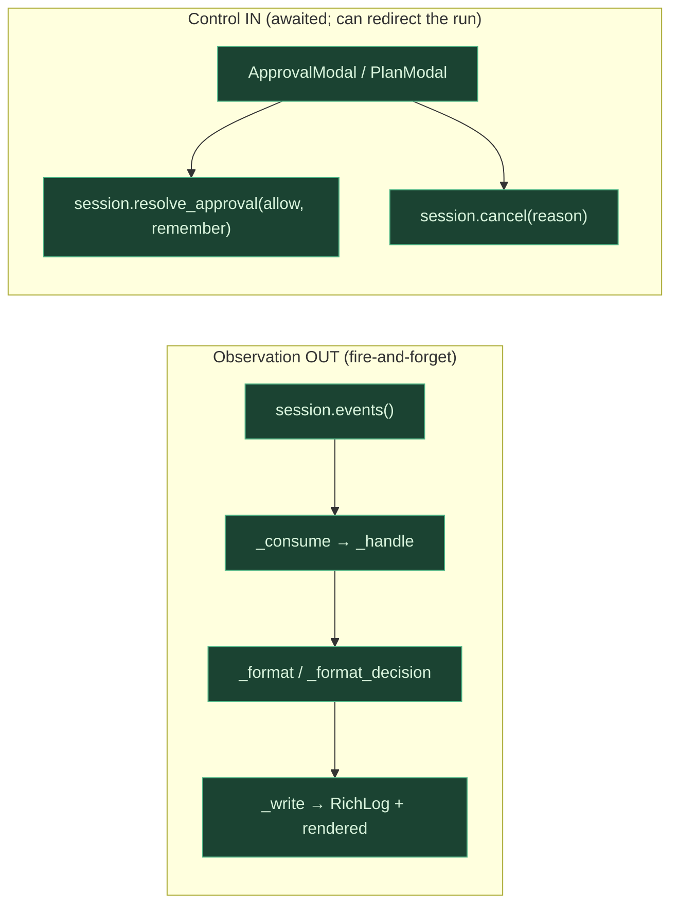
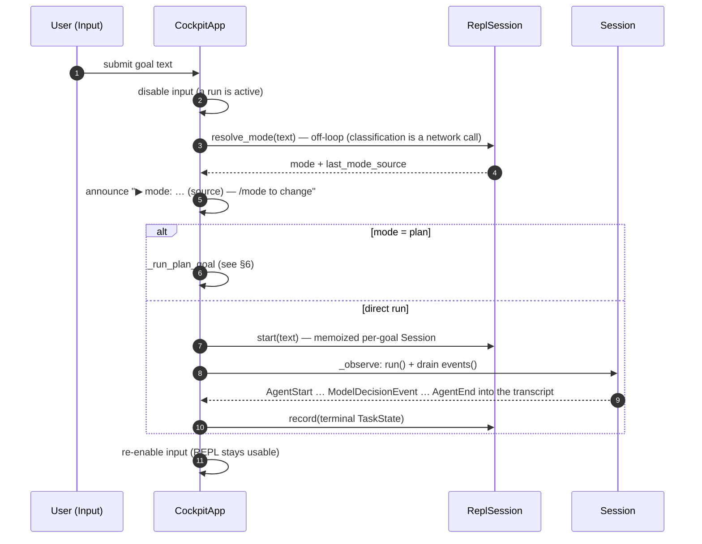
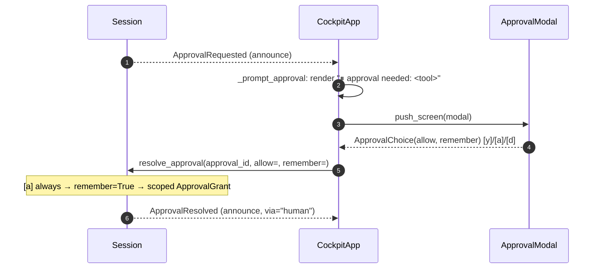
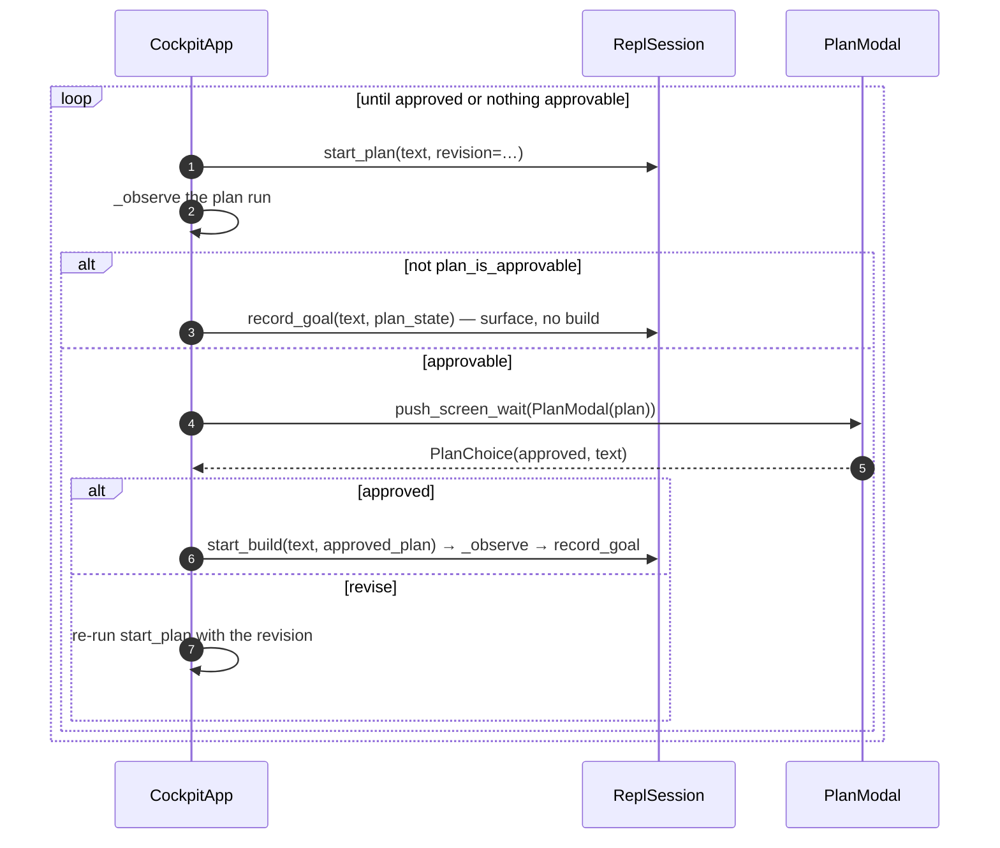
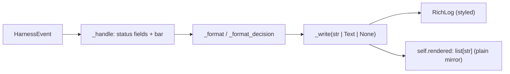

# ARCHITECTURE — `jo` (the cockpit)

A package-local map of the interactive Textual cockpit — the standalone `jo-cli`
distribution — in the same visual style as the root
[`ARCHITECTURE.md`](../ARCHITECTURE.md). This is the whole-package picture for
cockpit-local work; for *why* the engine around it is shaped as it is, follow the `§N` links
into `HARNESS_DESIGN.md` (the source-of-truth spec) and the root architecture map. For the
package's working rules, see [`CLAUDE.md`](./CLAUDE.md).

---

## 1. What this package is

The **interactive cockpit** — a full-screen Textual shell (the `jo` command) that turns a
multi-turn conversation into observable harness runs: a status bar, a scrollable chat
transcript, and an input box.

Two properties define it:

- **A pure consumer of the core engine.** A separate distribution (`jo-cli`) that depends on
  `avatar-harness`. The import direction is strictly **consumer → core, never back**
  (`cli.py` docstring): this package consumes the public `Harness` / `ReplSession` / `Session`
  surface (from the top-level `avatar` package), and nothing in the core imports `jo`. The
  harness is an independent core under many consumers (TUIs, eval drivers, autonomous wrappers);
  the cockpit is one of them, so it owns its launcher (ADR-0023).
- **Textual is this package's own dependency.** The core engine + SDK import without `textual`,
  so `import avatar` never pulls in this package's heavy imports. `load_cockpit()`
  (`__init__.py`) is the one guarded entry — it returns `CockpitApp` lazily so `replay.py` stays
  importable without forcing a Textual import at package load.

The cockpit sits **outside the loop** (§13): it is an observation subscriber + an input/control
source, never a step the runner awaits.

## 2. Component graph

The `jo` command builds a `ReplSession` over the core and hands it to a `CockpitApp`. The app
drives the REPL from input, observes each per-goal `Session`'s event stream, and acts only
through the modals → the session's control plane.

```mermaid
flowchart TD
    subgraph jo["jo (this package — the jo-cli distribution)"]
        CLI["jo (cli.py): build ReplSession, run CockpitApp"]
        APP["CockpitApp (app.py): status bar + transcript + input"]
        MOD["modals.py: ApprovalModal / DiffModal / PlanModal"]
        RP["ReplaySession (replay.py): engine-free event stream"]
        INIT["load_cockpit (__init__.py): guarded import"]
    end

    subgraph core["core engine (consumed — never imports jo)"]
        REPL["ReplSession (session_state.py): multi-turn scope"]
        SESS["Session (session.py): two-plane boundary"]
        RUN["AgentRunner: the loop"]
    end

    CLI -->|load_cockpit| INIT
    INIT -.->|returns class| APP
    CLI -->|repl=| APP
    APP -->|drive input| REPL
    REPL -->|per goal| SESS
    SESS --> RUN
    APP -->|observe events| SESS
    APP -->|control via| MOD
    MOD -->|resolve_approval / plan choice| SESS
    RP -.->|observe (tests / future --replay)| APP

    classDef pkg fill:#1b4332,stroke:#52b788,color:#d8f3dc;
    classDef ext fill:#343a40,stroke:#868e96,color:#dee2e6;
    class CLI,APP,MOD,RP,INIT pkg;
    class REPL,SESS,RUN ext;
```

| Component | Role |
| --- | --- |
| `cli.py` (`jo`) | The cockpit's own entry point: parse `--auto`/`--log`/`--allow-dirty`, build a journaled `ReplSession`, `load_cockpit()`, run the app. Consumer → core only. |
| `app.py` (`CockpitApp`) | The shell: status bar + `RichLog` transcript + a `HistoryInput` (a `TextArea` subclass: multi-line composition where **Enter** submits the whole buffer and **Ctrl+J** / **Shift+Enter** / **Alt+Enter** insert a newline — `Ctrl+J` is the universal path, the shift/alt variants need the enhanced kitty protocol; it posts its own `Submitted` message carrying `.value`. `↑`/`↓` recall the sitting's submitted prompts, **edge-gated** so they only browse history when the cursor sits on the first/last line — in between they move the cursor). Two modes — **observe** a fixed `session=` stream, or **drive** a live `repl=` `ReplSession`. Renders `events()`; acts via modals. `ctrl+c` copies an active text selection if there is one, else **hard-cancels** the in-flight run (`_run_task.cancel()` — instant, aborting an in-flight model call at the socket via the async client, ADR-0024; `_observe` marks it cancelled), else quits (a finished/cancelled goal clears the per-goal run so it always falls through to quit). An external `SIGINT`/`SIGTERM` is handled (skipped in headless tests) for a graceful shutdown. |
| `modals.py` | The control surfaces: `ApprovalModal` → `ApprovalChoice`, `DiffModal` → `None`, `PlanModal` → `PlanChoice`. Each `dismiss`es a small typed result the app routes. |
| `replay.py` (`ReplaySession`) | A session-shaped object that replays a fixed event list with no engine — the basis for headless tests and a future `--replay <journal>` viewer. No Textual import. |
| `__init__.py` (`load_cockpit`) | The guarded (lazy) import of the Textual app; raises a clear hint if `textual` is somehow absent (it is a hard dependency of `jo-cli`). |

## 3. The two planes (don't conflate them — §13)

The cockpit binds to exactly the `Session` two-plane API. **Observation flows OUT** via
`events()` (an async stream that can never block or redirect the run); **control flows IN** via
the modals → `resolve_approval` / `cancel`. An event may *announce* that approval is needed, but
the decision returns through the control method, **never** the event stream.



The cardinal trap, here as in the core: routing control back through the event stream. The
cockpit never does — an `ApprovalRequested` event only *announces*; `_prompt_approval` answers
through `resolve_approval`.

## 4. Goal flow

A non-meta input becomes one observable goal. Mode is resolved off-loop, **announced, and
`/mode`-correctable** (never hidden — revised ADR-0002 D3), then the per-goal `Session` runs
while its events stream into the transcript; the terminal state is recorded back into the REPL.



A goal that raises is rendered as a transcript line and leaves the REPL alive — an exception
escaping a Textual worker would tear down the whole app (the dogfood crash: a
`DirtyWorkspaceError` on a follow-up goal). `_run_goal` catches and surfaces it instead.

## 5. Approval flow

A tier-3 gated call announces `ApprovalRequested`; the cockpit pops the `ApprovalModal` and
routes the human's choice through the control plane. `[a] always` carries `remember=True`, which
the session stores as a scoped `ApprovalGrant` so matching calls auto-allow later in the sitting.



## 6. Plan flow

Plan mode (ADR-0002 D5) is the one mode that isn't a `task_kind`: a no-net-change plan run →
human approve/revise → the approved plan seeds the edit (build) run. The cockpit drives the
approve/revise loop with `PlanModal`.



## 7. Rendering pipeline

Each `HarnessEvent` becomes at most one transcript line. `_handle` updates the tracked status
fields (`phase`/`outcome`/`verdict`) and the status bar, then calls `_format` (which delegates
to `_format_decision` for `ModelDecisionEvent`). `_write` appends the line to the `RichLog` **and**
mirrors its plain text into `self.rendered: list[str]`, so behavior is assertable headlessly
without snapshotting the screen. Styled lines are carried as `rich.text.Text`; the `rendered`
mirror stays `list[str]` (`line.plain`).



The line vocabulary distinguishes who is speaking, so the conversation reads above the machinery
(the Part A render change — describing the intended vocabulary):

| Source | Event | Line |
| --- | --- | --- |
| **User** | `AgentStart` | `▶ you  {goal}` — `▶ you` styled (bold cyan), body default |
| **Model** | `ModelDecisionEvent` (`final_answer` / `ask_user`) | `● agent  {action}` — `● agent` styled (bold green) |
| **Model** | `ModelDecisionEvent.thought` (any decision type, when non-empty) | a dim/italic thought line (the public display-channel summary, ADR-0001 D6 — not private chain-of-thought) |
| **Model** | `ModelUpdate` | the streamed display delta |
| **Tool** | `ToolStart` / `ToolEnd` | dim `→`/`✓`/`✗` tool I/O |
| Verifier | `VerificationEnd` | `✓`/`⚠ verification …` (the real verdict, always — advisory in conversational mode, §23.5) |
| Loop | `DecisionError` / `ApprovalRequested` / `AgentEnd` | `↩` / `⏸` / `■ {outcome}` |

The label is **model-agnostic** (`you` / `agent`) — this harness runs non-Claude models too.
For a `tool_call` decision `_format` returns only the thought line (or `None`): the call itself
is already rendered by `ToolStart`/`ToolEnd`, so the decision branch never duplicates it. Event
ordering favors this — the runner emits `model_decision` *before* that turn's tool/verification/
block events, so the model's thought/message precedes them (and an `ask_user` question precedes
the `■ blocked` from `AgentEnd`).

## 8. Status / scope

**What's built:**

- **observe** mode (a fixed `session=` stream — `ReplaySession` for tests, a future `--replay`)
  and **drive** mode (the live `repl=` multi-turn REPL).
- The three modals — approval, diff, plan — wired to the control plane and the plan flow.
- Journaled sittings: `jo` writes one write-ahead `events/<session_id>.jsonl` (or `--log`),
  so an interactive run is as replayable as a batch one.
- The chat-style transcript (user / model / tool vocabulary) and a live status bar
  (mode · phase · outcome · verdict).

**The boundary it must keep:** a pure **consumer of the core** (consumer → core, never back), an
**observer + control-caller only** (control never flows through `events()`, §13), a separate
distribution owning its `textual` dependency, and **headless-testable** (assert on
`rendered`/status; drive with `ReplaySession` or the `Pilot` test harness; never snapshot the
rendered screen).
